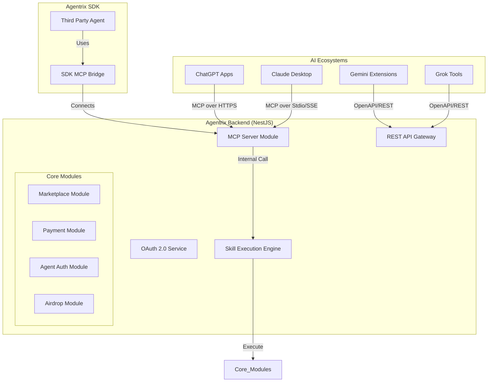

# Agentrix MCP 多生态集成 - 技术设计文档 (TDD)

**版本**: 1.0.0  
**日期**: 2025-12-27  
**状态**: Draft

---

## 1. 系统架构概览

Agentrix MCP 集成旨在通过统一的 Model Context Protocol (MCP) 协议，将 Agentrix 的核心交易和 Agent 能力暴露给主流 AI 生态。

### 1.1 整体架构图



---

## 2. MCP Server 实现方案

### 2.1 协议适配层

我们将基于 `@modelcontextprotocol/sdk` 构建 MCP Server。

- **Transport 层**:
  - **SSE (Server-Sent Events)**: 用于 ChatGPT 和远程 Web 调用。
  - **Stdio**: 用于 Claude Desktop 本地集成。
  - **HTTP Bridge**: 为不支持原生 MCP 的平台（Gemini/Grok）提供 OpenAPI 转换。

### 2.2 核心组件设计

1. **`McpModule`**: NestJS 模块，负责初始化 MCP Server 实例。
2. **`McpToolRegistry`**: 注册中心，将 NestJS Service 方法或 `Skill` 实体映射为 MCP Tools。
3. **`McpContextInterceptor`**: 拦截器，处理 AI 传递的上下文（如 `userId`, `sessionId`）。
4. **`McpSseController`**: 处理 SSE 连接和消息路由。

---

## 3. 认证与授权 (OAuth 2.0)

对于 ChatGPT 等云端集成，必须使用 OAuth 2.0 保护用户数据。

### 3.1 OAuth 流程设计

1. **Client Registration**: 在 Agentrix 后台为 ChatGPT 注册 Client ID/Secret。
2. **Scopes**:
   - `openid`: 基础身份
   - `marketplace:read`: 搜索商品
   - `order:write`: 创建订单
   - `payment:execute`: 执行支付
   - `agent:manage`: 管理 Agent 授权
3. **Token Management**: 使用 Redis 存储 Access Token 和 Refresh Token。

### 3.2 身份注入

MCP 请求头或参数中携带的 Token 将被 `AuthGuard` 解析，并将 `User` 对象注入到 MCP 执行上下文中。

---

## 4. Tool 定义与映射

### 4.1 动态 Tool 生成

系统将遍历 `Skill` 数据库中标记为 `published` 且 `ai_enabled` 的技能，动态生成 MCP Tool 定义。

```typescript
// 伪代码示例
async function generateMcpTools() {
  const skills = await skillService.findAll({ status: 'published' });
  return skills.map(skill => ({
    name: skill.name,
    description: skill.description,
    inputSchema: skill.inputSchema,
    handler: async (args) => skillExecutor.execute(skill.id, args)
  }));
}
```

### 4.2 静态核心 Tools

内置在代码中的核心功能，如：
- `search_products` -> 调用 `MarketplaceService.search`
- `create_pay_intent` -> 调用 `PaymentService.createIntent`

---

## 5. 平台适配细节

### 5.1 ChatGPT (Apps in ChatGPT)
- **集成方式**: 通过 HTTPS 暴露 SSE 端点。
- **Manifest**: 提供 `mcp-manifest.json` 描述 App 信息。
- **UI 渲染**: 返回符合 OpenAI 规范的结构化数据，触发内置卡片渲染。

### 5.2 Claude (Claude Desktop)
- **集成方式**: 提供一个轻量级的 Node.js 启动脚本，通过 Stdio 与 Claude 通讯。
- **SDK 支持**: `sdk-js` 提供 `createMcpServer()` 方法，方便开发者本地运行。

### 5.3 Gemini & Grok
- **集成方式**: 自动生成 OpenAPI 3.1 描述文件。
- **转换逻辑**: 将 MCP Tool 定义转换为 OpenAPI Path 定义。

---

## 6. 数据库变更

### 6.1 `skills` 表扩展
- `is_mcp_enabled`: boolean
- `mcp_category`: string
- `mcp_metadata`: jsonb (存储平台特定的配置)

### 6.2 `oauth_clients` 表
- 存储第三方 AI 平台的 Client 配置。

---

## 7. 安全性设计

1. **输入校验**: 使用 JSON Schema 严格校验 AI 传递的参数。
2. **速率限制**: 针对每个用户/会话设置调用频率限制。
3. **敏感操作确认**: 支付等操作必须返回一个 `confirmation_url`，引导用户在 Agentrix 页面完成最终确认（或使用预授权额度）。
4. **数据脱敏**: 返回给 AI 的数据需经过脱敏处理，隐藏敏感的钱包私钥或个人隐私。

---

## 8. SDK 集成设计

`sdk-js` 将新增 `McpBridge` 类：

```typescript
import { Agentrix } from '@agentrix/sdk';

const ax = new Agentrix({ apiKey: '...' });

// 启动一个本地 MCP Server
const mcpServer = ax.skills.createMcpServer({
  tools: ['search_products', 'my_custom_skill'],
  port: 3000
});

await mcpServer.start();
```
