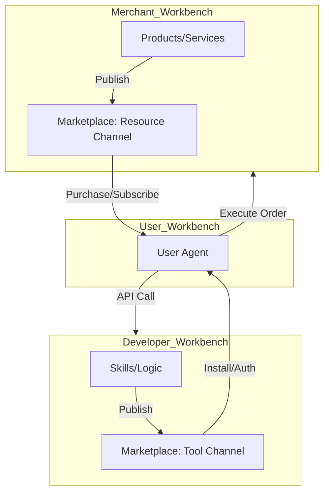

# Agentrix 工作台整体优化方案 (Workbench Optimization Plan)

**日期**: 2026-01-12
**状态**: 建议方案 (Proposal)
**目标**: 解决"工作台 (Workbench)"与"市场 (Marketplace)"职责混淆的问题，清晰界定用户、商家、开发者的操作边界。

---

## 1. 核心架构重构：分离"消费"与"管理"

当前最大的痛点在于**个人工作台 (User Workbench)** 承载了太多的职责：既是用户的"操作系统"（管理资产/Agent），又是"应用商店"（浏览/购买）。

**优化核心策略**: 将 **Marketplace** 提升为与 **Workbench** 平级的全局模块。

### 1.1 全局导航结构 (Global Navigation)

建议将网站顶层导航调整为：

| 导航项 | 定义 | 核心心智 |
| :--- | :--- | :--- |
| **Home** | 官网首页 | 了解 Agentrix |
| **Marketplace** (新) | 全局市场 | **发现 (Discover)**：找商品、找技能、找 Agent |
| **Workbench** | 统一工作台 | **管理 (Manage)**：我的资产、我的订单、我的开发 |
| **Docs** | 文档中心 | 学习如何使用 |

---

## 2. 统一工作台 (Unified Workbench) 内部架构

当用户点击 "Workbench" 时，根据其当前**激活的角色 (Active Role)** 进入对应的工作空间。工作台不再包含"逛市场"的功能，只包含"管理已拥有"的功能。

### 2.1 👨‍💻 个人工作台 (User Workbench)
**定位**: 个人的 AI 操作系统 (My AI OS)

*   **移除**: `Marketplace`, `Shop` (浏览页)
*   **保留与增强**:
    *   **🏠 Dashboard**: 个人概览 (资产、活跃 Agent)。
    *   **🤖 My Agents**: 管理**已雇佣/已部署**的 Agent。
    *   **🧰 My Skills**: 管理**已安装**的技能 (配置 API Key、授权)。
    *   **📋 Orders**: 查看作为买家的订单状态。
    *   **💰 My Assets**: 钱包、收益、持仓。
    *   **⚙️ Settings**: 个人偏好、KYC。

> **交互流程变化**: 用户想要添加新技能 -> 点击顶部导航 "Marketplace" -> 浏览并购买 -> 自动跳转回 Workbench 的 "My Skills" 进行配置。

### 2.2 🏪 商家工作台 (Merchant Workbench)
**定位**: 商品与交易后台 (Shop Backend)

*   **核心任务**: 将商品 (Resource) 发布到 Marketplace。
*   **功能模块**:
    *   **🏠 Dashboard**: 经营概览 (GMV、今日订单)。
    *   **📦 Products**: 商品管理。
        *   *Action*: "发布上架" -> 自动同步到 Marketplace 的 "Resource" 频道。
    *   **📃 Order Management**: 处理作为卖家的发货/售后。
    *   **📣 Marketing**: 优惠券、推广活动。
    *   **💳 Finance**: 提现、对账。

### 2.3 🛠️ 开发者工作台 (Developer Workbench)
**定位**: 技能与代码工厂 (Skill Factory)

*   **核心任务**: 将逻辑 (Skill) 发布到 Marketplace。
*   **功能模块**:
    *   **🏠 Dashboard**: 调用量概览、API 错误率。
    *   **🔨 Skill Builder**: 代码编辑、Schema 配置。
        *   *Action*: "发布版本" -> 自动同步到 Marketplace 的 "Tools" 频道。
    *   **📦 Skill Packs**: 组合多个 Skill 虽然。
    *   **🧪 Sandbox**: 调试沙盒。
    *   **📈 Analytics**: 详细的性能监控日志。

---

## 3. 发布与流通链路 (The Flow)

清晰定义三方如何在 Marketplace 汇合：

---

## 4. 界面优化具体措施

### 4.1 顶部导航栏 (Top Bar) 改造
- **左侧**: Logo
- **中间**: `Marketplace` (高亮)
- **右侧**: `Workbench` (下拉菜单可快速切换角色: User/Merchant/Dev) | `Connect Wallet`

### 4.2 个人工作台 UI 瘦身
将现有的庞杂 Tab 进行合并：
- **"自动赚钱 (Auto-Earn)"** -> 移入 **"My Agents"** (因为主要靠 Agent 运行策略) 或 **"My Assets"** (作为理财产品)。
- **"智能购物 (Smart Shopping)"** -> 全部移出至 **Marketplace**。工作台内只保留 **Orders**。
- **"安全中心"** -> 归入 **Settings** 或 **My Agents** 的授权管理子项。

### 4.3 角色切换器 (Role Switcher)
在 Workbench 左上角显著位置放置“角色切换器”：
- **当前**: [ 👨‍💻 个人 ]
- **点击弹出**:
  - [ 🏪 切换为商家 ] (需要 KYC/开店认证)
  - [ 🛠️ 切换为开发者 ] (需要 Github 绑定)

---

## 5. 总结

通过将 **Marketplace** 剥离出 **Workbench**：

1.  **心智更清晰**: 逛街去商场 (Marketplace)，干活回办公室 (Workbench)。
2.  **结构更扁平**: 个人工作台不再需要嵌套两三层导航来容纳购物功能。
3.  **角色更聚焦**: 商家和开发者只关注"生产"，用户只关注"管理"和"使用"。
