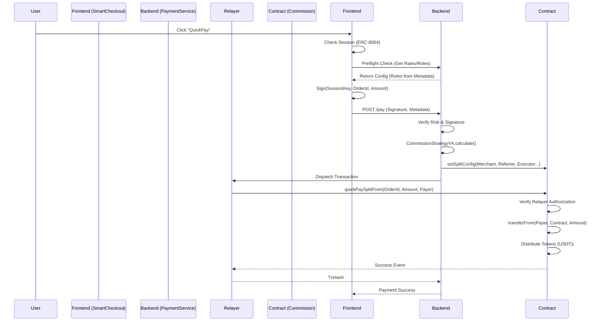

# Payment System Archive V4.0 (Source of Truth)

**Version:** 4.0.1 (Implementation Hybrid)
**Date:** December 14, 2025
**Status:** Active / Partial Implementation

---

## 1. Core Architecture (V4.0 Standard)

This section describes the **Target Architecture** as defined in `Agentrix生态分成机制详细设计-V4.0.md`.

### 1.1 Fund Distribution Model

Total Transaction Amount is split into 4 components:

$$ Total = Cost_{channel} + Fee_{platform} + Pool_{incentive} + Net_{merchant} $$

| Component | Rate (Physical) | Rate (Service) | Description |
| :--- | :--- | :--- | :--- |
| **Channel Cost** | 0.3% | 0.3% | Infrastructure/Gas/Relayer fees (ARN Treasury). |
| **Platform Fee** | 0.5% | 1.0% | Operational revenue. **Promoters** take 20% of this. |
| **Incentive Pool** | 2.2% | 3.7% | Agent budget. **Executors** (70%) & **Referrers** (30%). |
| **Merchant Net** | 97.0% | 95.0% | Remainder sent to Merchant MPC Wallet. |

### 1.2 Role Definitions

1.  **Promoter (推广者)**:
    *   **Source**: 20% of Platform Fee.
    *   **Definition**: Agent who onboarded the Merchant.
    *   **Fallback**: If none, Platform keeps 100% of Platform Fee.

2.  **Executor (执行者)**:
    *   **Source**: 70% of Incentive Pool.
    *   **Definition**: Frontend/App where the transaction occurred.
    *   **Fallback**: If none, funds go to **Platform Fund**.

3.  **Referrer (推荐人)**:
    *   **Source**: 30% of Incentive Pool.
    *   **Definition**: Agent who drove the traffic (URL ref).
    *   **Fallback**: If none, funds go to **Platform Fund**.

---

## 2. Implementation Status (Audit Report)

**Current State**: The system implements V4.0 **Calculation Logic** but runs on a **V3-Compatible Contract Structure**.

### 2.1 Backend (`CommissionStrategyV4Service`)
*   **Status**: ✅ **Fully Compliant**
*   **Details**:
    *   Correctly implements the V4 rate cards for Physical, Service, Virtual, and NFT.
    *   Correctly calculates splits for Promoter, Executor, and Referrer.
    *   Correctly handles fallback logic (unclaimed agent funds -> Platform Fund).

### 2.2 Smart Contract (`Commission.sol`)
*   **Status**: ⚠️ **Hybrid / Backward Compatible**
*   **Deviation**:
    *   **Target V4**: Uses dynamic `Payee[]` array in `SplitConfig`.
    *   **Current**: Uses fixed fields (`referrer`, `referralFee`, `executor`, `executionFee`) in `SplitConfig`.
    *   **Impact**: The backend maps the V4 calculation results into these fixed fields.
        *   `referrer` field holds the Referrer Agent.
        *   `executor` field holds the Executor Agent.
        *   `platformFee` field aggregates (Net Platform Fee + Promoter Share + Platform Fund).
        *   *Note*: Promoter share is currently bundled into Platform Fee on-chain, or needs specific handling if `promoter` field is missing in contract.

### 2.3 Frontend (`SmartCheckout.tsx`)
*   **Status**: ⚠️ **Missing Automatic Tracking**
*   **Deviation**:
    *   The component does not currently automatically parse `?ref=` or `?referrer=` from the URL.
    *   **Workaround**: The parent component or caller must extract these parameters and pass them in `order.metadata`.

---

## 3. Sequence Diagrams

### 3.1 QuickPay Flow (Happy Path)

---

## 4. Critical Implementation Details

### 4.1 Decimal Precision
*   **Rule**: All stablecoin amounts (USDT/USDC) in signatures and contract calls **MUST be 6 decimals**.
*   **Reason**: The contract enforces 6 decimals for standardization.
*   **Backend Handling**: `payment.service.ts` normalizes amounts before generating signatures or calling contracts.
*   **Rounding Fix**: `CommissionCalculatorService` updated to use 6 decimals rounding (was 2) to prevent zero-commission errors for small amounts.

### 4.2 ABI Mismatch Prevention
*   **Issue**: `Commission.sol` and `FeeSplitter.sol` have different `quickPaySplit` signatures.
*   **Solution**: The backend dynamically selects the correct ABI based on the target contract address.
    *   Direct Commission: `quickPaySplitFrom(bytes32, uint256, address)` (New V4.1)
    *   ARN FeeSplitter: `quickPaySplit(address, address, uint256, bytes32)`

### 4.3 Session ID & Relayer Auth
*   **Requirement**: V4.0 requires `sessionId` in `SplitConfig` for ERC-8004 compliance.
*   **Relayer Auth**: `Commission.sol` updated to include `relayers` whitelist and `quickPaySplitFrom` to allow Relayer/SessionManager to trigger payments from User wallet (via `transferFrom`).
*   **Status**: Added to `Commission.sol` struct and backend logic.

---

## 5. Action Items

1.  **Frontend**: Update `SmartCheckout.tsx` to parse `window.location.search` for `ref` params and inject into `order.metadata`.
2.  **Contract**: Plan migration to `ArnFeeSplitter.sol` with `Payee[]` support for full V4 flexibility (e.g., multiple promoters).
3.  **Verification**: Perform end-to-end test with `0.1 USDT` to verify the Hybrid V4 logic works on the current contract.
