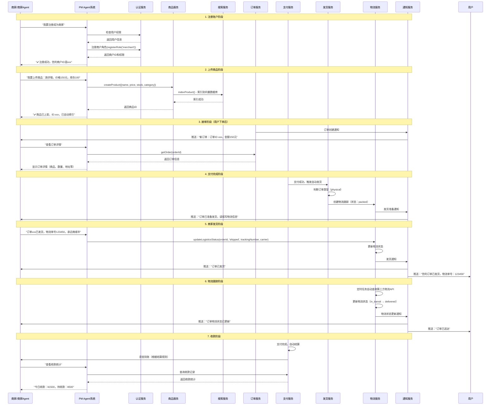
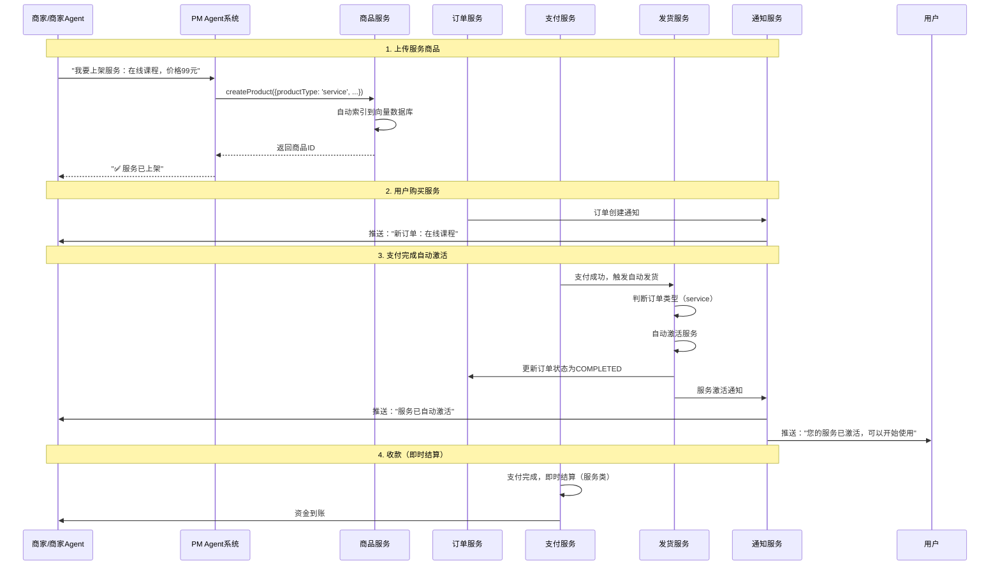
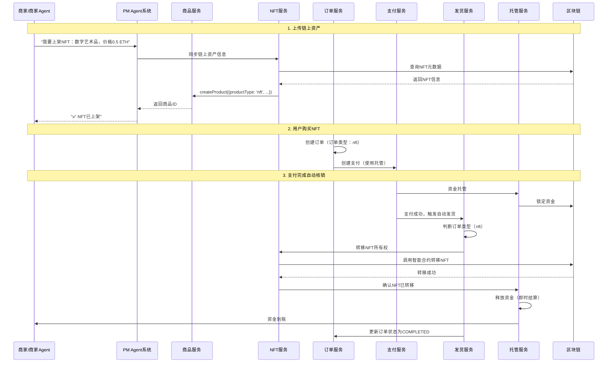
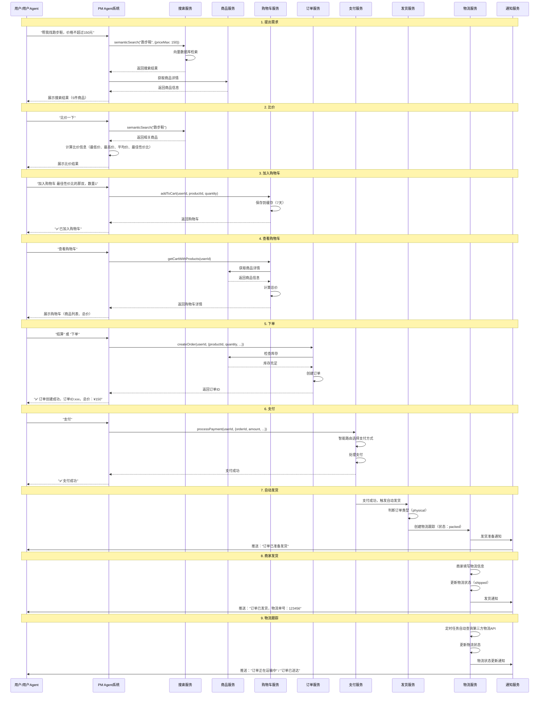
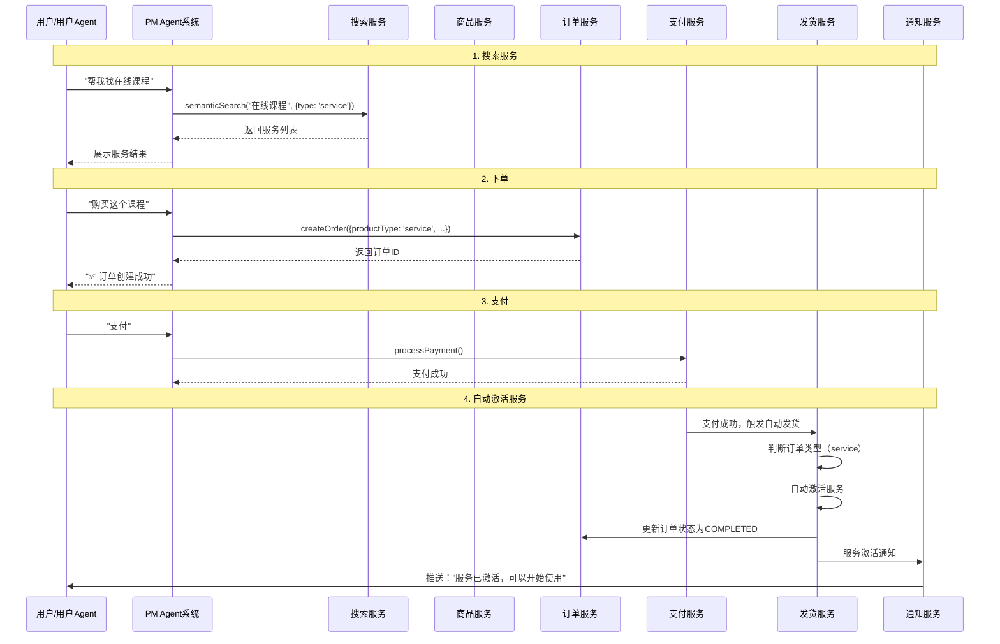
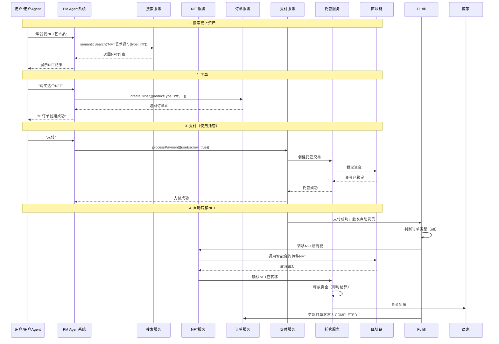

# PayMind Agent 完整流程时序图与功能检查

**创建日期**: 2025-01-XX

---

## 📋 目录

1. [商家端完整流程时序图](#商家端完整流程时序图)
2. [用户端完整流程时序图](#用户端完整流程时序图)
3. [功能完成状态检查](#功能完成状态检查)
4. [缺失功能补充计划](#缺失功能补充计划)

---

## 商家端完整流程时序图

### 1. 实物商品完整流程



### 2. 服务类商品完整流程



### 3. 链上资产（NFT/FT）完整流程



---

## 用户端完整流程时序图

### 1. 实物商品完整流程



### 2. 服务类商品完整流程



### 3. 链上资产（NFT/FT）完整流程



---

## 功能完成状态检查

### 商家Agent功能检查

| 功能 | Agent支持 | SDK支持 | 后端API | 状态 |
|------|----------|---------|---------|------|
| **注册商户账户** | ❌ 未实现 | ✅ 有前端页面 | ✅ AuthService.register() | ⚠️ 需补充 |
| **上传商品（实物）** | ❌ 未实现 | ✅ marketplace.createProduct() | ✅ ProductService.createProduct() | ⚠️ 需补充 |
| **上传商品（服务）** | ❌ 未实现 | ✅ marketplace.createProduct() | ✅ ProductService.createProduct() | ⚠️ 需补充 |
| **上传商品（NFT/FT）** | ❌ 未实现 | ✅ marketplace.createProduct() | ✅ ProductService.createProduct() | ⚠️ 需补充 |
| **查看订单列表** | ❌ 未实现 | ✅ merchants.listOrders() | ✅ OrderService.getOrders() | ⚠️ 需补充 |
| **查看订单详情** | ❌ 未实现 | ✅ merchants.getOrder() | ✅ OrderService.getOrder() | ⚠️ 需补充 |
| **发货（填写物流信息）** | ❌ 未实现 | ❌ 未实现 | ✅ LogisticsService.updateLogisticsStatus() | ⚠️ 需补充 |
| **收款管理** | ✅ 已实现 | ❌ 未实现 | ✅ PayIntentService.createPayIntent() | ✅ 完成 |
| **订单分析** | ✅ 已实现 | ❌ 未实现 | ✅ AnalyticsService.getMerchantAnalytics() | ✅ 完成 |
| **对账** | ✅ 已实现 | ❌ 未实现 | ✅ ReconciliationService | ✅ 完成 |
| **结算规则** | ✅ 已实现 | ❌ 未实现 | ✅ SettlementRulesService | ✅ 完成 |

### 用户Agent功能检查

| 功能 | Agent支持 | SDK支持 | 后端API | 状态 |
|------|----------|---------|---------|------|
| **语义检索商品** | ✅ 已实现 | ✅ marketplace.searchProducts() | ✅ SearchService.semanticSearch() | ✅ 完成 |
| **比价** | ✅ 已实现 | ❌ 未实现 | ✅ AgentService.searchAndCompareProducts() | ✅ 完成 |
| **加入购物车** | ✅ 已实现 | ❌ 未实现 | ✅ CartService.addToCart() | ✅ 完成 |
| **查看购物车** | ✅ 已实现 | ❌ 未实现 | ✅ CartService.getCartWithProducts() | ✅ 完成 |
| **删除购物车商品** | ✅ 已实现 | ❌ 未实现 | ✅ CartService.removeFromCart() | ✅ 完成 |
| **清空购物车** | ✅ 已实现 | ❌ 未实现 | ✅ CartService.clearCart() | ✅ 完成 |
| **下单** | ✅ 已实现 | ❌ 未实现 | ✅ OrderService.createOrder() | ✅ 完成 |
| **支付** | ✅ 已实现 | ✅ payment.processPayment() | ✅ PaymentService.processPayment() | ✅ 完成 |
| **查看订单** | ❌ 未实现 | ❌ 未实现 | ✅ OrderService.getOrders() | ⚠️ 需补充 |
| **物流跟踪** | ❌ 未实现 | ❌ 未实现 | ✅ LogisticsService.getLogisticsTracking() | ⚠️ 需补充 |

### SDK功能检查

| 功能模块 | 完成度 | 说明 |
|---------|--------|------|
| **Marketplace** | 90% | ✅ 商品搜索、创建、更新、删除<br>❌ 比价、购物车 |
| **Merchants** | 70% | ✅ 商品管理、订单查询<br>❌ 发货、收款 |
| **Payment** | 100% | ✅ 支付流程完整 |
| **Cart** | 0% | ❌ 未实现 |
| **Logistics** | 0% | ❌ 未实现 |

---

## 缺失功能补充计划

### 优先级P0（核心功能）

#### 1. 商家Agent - 注册商户账户

**实现位置**: `backend/src/modules/agent/agent-p0-integration.service.ts`

**需要添加**:
- 意图识别：`register_merchant` / `注册商户`
- 处理方法：`handleRegisterMerchant()`
- 调用：`AuthService.registerRole('merchant')`

**Agent对话示例**:
```
商家："我要注册成为商家"
Agent：[检查权限] → [注册商户角色] → "✅ 注册成功，您的商户ID是xxx"
```

#### 2. 商家Agent - 上传商品

**实现位置**: `backend/src/modules/agent/agent-p0-integration.service.ts`

**需要添加**:
- 意图识别：`create_product` / `上传商品` / `上架商品`
- 处理方法：`handleCreateProduct()`
- 支持商品类型：physical, service, nft, ft, game_asset, rwa
- 调用：`ProductService.createProduct()`

**Agent对话示例**:
```
商家："我要上传商品：跑步鞋，价格150元，库存100，分类运动鞋"
Agent：[创建商品] → [自动索引] → "✅ 商品已上架，ID:xxx"
```

#### 3. 商家Agent - 查看订单

**实现位置**: `backend/src/modules/agent/agent-p0-integration.service.ts`

**需要添加**:
- 意图识别：`view_orders` / `查看订单` / `订单列表`
- 处理方法：`handleViewOrders()`
- 调用：`OrderService.getOrders(merchantId)`

#### 4. 商家Agent - 发货

**实现位置**: `backend/src/modules/agent/agent-p0-integration.service.ts`

**需要添加**:
- 意图识别：`ship_order` / `发货` / `填写物流信息`
- 处理方法：`handleShipOrder()`
- 调用：`LogisticsService.updateLogisticsStatus()`

**Agent对话示例**:
```
商家："订单xxx已发货，物流单号123456，承运商顺丰"
Agent：[更新物流状态] → [推送通知] → "✅ 发货成功，已通知用户"
```

#### 5. 用户Agent - 查看订单

**实现位置**: `backend/src/modules/agent/agent-p0-integration.service.ts`

**需要添加**:
- 意图识别：`view_orders` / `查看订单` / `我的订单`
- 处理方法：`handleViewOrders()`
- 调用：`OrderService.getOrders(userId)`

#### 6. 用户Agent - 物流跟踪

**实现位置**: `backend/src/modules/agent/agent-p0-integration.service.ts`

**需要添加**:
- 意图识别：`track_logistics` / `物流跟踪` / `查看物流`
- 处理方法：`handleTrackLogistics()`
- 调用：`LogisticsService.getLogisticsTracking()`

**Agent对话示例**:
```
用户："查看订单xxx的物流"
Agent：[查询物流信息] → 展示物流状态、事件时间线、当前位置
```

### 优先级P1（增强功能）

#### 7. SDK - 购物车功能

**实现位置**: `sdk-js/src/resources/cart.ts`

**需要添加**:
- `addToCart()`
- `getCart()`
- `removeFromCart()`
- `updateQuantity()`
- `clearCart()`

#### 8. SDK - 物流功能

**实现位置**: `sdk-js/src/resources/logistics.ts`

**需要添加**:
- `getTracking()`
- `updateStatus()` (商家)
- `autoUpdate()`

---

## 总结

### 当前完成度

- **商家Agent**: 40% (收款、订单分析、对账已完成，注册、上传商品、发货待实现)
- **用户Agent**: 85% (搜索、比价、购物车、下单、支付已完成，查看订单、物流跟踪待实现)
- **SDK**: 70% (Marketplace、Payment完成，Cart、Logistics待实现)

### 核心流程完整性

| 流程 | 商家端 | 用户端 | 状态 |
|------|--------|--------|------|
| **注册/登录** | ⚠️ 需补充Agent | ✅ 已完成 | ⚠️ 部分完成 |
| **商品管理** | ⚠️ 需补充Agent | ✅ 已完成 | ⚠️ 部分完成 |
| **订单处理** | ⚠️ 需补充Agent | ✅ 已完成 | ⚠️ 部分完成 |
| **发货/物流** | ⚠️ 需补充Agent | ⚠️ 需补充Agent | ⚠️ 部分完成 |
| **收款/支付** | ✅ 已完成 | ✅ 已完成 | ✅ 完成 |

### 下一步行动

1. **立即实现**（P0）:
   - 商家Agent注册商户
   - 商家Agent上传商品
   - 商家Agent查看订单
   - 商家Agent发货
   - 用户Agent查看订单
   - 用户Agent物流跟踪

2. **后续实现**（P1）:
   - SDK购物车功能
   - SDK物流功能

