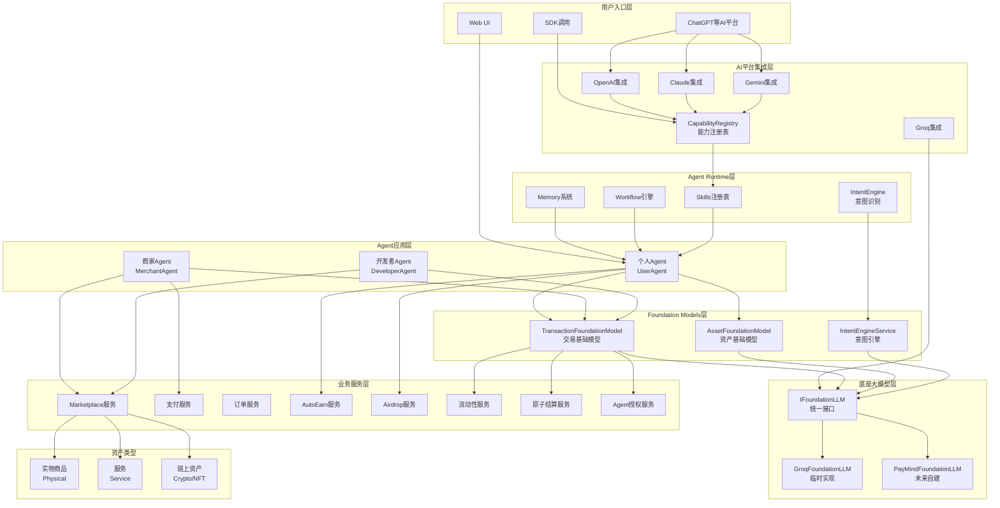
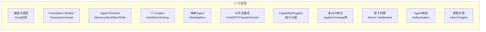
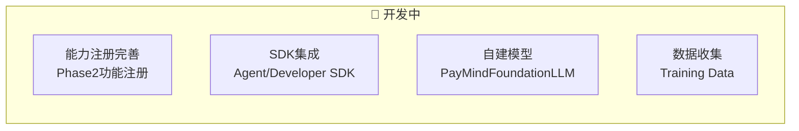
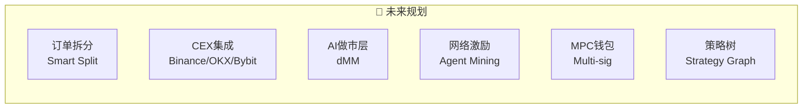
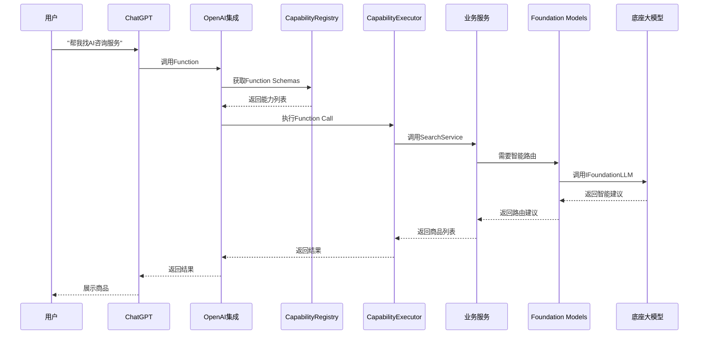
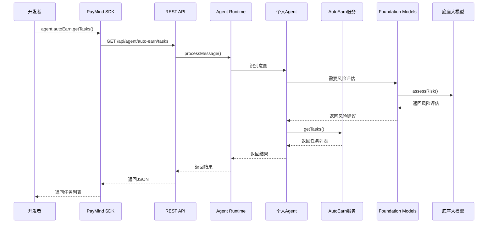
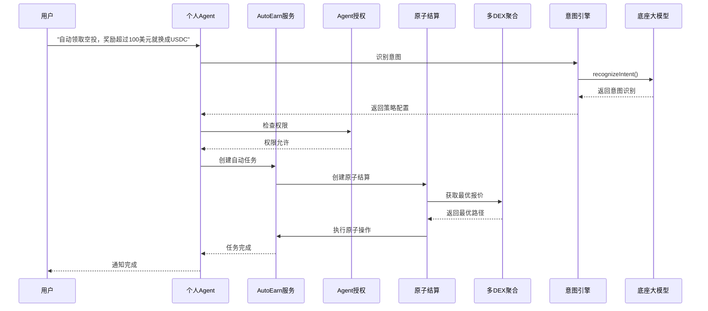
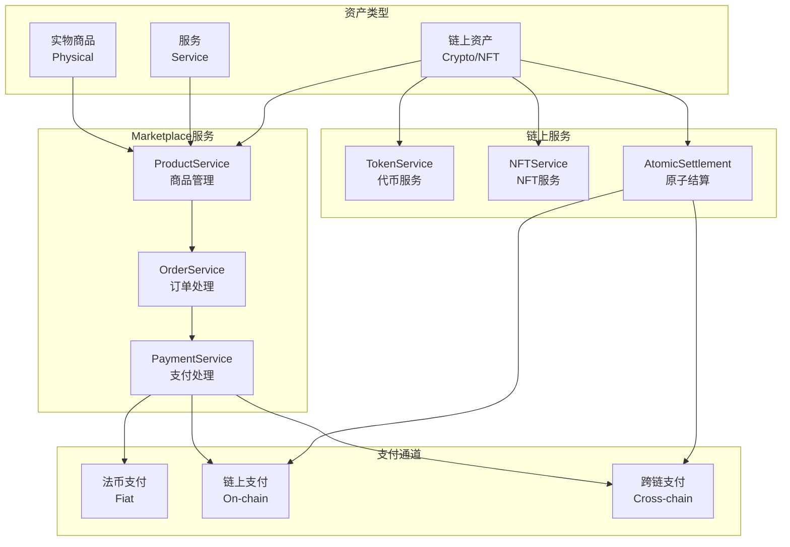
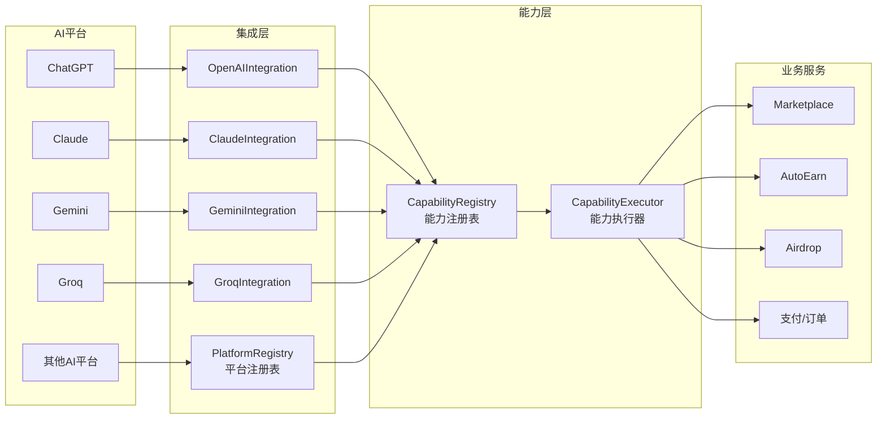
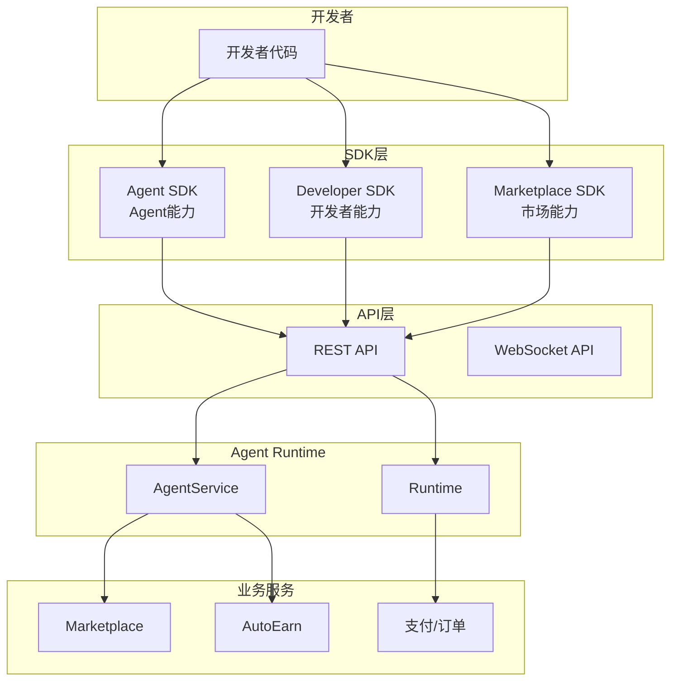

# PayMind 整体架构框架图

**版本**: V2.0  
**日期**: 2025-01-XX  
**状态**: 完整架构说明，包含已实现、开发中、未来规划

---

## 📊 整体架构概览

### 核心架构层次

```
┌─────────────────────────────────────────────────────────────────────────┐
│                        用户入口层                                          │
│  ┌──────────┐  ┌──────────┐  ┌──────────┐  ┌──────────┐  ┌──────────┐  │
│  │ ChatGPT  │  │ Claude   │  │ Gemini   │  │ SDK调用  │  │ Web UI   │  │
│  │ 等AI平台 │  │ 等AI平台 │  │ 等AI平台 │  │          │  │          │  │
│  └────┬─────┘  └────┬─────┘  └────┬─────┘  └────┬─────┘  └────┬─────┘  │
└───────┼──────────────┼──────────────┼──────────────┼──────────────┼───────┘
        │              │              │              │              │
        └──────────────┴──────────────┴──────────────┴──────────────┘
                                    │
        ┌───────────────────────────┴───────────────────────────┐
        │              AI平台集成层 (Capability Registry)         │
        │  ┌──────────────┐  ┌──────────────┐  ┌──────────────┐ │
        │  │ OpenAI集成   │  │ Claude集成   │  │ Gemini集成   │ │
        │  │ Groq集成     │  │ 其他AI平台   │  │              │ │
        │  └──────┬───────┘  └──────┬───────┘  └──────┬───────┘ │
        └─────────┼──────────────────┼──────────────────┼─────────┘
                  │                  │                  │
        ┌─────────┴──────────────────┴──────────────────┴─────────┐
        │              Agent Runtime 层                              │
        │  ┌──────────────┐  ┌──────────────┐  ┌──────────────┐   │
        │  │ Memory系统   │  │ Workflow引擎  │  │ Skills注册表  │   │
        │  │ 上下文管理   │  │ 流程编排      │  │ 能力执行      │   │
        │  └──────┬───────┘  └──────┬───────┘  └──────┬───────┘   │
        └─────────┼──────────────────┼──────────────────┼─────────┘
                  │                  │                  │
        ┌─────────┴──────────────────┴──────────────────┴─────────┐
        │              Agent 应用层                                  │
        │  ┌──────────────┐  ┌──────────────┐  ┌──────────────┐   │
        │  │ 个人Agent    │  │ 商家Agent    │  │ 开发者Agent  │   │
        │  │ (UserAgent)  │  │(MerchantAgent│  │(DeveloperAgent│   │
        │  └──────┬───────┘  └──────┬───────┘  └──────┬───────┘   │
        └─────────┼──────────────────┼──────────────────┼─────────┘
                  │                  │                  │
        ┌─────────┴──────────────────┴──────────────────┴─────────┐
        │              Foundation Models 层                          │
        │  ┌──────────────┐  ┌──────────────┐  ┌──────────────┐   │
        │  │ Transaction  │  │ Asset        │  │ Intent       │   │
        │  │ Foundation   │  │ Foundation   │  │ Engine       │   │
        │  └──────┬───────┘  └──────┬───────┘  └──────┬───────┘   │
        └─────────┼──────────────────┼──────────────────┼─────────┘
                  │                  │                  │
        ┌─────────┴──────────────────┴──────────────────┴─────────┐
        │              底座大模型接口层 (IFoundationLLM)              │
        │  ┌──────────────┐  ┌──────────────┐  ┌──────────────┐   │
        │  │ Groq实现     │  │ 自建模型     │  │ 其他LLM      │   │
        │  │ (临时)       │  │ (未来)       │  │ (可选)       │   │
        │  └──────────────┘  └──────────────┘  └──────────────┘   │
        └──────────────────────────────────────────────────────────┘
```

---

## 🏗️ 详细架构图

### 1. 完整架构流程图



---

## 📋 功能状态图

### 2. 已实现功能 ✅



### 3. 开发中功能 🚧



### 4. 未来规划 🔮



---

## 🔄 完整调用流程

### 场景1: ChatGPT调用PayMind功能



### 场景2: SDK调用个人Agent能力



### 场景3: 个人Agent使用Phase2功能增强AutoEarn



---

## 🎯 资产类型处理流程

### 资产类型架构



---

## 🔌 AI平台集成架构

### AI平台集成流程



---

## 🚀 SDK架构

### SDK调用架构



---

## 📊 功能状态矩阵

### 完整功能状态表

| 功能模块 | 子功能 | 状态 | 说明 |
|---------|--------|------|------|
| **底座大模型** | Groq实现 | ✅ 已实现 | 临时方案，通过IFoundationLLM接口 |
| | 自建模型 | 🔮 未来 | 逐步过渡，收集训练数据 |
| **Foundation Models** | TransactionFoundationModel | ✅ 已实现 | 支付路由、风险评估、手续费估算 |
| | AssetFoundationModel | ✅ 已实现 | 资产聚合、交易分类、风险建议 |
| | IntentEngine | ✅ 已实现 | 意图识别、策略转换 |
| **Agent Runtime** | Memory系统 | ✅ 已实现 | 上下文管理 |
| | Workflow引擎 | ✅ 已实现 | 流程编排 |
| | Skills注册表 | ✅ 已实现 | 能力执行 |
| **个人Agent** | AutoEarn | ✅ 已实现 | 自动收益任务 |
| | Airdrop | ✅ 已实现 | 空投发现和领取 |
| | Phase2增强 | 🚧 开发中 | 使用原子结算、多DEX聚合等 |
| **商家Agent** | Marketplace | ✅ 已实现 | 商品管理、订单处理 |
| | 支付处理 | ✅ 已实现 | 多通道支付 |
| **开发者Agent** | API生成 | ⚠️ 部分 | 基础功能 |
| | SDK生成 | ⚠️ 部分 | 基础功能 |
| **AI平台集成** | ChatGPT | ✅ 已实现 | Function Calling |
| | Claude | ✅ 已实现 | Tools支持 |
| | Gemini | ✅ 已实现 | Function Calling |
| | Groq | ✅ 已实现 | Function Calling（可选） |
| **能力注册** | CapabilityRegistry | ✅ 已实现 | 系统能力注册 |
| | 个人能力注册 | 🚧 开发中 | Phase2功能注册 |
| | 外部暴露控制 | 🚧 开发中 | enabled/externalExposed字段 |
| **流动性服务** | 多DEX聚合 | ✅ 已实现 | Jupiter/Uniswap/Raydium等 |
| | 最优执行 | ✅ 已实现 | BestExecutionService |
| | CEX集成 | 🔮 未来 | Binance/OKX/Bybit |
| **交易执行** | 原子结算 | ✅ 已实现 | AtomicSettlementService |
| | 订单拆分 | 🔮 未来 | Smart Split（暂缓） |
| | Agent授权 | ✅ 已实现 | AgentAuthorizationService |
| **资产类型** | 实物商品 | ✅ 已实现 | Physical Products |
| | 服务 | ✅ 已实现 | Services |
| | 链上资产 | ✅ 已实现 | Crypto/NFT |
| **SDK** | Agent SDK | 🚧 开发中 | 个人Agent能力 |
| | Developer SDK | 🚧 开发中 | 开发者能力 |
| | Marketplace SDK | ✅ 已实现 | 市场能力 |

---

## 🎨 可视化架构图（ASCII Art）

### 完整系统架构

```
┌─────────────────────────────────────────────────────────────────────────────┐
│                          用户入口层                                           │
│  ┌──────────┐  ┌──────────┐  ┌──────────┐  ┌──────────┐  ┌──────────┐    │
│  │ ChatGPT  │  │ Claude   │  │ Gemini   │  │ SDK调用  │  │ Web UI   │    │
│  │ ✅已实现 │  │ ✅已实现 │  │ ✅已实现 │  │ 🚧开发中 │  │ ✅已实现 │    │
│  └────┬─────┘  └────┬─────┘  └────┬─────┘  └────┬─────┘  └────┬─────┘    │
└───────┼──────────────┼──────────────┼──────────────┼──────────────┼───────┘
        │              │              │              │              │
        └──────────────┴──────────────┴──────────────┴──────────────┘
                                    │
        ┌───────────────────────────┴───────────────────────────┐
        │         AI平台集成层 (Capability Registry)             │
        │  ┌──────────────┐  ┌──────────────┐  ┌──────────────┐ │
        │  │ OpenAI集成   │  │ Claude集成   │  │ Gemini集成   │ │
        │  │ ✅已实现     │  │ ✅已实现     │  │ ✅已实现     │ │
        │  └──────┬───────┘  └──────┬───────┘  └──────┬───────┘ │
        │  ┌──────────────┐  ┌──────────────┐                  │
        │  │ Groq集成     │  │ 平台注册表   │                  │
        │  │ ✅已实现     │  │ ✅已实现     │                  │
        │  └──────┬───────┘  └──────┬───────┘                  │
        └─────────┼──────────────────┼──────────────────────────┘
                  │                  │
        ┌─────────┴──────────────────┴──────────────────────────┐
        │              Agent Runtime 层                          │
        │  ┌──────────────┐  ┌──────────────┐  ┌──────────────┐ │
        │  │ Memory系统   │  │ Workflow引擎 │  │ Skills注册表 │ │
        │  │ ✅已实现     │  │ ✅已实现     │  │ ✅已实现     │ │
        │  └──────┬───────┘  └──────┬───────┘  └──────┬───────┘ │
        │  ┌──────────────┐                          │          │
        │  │ IntentEngine │                          │          │
        │  │ ✅已实现     │                          │          │
        │  └──────┬───────┘                          │          │
        └─────────┼──────────────────────────────────┼──────────┘
                  │                                  │
        ┌─────────┴──────────────────────────────────┴──────────┐
        │              Agent 应用层                              │
        │  ┌──────────────┐  ┌──────────────┐  ┌──────────────┐│
        │  │ 个人Agent   │  │ 商家Agent    │  │ 开发者Agent  ││
        │  │ ✅已实现     │  │ ✅已实现     │  │ ⚠️部分实现   ││
        │  │ -AutoEarn   │  │ -Marketplace │  │ -API生成     ││
        │  │ -Airdrop    │  │ -订单处理    │  │ -SDK生成     ││
        │  │ 🚧Phase2增强 │  │ -支付处理    │  │              ││
        │  └──────┬───────┘  └──────┬───────┘  └──────┬───────┘│
        └─────────┼──────────────────┼──────────────────┼────────┘
                  │                  │                  │
        ┌─────────┴──────────────────┴──────────────────┴────────┐
        │              Foundation Models 层                        │
        │  ┌──────────────┐  ┌──────────────┐  ┌──────────────┐  │
        │  │ Transaction │  │ Asset        │  │ Intent       │  │
        │  │ Foundation  │  │ Foundation   │  │ Engine       │  │
        │  │ ✅已实现     │  │ ✅已实现     │  │ ✅已实现     │  │
        │  └──────┬───────┘  └──────┬───────┘  └──────┬───────┘  │
        └─────────┼──────────────────┼──────────────────┼─────────┘
                  │                  │                  │
        ┌─────────┴──────────────────┴──────────────────┴─────────┐
        │        底座大模型接口层 (IFoundationLLM)                   │
        │  ┌──────────────┐  ┌──────────────┐  ┌──────────────┐   │
        │  │ Groq实现     │  │ 自建模型     │  │ 其他LLM      │   │
        │  │ ✅已实现     │  │ 🔮未来       │  │ 🔮可选       │   │
        │  │ (临时)       │  │ (目标)       │  │              │   │
        │  └──────────────┘  └──────────────┘  └──────────────┘   │
        └──────────────────────────────────────────────────────────┘
                  │                  │                  │
        ┌─────────┴──────────────────┴──────────────────┴─────────┐
        │              业务服务层                                    │
        │  ┌──────────────┐  ┌──────────────┐  ┌──────────────┐  │
        │  │ Marketplace  │  │ AutoEarn     │  │ Airdrop      │  │
        │  │ ✅已实现     │  │ ✅已实现     │  │ ✅已实现     │  │
        │  └──────┬───────┘  └──────┬───────┘  └──────┬───────┘  │
        │  ┌──────────────┐  ┌──────────────┐  ┌──────────────┐ │
        │  │ 支付/订单    │  │ 流动性服务   │  │ 原子结算     │ │
        │  │ ✅已实现     │  │ ✅已实现     │  │ ✅已实现     │ │
        │  └──────┬───────┘  └──────┬───────┘  └──────┬───────┘ │
        │  ┌──────────────┐  ┌──────────────┐                  │
        │  │ Agent授权    │  │ 多DEX聚合    │                  │
        │  │ ✅已实现     │  │ ✅已实现     │                  │
        │  └──────┬───────┘  └──────┬───────┘                  │
        └─────────┼──────────────────┼──────────────────────────┘
                  │                  │
        ┌─────────┴──────────────────┴──────────────────────────┐
        │              资产类型层                                 │
        │  ┌──────────────┐  ┌──────────────┐  ┌──────────────┐│
        │  │ 实物商品     │  │ 服务          │  │ 链上资产     ││
        │  │ ✅已实现     │  │ ✅已实现     │  │ ✅已实现     ││
        │  │ Physical     │  │ Service      │  │ Crypto/NFT   ││
        │  └──────────────┘  └──────────────┘  └──────────────┘│
        └────────────────────────────────────────────────────────┘
```

---

## 🔄 关键流程说明

### 1. AI平台调用流程

```
用户 → AI平台 → AI集成层 → CapabilityRegistry → CapabilityExecutor → 业务服务
                                                      ↓
                                              Foundation Models (可选)
                                                      ↓
                                              底座大模型 (可选)
```

### 2. SDK调用流程

```
开发者 → SDK → REST API → Agent Runtime → Agent应用层 → 业务服务
                                              ↓
                                      Foundation Models
                                              ↓
                                      底座大模型
```

### 3. 个人Agent增强流程

```
用户意图 → IntentEngine → 底座大模型识别 → StrategyGraph → 
Agent授权检查 → 原子结算 → 多DEX聚合 → 执行 → 返回结果
```

---

## 📝 功能状态说明

### ✅ 已实现功能
- 底座大模型（Groq临时实现）
- Foundation Models（Transaction/Asset）
- Agent Runtime（Memory/Workflow/Skills）
- 个人Agent（AutoEarn/Airdrop）
- 商家Agent（Marketplace）
- AI平台集成（ChatGPT/Claude/Gemini）
- 多DEX聚合（Jupiter/Uniswap等）
- 原子结算
- Agent授权
- 意图交易

### 🚧 开发中功能
- Phase2功能注册为个人能力
- SDK完善（Agent/Developer SDK）
- 能力确认机制（externalExposed字段）
- 自建模型数据收集

### 🔮 未来规划
- 订单拆分（Smart Split）
- CEX集成（Binance/OKX/Bybit）
- AI做市层（dMM）
- 网络激励（Agent Mining）
- MPC钱包
- 策略树完善

---

## 🎯 关键设计原则

1. **分层架构**：清晰的层次划分，每层职责明确
2. **统一接口**：IFoundationLLM统一底座大模型接口
3. **能力注册**：所有能力通过CapabilityRegistry注册
4. **可扩展性**：支持新AI平台、新资产类型、新能力
5. **向后兼容**：保持现有功能不变，逐步增强

---

**最后更新**: 2025-01-XX

