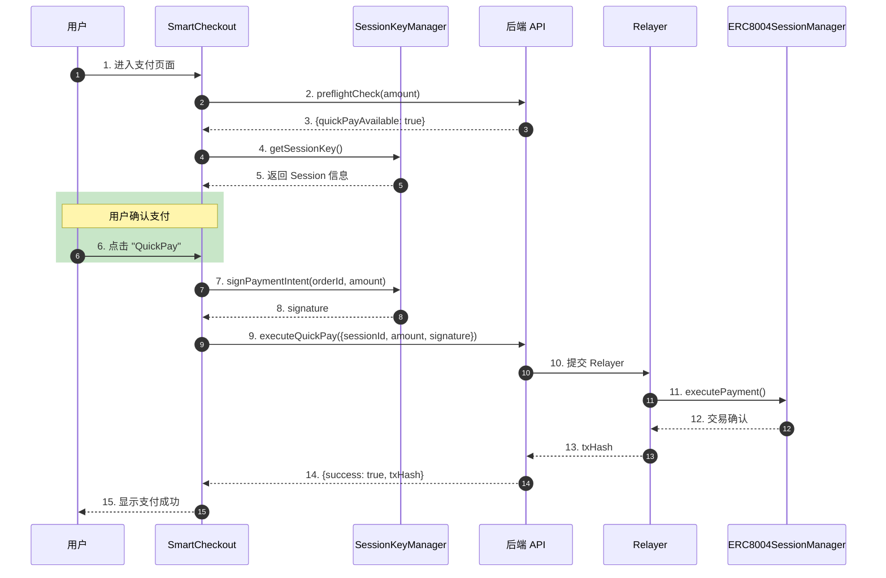
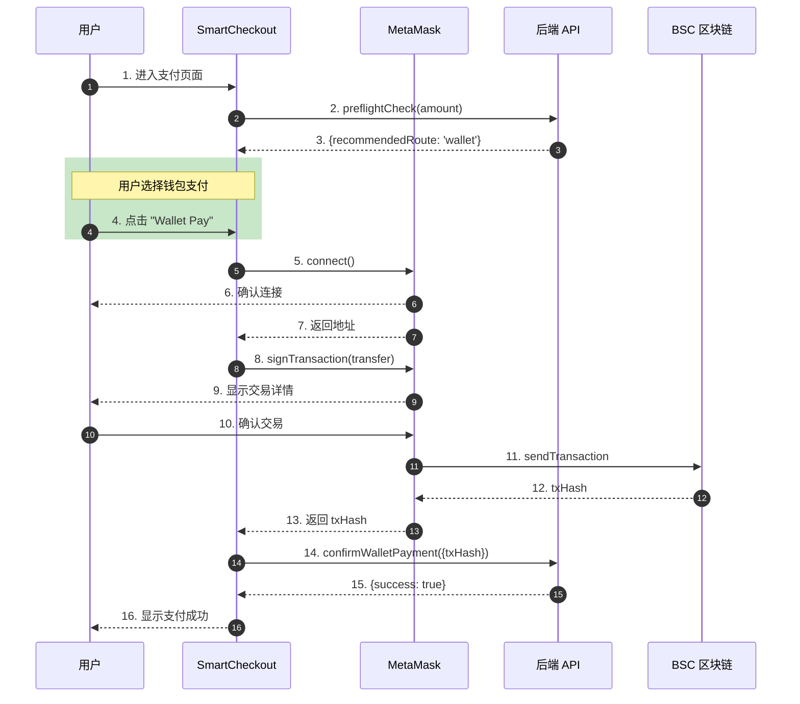
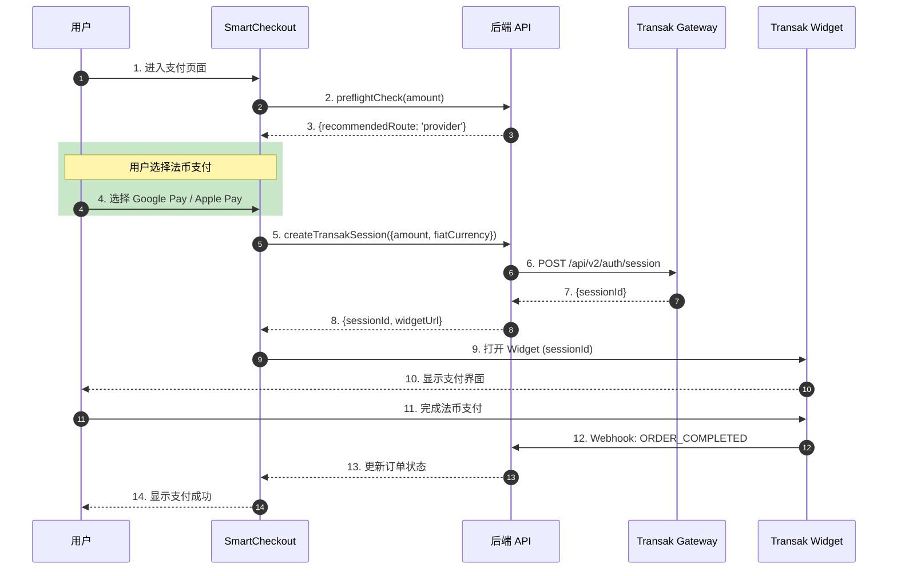

# SmartCheckout 支付系统文档 V9.0

**版本**: 9.0  
**更新日期**: 2026年1月21日  
**网络**: BSC Testnet (Chain ID: 97)  
**分支**: feat/smartcheckout-layout

> **V9.0 更新**: 新增 Stripe 原生支付通道，支持 Google Pay / Apple Pay / 信用卡直接法币结算

---

## 📋 目录

1. [系统概述](#1-系统概述)
2. [支付方式](#2-支付方式)
3. [组件架构](#3-组件架构)
4. [支付流程详解](#4-支付流程详解)
5. [Session 授权机制](#5-session-授权机制)
6. [Transak 法币集成](#6-transak-法币集成)
7. [汇率转换机制](#7-汇率转换机制)
8. [已知问题与解决方案](#8-已知问题与解决方案)
9. [配置参考](#9-配置参考)

---

## 1. 系统概述

### 1.1 SmartCheckout 简介

SmartCheckout 是 Agentrix 的核心支付组件，提供统一的支付入口，支持多种支付方式的智能路由。

**核心特性**:
- ⚡ **QuickPay**: 一键免 Gas 支付（基于 Session 授权）
- 💳 **Wallet Pay**: 直接钱包转账（ERC20 代币）
- 🏦 **Fiat Payment (Transak)**: 法币→加密货币支付（需KYC）
- 💳 **Fiat Payment (Stripe)**: 原生法币支付（无需KYC，直接法币结算）

### 1.2 技术栈

| 层级 | 技术 |
|------|------|
| 前端框架 | Next.js + TypeScript |
| 区块链交互 | ethers.js v6 |
| 状态管理 | React Hooks |
| UI 组件 | Tailwind CSS + Lucide Icons |
| 法币网关 (加密) | Transak (Staging/Production) |
| 法币网关 (直结) | Stripe (Test/Live) |

### 1.3 合约地址 (BSC Testnet)

| 代币 | 地址 | 精度 |
|------|------|------|
| **USDT** | `0x337610d27c682E347C9cD60BD4b3b107C9d34dDd` | 18 |
| **USDC** | `0x64544969ed7EBf5f083679233325356EbE738930` | 6 |

---

## 2. 支付方式

### 2.1 支付方式对比

| 支付方式 | Gas 费 | KYC | 适用场景 | 最小金额 | 费率 |
|---------|--------|-----|---------|----------|------|
| **QuickPay** | 无 (Gasless) | 否 | 小额高频 | 无限制 | 0% |
| **Wallet Pay** | 用户承担 | 否 | 即时支付 | 无限制 | Gas费 |
| **Fiat (Stripe)** | 无 | 否 | 法币直结 | $0.50 | 2.9% |
| **Fiat (Transak)** | 无 | 是 | 法币→加密 | $30 USD | 3-5% |

### 2.2 QuickPay (快捷支付)

**原理**: 用户预先创建 Session 授权，在限额内可一键支付。

**限制检查** (V8.0 新增):
```typescript
// 从 session 根级别读取限额 (已修复)
const singleLimit = session?.singleLimit ? parseFloat(String(session.singleLimit)) : 0;
const dailyLimit = session?.dailyLimit ? parseFloat(String(session.dailyLimit)) : 0;
const usedToday = session?.usedToday ? parseFloat(String(session.usedToday)) : 0;
const dailyRemaining = dailyLimit - usedToday;

// 只有限额 > 0 时才检查是否超限
const hasValidLimits = singleLimit > 0 && dailyLimit > 0;
const exceedsLimit = session && hasValidLimits && cryptoAmount && 
  (cryptoAmount > singleLimit || cryptoAmount > dailyRemaining);
```

**显示状态**:
- ✅ 可用: 显示为可点击的紫色卡片
- ⚠️ 超限: 显示 "Exceeds session limit"，灰色不可点击
- ❌ 无 Session: 显示 "Enable for instant payment"

### 2.3 Wallet Pay (钱包支付)

**流程**:
1. 检查钱包连接状态
2. 获取代币余额
3. 调用 ERC20 `transfer` 方法
4. 等待交易确认

**错误处理** (V8.0 新增):
- 余额不足时在卡片内显示红色错误提示
- 用户拒绝签名时显示具体原因

### 2.4 Fiat Payment - Stripe (法币直结) 🆕

**V9.0 新增**: 原生 Stripe 支付，无需法币→加密货币转换

**支持的支付方式**:
| 支付方式 | 最低金额 | 费率 | 特点 |
|---------|---------|------|------|
| Google Pay | $0.50 | 2.9% | 无需KYC，即时确认 |
| Apple Pay | $0.50 | 2.9% | 无需KYC，即时确认 |
| Credit Card | $0.50 | 2.9%+$0.30 | Visa/Mastercard/银联 |

**适用场景**:
- ✅ 商户配置为接受法币直结
- ✅ 用户不想做KYC
- ✅ 小额订单 (<$30)

**费用承担方**:
- **处理费 (2.9%)**: 用户承担，显示在支付总额中
- **平台费/通道费**: 商户承担

**结算周期**:
- Stripe T+2 到达平台账户
- 平台 T+3 批量结算给商户/Agent

### 2.5 Fiat Payment - Transak (法币→加密)

**原有功能**: 通过 Transak 将法币转换为 USDC，链上结算

**支持的渠道**:
- Google Pay (Min: $5)
- Apple Pay (Min: $5)
- Credit/Debit Card (Min: $30)
- Bank Transfer (因地区而异)

**本地化支付** (按货币):
| 货币 | 额外支持的渠道 |
|------|---------------|
| EUR | SEPA Bank Transfer |
| GBP | Faster Payments |
| USD | ACH / Fedwire |
| CNY | 本地银行卡 (需 KYC) |

**适用场景**:
- ✅ 商户仅接受加密货币
- ✅ 需要链上自动分账
- ⚠️ 大额订单 (≥$30)

### 2.6 支付路由决策 🆕

```
用户选择 "Google Pay"
    ↓
智能路由检查商户配置
    ↓
┌─────────────────────────────────────┐
│  商户接受法币直结?                    │
│  ├── Yes → Stripe 处理              │
│  └── No  → Transak 处理 (法币→USDC)  │
└─────────────────────────────────────┘
    ↓
用户无感知，统一显示 "Google Pay" 图标
```

**UI 设计原则**:
- ✅ 显示支付方式图标: Google Pay, Apple Pay, Visa
- ✅ 显示处理费率: "处理费 2.9%"
- ❌ **不显示**: Stripe / Transak 等底层通道名称
- ❌ **不显示**: 分佣明细 (仅商户后台可见)

---

## 3. 组件架构

### 3.1 核心组件

```
SmartCheckout.tsx (主组件)
├── CryptoSection()           - 加密货币支付区域
│   ├── QuickPay Card         - 一键支付
│   └── Wallet Pay Card       - 钱包支付
├── FiatSection()             - 法币支付区域
│   ├── Google Pay            - Google 支付 (Stripe/Transak)
│   ├── Apple Pay             - Apple 支付 (Stripe/Transak)
│   └── Card Payment          - 信用卡支付 (Stripe/Transak)
├── SessionManager            - Session 管理弹窗
├── StripePaymentModal        - Stripe 支付弹窗 🆕
├── TransakWhiteLabelModal    - Transak 白标集成
└── TransakWidget             - Transak SDK/iframe
```

### 3.2 状态管理

```typescript
// 核心状态
const [status, setStatus] = useState<Status>('loading');  // loading | ready | processing | success | error
const [routeType, setRouteType] = useState<RouteType>('quickpay');  // quickpay | wallet | provider
const [error, setError] = useState<string | null>(null);

// Session 相关
const [currentSession, setCurrentSession] = useState<any>(null);
const { activeSession, loadActiveSession } = useSessionManager();

// 汇率相关
const [exchangeRate, setExchangeRate] = useState<number | null>(null);
const [cryptoAmount, setCryptoAmount] = useState<number | null>(null);
```

---

## 4. 支付流程详解

### 4.1 初始化流程

```
页面加载
    ↓
加载用户信息 (userApi.getProfile)
    ↓
检查钱包连接状态
    ↓
加载 Session (loadActiveSession)
    ↓
执行预检查 (paymentApi.preflightCheck)
    ↓
获取汇率 (如果是法币订单)
    ↓
设置默认支付路由
    ↓
显示 SmartCheckout UI
```

### 4.2 QuickPay 流程

```typescript
const handleQuickPay = async () => {
  // 1. 获取 Session
  const session = currentSession || activeSession;
  
  // 2. 处理法币订单 (V8.0 新增)
  if (isFiatCurrency) {
    // 转换为 USDT 金额
    paymentAmount = cryptoAmount;
    paymentCurrency = 'USDT';
  }
  
  // 3. 获取代币元数据
  const { address: tokenAddress, decimals } = getTokenMetadata(paymentCurrency);
  
  // 4. 计算链上金额
  const amountInSmallestUnit = ethers.parseUnits(paymentAmount.toFixed(decimals), decimals);
  
  // 5. 生成签名
  const signature = await SessionKeyManager.signPaymentIntent(...);
  
  // 6. 调用后端 Relayer
  const result = await paymentApi.executeQuickPay({
    sessionId, orderId, amount, signature, ...
  });
}
```

### 4.3 Wallet Pay 流程

```typescript
const handleWalletPay = async () => {
  // 1. 检查钱包连接
  if (!isConnected) throw new Error('Wallet not connected');
  
  // 2. 获取代币合约
  const tokenContract = new ethers.Contract(tokenAddress, ERC20_ABI, signer);
  
  // 3. 检查余额
  const balance = await tokenContract.balanceOf(userAddress);
  if (balance < requiredAmount) throw new Error('Insufficient balance');
  
  // 4. 执行转账
  const tx = await tokenContract.transfer(merchantAddress, requiredAmount);
  
  // 5. 等待确认
  await tx.wait();
  
  // 6. 通知后端
  await paymentApi.confirmWalletPayment({ txHash: tx.hash, orderId });
}
```

---

## 5. Session 授权机制

### 5.1 Session 数据结构

```typescript
interface Session {
  id: string;
  sessionId: string;           // 链上 Session ID
  signer: string;              // 签名者地址
  singleLimit: number;         // 单笔限额 (USDT)
  dailyLimit: number;          // 日限额 (USDT)
  usedToday: number;           // 今日已用
  expiry: Date;                // 过期时间
  isActive: boolean;           // 是否激活
}
```

### 5.2 限额检查逻辑 (V8.0 修复)

**之前的问题**: 代码读取 `session.limit.singleLimit`，但后端返回 `session.singleLimit`

**修复后**:
```typescript
// 正确读取限额 (直接从根级别)
const singleLimit = session?.singleLimit ? parseFloat(String(session.singleLimit)) : 0;
const dailyLimit = session?.dailyLimit ? parseFloat(String(session.dailyLimit)) : 0;
const dailyRemaining = dailyLimit - usedToday;

// 只有限额有效时才检查
const hasValidLimits = singleLimit > 0 && dailyLimit > 0;
const exceedsLimit = hasValidLimits && cryptoAmount > singleLimit;
```

---

## 6. Transak 法币集成

### 6.1 配置要求

```env
# 后端 .env
TRANSAK_ENVIRONMENT=STAGING           # 或 PRODUCTION
TRANSAK_API_KEY=7f03deb8-...          # Staging API Key
TRANSAK_WEBHOOK_URL=https://api.agentrix.top/api/payments/provider/transak/webhook
```

### 6.2 集成方式

**方案 1: Create Session API (推荐)**
- 后端调用 Transak API 创建 Session
- 返回 `sessionId` 和 `widgetUrl`
- 金额锁定，用户无法修改

**方案 2: URL 参数 (降级)**
- 直接传递 URL 参数
- Staging 环境不支持金额锁定
- 用户可能修改金额

### 6.3 已知网络问题

| 问题 | 原因 | 解决方案 |
|------|------|---------|
| Cloudflare 403 | 中国 IP 被封锁 | 部署到海外服务器 |
| CORS 错误 | SDK 跨域加载失败 | 使用 iframe 降级 |
| 金额未锁定 | Create Session API 失败 | 修复网络后重试 |

---

## 7. 汇率转换机制

### 7.1 法币订单处理

当订单货币为法币 (CNY/USD/EUR) 时:

```typescript
// 1. 获取实时汇率
const rateInfo = await paymentApi.getExchangeRate(currency, 'USDT');
setExchangeRate(rateInfo.rate);

// 2. 计算 USDT 金额 (含 3% 缓冲)
const usdtAmount = (order.amount / rateInfo.rate) * 1.03;
setCryptoAmount(usdtAmount);

// 3. QuickPay 使用 USDT 金额
if (isFiatCurrency) {
  paymentAmount = cryptoAmount;
  paymentCurrency = 'USDT';
}
```

### 7.2 显示格式

- 订单金额: `$0.01 USD` (原始法币)
- 换算金额: `≈ 0.01 USDT` (加密货币)

---

## 8. 端对端支付时序图

### 8.1 QuickPay 完整流程



### 8.2 Wallet Pay 完整流程



### 8.3 Transak 法币支付流程



---

## 9. 已知问题与解决方案

### 9.1 QuickPay 总是显示 "Exceeds session limit"

**原因**: 前端读取 `session.limit.singleLimit`，但后端返回 `session.singleLimit`

**状态**: ✅ 已修复 (V8.0)

### 9.2 Wallet Pay 错误不易看到

**原因**: 错误只显示在页面底部

**状态**: ✅ 已修复 - 在卡片内显示内联错误

### 9.3 Transak 金额默认 250 EUR

**原因**: 
1. Create Session API 被 Cloudflare 阻止
2. Staging 环境不支持 URL 参数锁定金额

**状态**: ⏸️ 需要网络修复

**临时解决**: 部署后端到海外服务器 (新加坡)

### 9.4 QuickPay 法币订单报错 "暂不支持 USD 支付"

**原因**: QuickPay 未处理法币→USDT 转换

**状态**: ✅ 已修复 (V8.0) - 自动转换为 USDT 支付

---

## 10. 配置参考

### 10.1 环境变量

```env
# 前端 (.env.local)
NEXT_PUBLIC_BSC_TESTNET_RPC_URL=https://bsc-testnet.publicnode.com
NEXT_PUBLIC_BSC_TESTNET_USDT_ADDRESS=0x337610d27c682E347C9cD60BD4b3b107C9d34dDd
NEXT_PUBLIC_BSC_TESTNET_USDC_ADDRESS=0x64544969ed7EBf5f083679233325356EbE738930
NEXT_PUBLIC_STRIPE_PUBLISHABLE_KEY=pk_test_xxx

# 后端 (.env)
TRANSAK_ENVIRONMENT=STAGING
TRANSAK_API_KEY=7f03deb8-ee24-49b3-a919-31e7d9244030

# Stripe 配置 🆕
STRIPE_SECRET_KEY=sk_test_xxx
STRIPE_PUBLISHABLE_KEY=pk_test_xxx
STRIPE_WEBHOOK_SECRET=whsec_xxx
```

### 10.2 API 端点

| 端点 | 方法 | 描述 |
|------|------|------|
| `/api/payment/preflight` | GET | 预检查 |
| `/api/sessions/active` | GET | 获取活跃 Session |
| `/api/payments/exchange-rate/quotes` | GET | 获取汇率 |
| `/api/payments/provider/transak/session` | POST | 创建 Transak Session |
| `/api/payments/stripe/create-intent` | POST | 创建 Stripe PaymentIntent 🆕 |
| `/api/payments/stripe/webhook` | POST | Stripe Webhook 接收 🆕 |
| `/api/payments/stripe/confirm` | POST | 确认 Stripe 支付 🆕 |

---

## 📊 版本历史

| 版本 | 日期 | 主要更新 |
|------|------|---------|
| V9.0 | 2026-01-21 | **新增 Stripe 原生支付**、支付路由决策逻辑、费用承担方说明 |
| V8.0 | 2025-01-17 | 添加端对端时序图、修复 Session 限额读取、QuickPay 法币支持、Wallet Pay 错误显示 |
| V7.0 | 2025-01 | 统一支付流程重构 |
| V6.0 | 2024-12 | Transak 白标集成 |

---

**文档维护**: Agentrix Team  
**最后更新**: 2026-01-21
