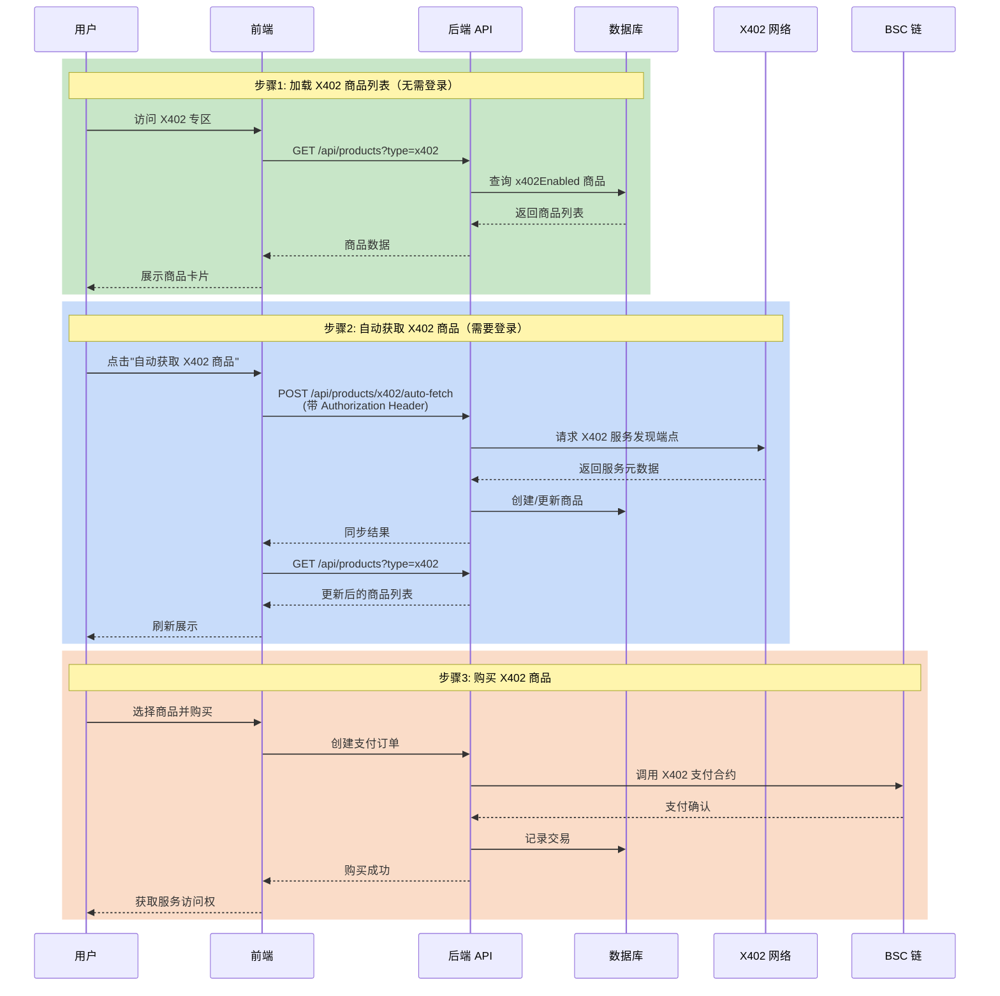

# X402 商品获取流程文档

## 1. 概述

X402 是一种基于 HTTP 402 状态码的去中心化支付协议，允许 API 服务提供商通过区块链接受微支付。Agentrix 平台支持 X402 协议商品的自动发现和同步。

## 2. 当前状态

**我们目前处于第 1 步：商品展示和加载**

- ✅ 后端 API 正常返回 X402 商品列表
- ✅ 数据库中已有 5 个 X402 示例商品
- 🔄 前端自动获取功能需要用户登录认证

## 3. 完整流程图



## 4. 详细步骤说明

### 步骤 1: 加载商品列表（当前可用）

**前端调用:**
```typescript
// frontend/lib/api/product.api.ts
const data = await productApi.getProducts({ type: 'x402' });
```

**后端处理:**
```typescript
// backend/src/modules/product/product.service.ts
// 使用 QueryBuilder 查询 JSONB 字段
qb.andWhere(`(product.metadata->>'x402Enabled' = 'true' OR product.metadata->'x402Params' IS NOT NULL)`);
```

**API 端点:** `GET /api/products?type=x402`  
**认证:** 无需登录（公开接口）

### 步骤 2: 自动获取商品（需要登录）

**前端调用:**
```typescript
// frontend/components/marketplace/X402ProductSection.tsx
const response = await fetch(`${apiBaseUrl}/products/x402/auto-fetch`, {
  method: 'POST',
  headers: {
    'Authorization': `Bearer ${token}`,
    'Content-Type': 'application/json',
  },
});
```

**后端处理:**
```typescript
// backend/src/modules/product/product.service.ts
async autoFetchX402Products(userId: string) {
  // 1. 从 X402 服务发现端点获取商品
  const fetchedProducts = await this.fetchFromX402Network();
  
  // 2. 同步到数据库
  for (const product of fetchedProducts) {
    // 检查是否已存在，更新或创建
  }
}
```

**API 端点:** `POST /api/products/x402/auto-fetch`  
**认证:** 需要 JWT Token 或钱包连接

### 步骤 3: 购买商品（未完全实现）

目前购买流程使用标准支付通道，X402 原生支付功能尚未完全实现。

## 5. 公链与网络区分

### 当前支持

| 网络 | Chain ID | 状态 |
|------|----------|------|
| BSC Testnet | 97 | ✅ 主要支持 |
| BSC Mainnet | 56 | 🔄 准备中 |
| Ethereum Mainnet | 1 | 📋 计划中 |
| Polygon | 137 | 📋 计划中 |

### 网络配置

```env
# backend/.env
CHAIN_ID=97
BSC_TESTNET_RPC_URL=https://bsc-testnet.nodereal.io/v1/...
ERC8004_CONTRACT_ADDRESS=0x3310a6e841877f28C755bFb5aF90e6734EF059fA
```

### 测试网 vs 主网

- **测试网 (BSC Testnet, Chain ID 97)**
  - 当前开发和测试环境
  - 使用测试代币 (USDT)
  - 合约地址: `0x3310a6e841877f28C755bFb5aF90e6734EF059fA`

- **主网 (BSC Mainnet, Chain ID 56)**
  - 生产环境（未部署）
  - 需要部署新合约
  - 使用真实代币

## 6. X402 服务发现

### 当前服务源

```typescript
const x402ServiceUrls = [
  'https://raw.githubusercontent.com/coinbase/x402/master/examples/weather-service/x402.json',
  // 可添加更多已知的 X402 服务端点
];
```

### 默认示例商品

当外部服务不可用时，系统提供 5 个示例商品：

1. **AI 图像生成 API** - 0.01 USDT/次
2. **GPT-4 对话 API** - 0.005 USDT/次
3. **实时市场数据** - 0.001 USDT/次
4. **GPU 计算服务** - 0.0001 USDT/秒
5. **去中心化存储** - 0.00001 USDT/MB

## 7. 商品数据结构

```typescript
interface X402Product {
  id: string;
  name: string;
  description: string;
  price: number;  // 基础价格（可能为 0，实际价格在 x402Params 中）
  metadata: {
    x402Enabled: boolean;
    x402Network: string;  // 'BSC Testnet' | 'BSC Mainnet' | etc.
    x402Params: {
      scheme: 'exact' | 'upto';
      currency: 'USDT' | 'USDC' | 'ETH';
      paymentAddress: string;
      // 计价方式（取其一）
      pricePerRequest?: string;  // 每次调用
      pricePerQuery?: string;    // 每次查询
      pricePerSecond?: string;   // 每秒计费
      pricePerMB?: string;       // 每 MB 计费
    };
    sourceUrl: string;
    lastSyncAt: string;
  };
}
```

## 8. 故障排除

### "fail to fetch" 错误

1. 检查后端服务是否运行 (`npm run start:dev`)
2. 检查网络连接
3. 确认用户已登录（需要 `access_token`）

### "登录已过期" 错误

1. 重新登录获取新 token
2. 或连接钱包进行钱包认证

### 商品价格显示 0.00

这是正常的！X402 商品的实际价格在 `metadata.x402Params` 中：
- `pricePerRequest`: 按次计费
- `pricePerSecond`: 按秒计费
- `pricePerMB`: 按存储容量计费

## 9. 下一步计划

1. **实现 X402 原生支付**
   - 集成 X402 支付合约
   - 支持微支付流式付款

2. **添加更多 X402 服务源**
   - 支持自定义服务发现 URL
   - 接入 X402 服务注册表

3. **支持多链**
   - 部署主网合约
   - 支持 Ethereum、Polygon 等网络

4. **商户自助上架**
   - 允许商户注册自己的 X402 服务
   - 提供 X402 服务配置向导
