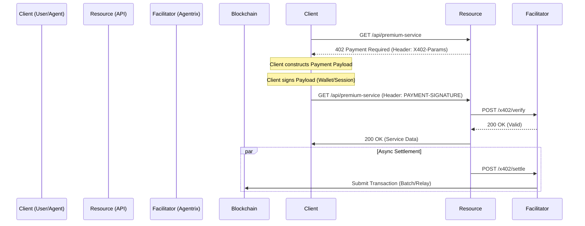

# X402 V2 协议升级与集成计划

**版本**: V2.0 (基于 Coinbase X402 官方最新标准)
**日期**: 2025年12月12日
**状态**: 规划中

---

## 1. 核心升级目标

将 Agentrix 现有的支付系统升级到 X402 V2 标准，实现以下核心能力：

1.  **HTTP 原生支付流 (HTTP Native Flow)**: 利用 HTTP `402 Payment Required` 状态码和标准 Header 进行交互，实现无缝的 API 支付。
2.  **统一支付架构**: 分离 `Scheme` (支付逻辑) 和 `Network` (底层网络)，实现多链和法币的统一支持。
3.  **Facilitator 模式**: 标准化支付验证与结算接口，支持第三方集成。
4.  **Marketplace 增强**: 实现基于标准协议的服务自动发现和去中心化评价。

---

## 2. 功能增强清单

### 2.1 协议层增强
- [x] **HTTP Native**: 废弃自定义 API 调用，转为拦截器模式。
- [x] **Scheme/Network 分离**: 支持 `exact` (精确金额) 和 `upto` (流式/限额) 等多种支付方案，运行于 EVM/Solana/Transak 等不同网络。
- [x] **Facilitator 接口**: 提供标准的 `/verify` 和 `/settle` 端点。

### 2.2 业务层增强
- [x] **QuickPay 升级**: 基于 V2 Session 标准，支持 SIWx (Sign-In-With-X)。
- [x] **法币自动路由**: 将 Transak 封装为 Fiat Facilitator，前端统一调用。
- [x] **动态 PayTo**: 支持将资金动态路由到分佣合约或商户钱包。

### 2.3 生态层增强 (Marketplace & Agent)
- [x] **服务自动发现**: 爬虫扫描 API 端点的 `x402.json` 自动上架服务。
- [x] **Agent 自主支付**: 赋予 Agent 子账户 Session Key，使其能自主调用付费 API。
- [x] **流式计费**: 针对 LLM 对话场景，使用 `upto` Scheme 实现按 Token 计费。

---

## 3. 实施工作清单 (Roadmap)

### 阶段一：核心协议适配 (Backend) [当前重点]

#### 1. 实现 X402 Guard (中间件)
- **目标**: 拦截受保护 API，返回标准 402 响应。
- **文件**: `backend/src/common/guards/x402.guard.ts`
- **逻辑**: 
    - 检查 `PAYMENT-SIGNATURE` Header。
    - 缺失时返回 `402 Payment Required`。
    - Header 中包含 `WWW-Authenticate: X402 <params>` 或自定义 `X402-Payment-Required`。

#### 2. 重构 Relayer 为 Facilitator
- **目标**: 标准化验证与结算服务。
- **文件**: 
    - `backend/src/modules/payment/facilitator.service.ts`
    - `backend/src/modules/payment/facilitator.controller.ts`
- **接口**:
    - `POST /x402/verify`: 验证签名。
    - `POST /x402/settle`: 提交上链。

#### 3. 升级 Payload 结构
- **目标**: 兼容 V2 数据格式。
- **文件**: `backend/src/modules/payment/x402.service.ts`
- **改动**: 增加 `scheme` (如 `exact`) 和 `network` (如 `base`, `solana`) 字段。

### 阶段二：前端与客户端适配 (Frontend/SDK)

#### 4. 升级 API Client
- **目标**: 自动处理 402 响应。
- **文件**: `frontend/lib/api/client.ts`
- **逻辑**: 拦截 402 -> 唤起 SmartCheckout -> 支付 -> 重试请求。

#### 5. 更新 SmartCheckout 组件
- **目标**: 解析 V2 元数据。
- **文件**: `frontend/components/payment/SmartCheckout.tsx`

### 阶段三：生态扩展 (Marketplace & Agent)

#### 6. 实现服务发现 Indexer
- **目标**: 自动上架商户服务。
- **任务**: 开发爬虫扫描注册端点。

#### 7. Agent SDK 升级
- **目标**: Agent 自主支付。
- **任务**: 集成 X402 Client，管理 Session Key。

---

## 4. 架构示意图 (V2)

