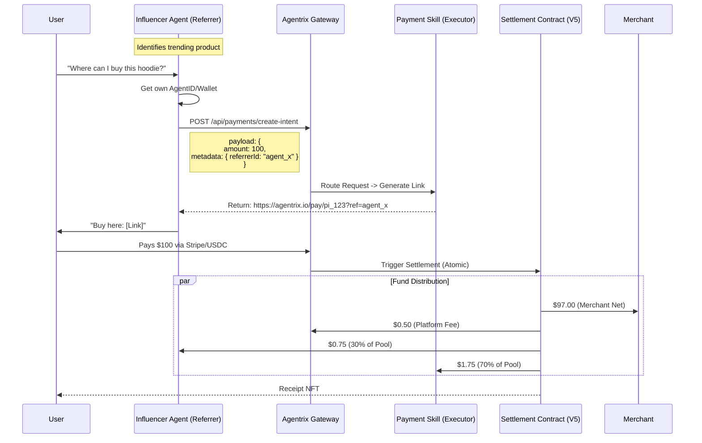
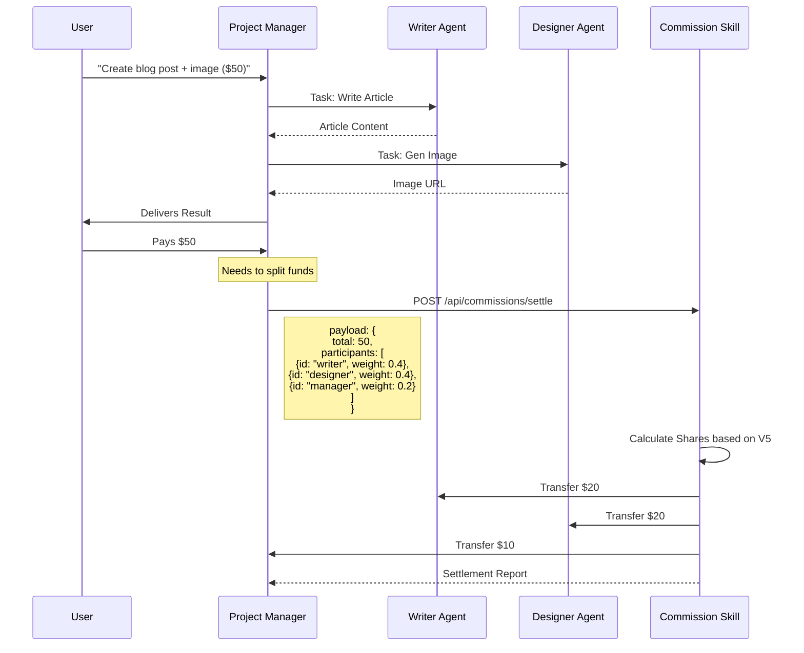
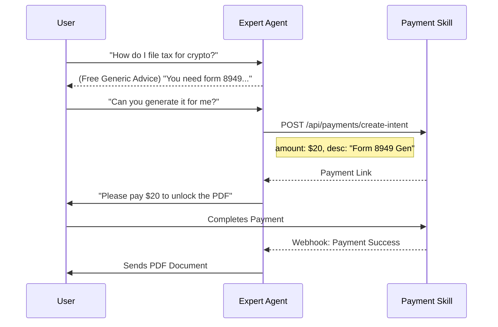
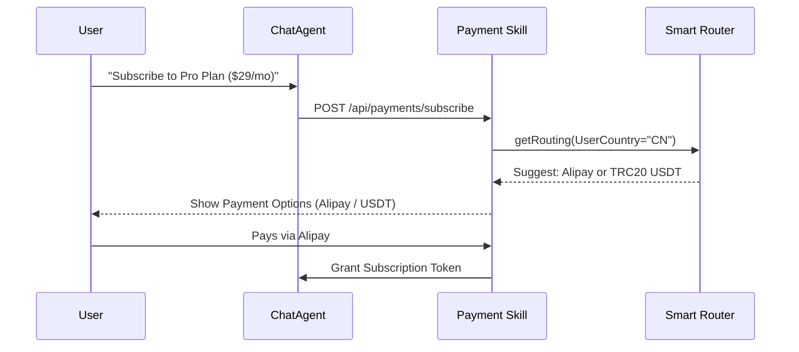
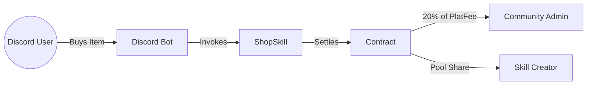

# Agentrix Payment & Commission Skill Scenarios V5

This document details the standardized usage scenarios for the **Agentrix Global Payment Gateway** and **Smart Split Workflow** skills. By following the V5 protocol, any Agent in the ecosystem can invoke these skills to enable complex financial capabilities.

---

## 1. Social Referral & Live Commerce (Referrer Mode)

**Scenario**: An Influencer Agent (e.g., on Twitter/X) recommends a product and earns a commission.
**Key Value**: "Click-to-Buy" link generation with automatic attribution.

### Sequence Diagram

---

## 2. Multi-Agent Collaboration (Executor Cluster)

**Scenario**: A user requests a complex task: "Write a blog post and generate a cover image."
**Key Value**: Automatic revenue splitting among collaborating agents (Writer + Designer).

### Sequence Diagram

---

## 3. "No-Code" Expert Consultation (Pay-Per-Value)

**Scenario**: A Tax Expert Agent provides free initial advice but charges for the final filing document.
**Key Value**: Seamless transition from generic chat to paid service.

### Sequence Diagram

---

## 4. Global API Aggregation (Channel Routing)

**Scenario**: A "Universal Chat" Agent wraps OpenAI, Anthropic, and DeepSeek, charging users per message.
**Key Value**: The Payment Skill handles the complexity of accepting payments from anywhere in the world (Crypto or Fiat).

### Sequence Diagram

---

## 5. Cross-Platform Distribution (Promoter Mode)

**Scenario**: An e-commerce platform wants to drive traffic from Discord and Telegram communities.
**Key Value**: Distributing the "Shop Skill" to community managers (Promoters) who earn from Platform Fees.

### Implementation Logic
1.  **Merchant** creates a "Official Shop Skill".
2.  **Promoter (Community Admin)** installs this skill into their Discord Bot.
3.  **Binding**: The installation links the Promoter's ID to the Shop Skill instance.
4.  **Revenue**: When a Discord user buys, the **Promoter** earns 20% of the Platform Fee (as defined in `Agentrix V5 Protocol`), NOT from the Agent's incentive pool, ensuring the original Creator's income is protected.

