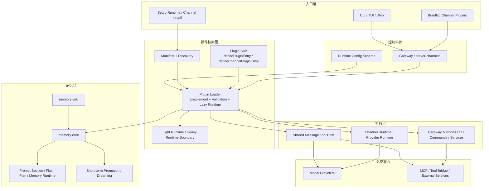

# OpenClaw 4.5 与 Agentrix 当前 Agent Framework 审计

更新时间：2026-04-10

## 1. 文档目的

这份文档回答两个问题：

1. OpenClaw 4.5 开源框架当前到底由哪些模块组成，它们分别负责什么，靠什么机制运行。
2. Agentrix 当前后端中的 agent framework 到底已经跑到哪一步，哪些模块已经在真实链路里工作，哪些还只是部分接线。

本文不是产品宣传稿，而是基于代码与公开仓库结构做的架构审计。

证据来源分为两类：

- OpenClaw 部分：基于公开仓库 openclaw/openclaw 的 v2026.4.5 标签族与同期公开主线结构，重点参考 docs/plugins/architecture.md、docs/plugins/sdk-overview.md、src/plugins/loader.ts、src/gateway/server-channels.ts、extensions/memory-core、extensions/memory-wiki、docs/tools/media-overview.md、docs/tools/video-generation.md、src/agents/tools/video-generate-tool.ts、extensions/video-generation-core、extensions/alibaba、extensions/vydra、docs/providers/fal.md。
- Agentrix 部分：基于 backend/src/app.module.ts 的真实模块接线、当前仓库中的模块实现、以及 2026-04-10 本轮代码补丁后的运行态复核结果。

状态口径：

- 已运行：已接入真实控制器、聊天热路径、定时/事件链路或生产可用 API。
- 已投入运行，继续收敛：模块已进入真实链路，但还没有成为唯一核心，或仍需向单控制面继续收口。
- 待补齐：代码中没有足够运行证据，或者只有概念占位。

## 2. 执行摘要

先给结论：

- OpenClaw 4.5 的核心不是单个聊天接口，而是一个以 Gateway 为控制平面、以 Plugin 为扩展边界、以 Memory Slot 为长期记忆边界、以 Channel Runtime 为多入口边界的 agent framework。
- Agentrix 当前已经不是“只有 UI 的 OpenClaw 外壳”，而是一个已经落地了平台托管、桌面协同、技能市场、支付商业域的产品化运行层。
- Agentrix 当前已经把真实聊天运行时收口到 /openclaw/proxy；/claude/chat 仍保留，但只作为兼容壳转发到默认 OpenClaw runtime，不再单独维护第二套主执行链路。
- 当前审计的 17 个核心 agent 模块里，16 个已运行，1 个已投入运行但仍待继续收敛，0 个可判定为纯占位模块。
- 本轮已经补上桌面复杂任务提前结束的三个关键执行语义缺口：复杂任务工具轮次预算、`tool_use` 结束原因透传、桌面 Continue 续跑提示；同时把 llm-router 与 cost-tracker 接入了聊天热路径。
- OpenClaw 4.5 公开能力里确实包含完整的视频创作/生成栈，而不只是媒体导入：它有 `video_generate` 工具、provider registry、异步任务回填和 text-to-video / image-to-video / video-to-video 三种模式。
- 与 OpenClaw 4.5 相比，Agentrix 当前真正的强项不在 Plugin contract，而在多设备协同、平台托管和 commerce-first 产品域；当前最值得继续补齐的缺口已经收敛为复杂任务 UX、视频生成 contract、plugin-owned runtime、memory/ACP/runtime compat 四类。

## 3. OpenClaw 4.5 框架图



## 4. OpenClaw 4.5 模块说明

| 模块 | 主要功能 | 实现原理 | 运行机制 |
|---|---|---|---|
| Gateway / server-channels | 统一控制平面，承接客户端、channel、账户快照、运行时助手 | Gateway 把 channel 统一抽象成 ChannelId、AccountSnapshot、GatewayMethod 等可调度接口 | 启动时构建 channel manager，运行中根据配置和 account 状态管理 channel runtime、重试与 backoff |
| Plugin Manifest + Discovery | 发现插件、读取 manifest、识别 kind/channels/providers/modelSupport | 优先读 openclaw.plugin.json 与 bundle manifest，用静态元数据决定可见性和基础校验 | 插件发现发生在 runtime 加载前，先决定“能不能看见”，再决定“是否真正激活” |
| Plugin Loader | 完成启用、禁用、slot 选择、lazy runtime 绑定 | loadOpenClawPlugins 先处理 enablement，再按需要用 jiti 懒加载运行时代码 | 启动阶段可走 validate 或 full 模式；只有需要的插件 runtime 会被真正 import |
| Plugin SDK Entry | 为普通插件、channel 插件、provider 插件提供统一注册入口 | definePluginEntry 负责通用插件，defineChannelPluginEntry 额外接入 channel 能力和全量注册面 | 插件 register(api) 后把工具、gateway method、memory capability、CLI descriptor 等注册进中心 registry |
| Shared Message Tool Host | 让不同 channel 共享同一个 message tool，而不是每个 channel 各造一套发送工具 | core 负责 session/thread bookkeeping，channel 插件只负责动作发现与最终执行 | 模型调用共享 message host，具体发送/编辑/反应能力由 channel plugin 动态描述并落地 |
| Light Runtime / Heavy Runtime Boundary | 降低插件冷启动成本，把 setup/light surface 与 full runtime 分离 | runtime-web-channel-plugin 等模块缓存 light/heavy runtime，并在真正需要时再装载 heavy module | 配置、探测、setup 阶段尽量只触发 light runtime；实际发送、媒体处理时再进 heavy runtime |
| Runtime Config Schema | 把所有插件 manifest 里的 schema 汇总成最终配置界面和校验面 | loadManifestRegistry 读取 manifest registry，再 buildConfigSchema 生成 channels/plugins 的组合 schema | 启动前可读出当前配置 schema，供 gateway、setup UI、doctor、CLI 使用 |
| memory-core | 提供默认长期记忆插件，包括 recall、索引、runtime、embedding provider | 通过 memory kind 插件向框架注册 promptBuilder、flushPlanResolver、memoryRuntime、publicArtifacts、memory_search/memory_get 工具 | 运行中由 memory slot 独占启用；聊天时参与 prompt supplement，后台可做 index、search、promote、rem-harness |
| Flush Plan / Prompt Section | 把“何时压缩对话进记忆”和“如何提示模型使用记忆”标准化 | MemoryPluginCapability 中显式暴露 promptBuilder 与 flushPlanResolver | 聊天环路可通过 resolveMemoryFlushPlan 决定刷写时机，通过 buildPromptSection 构造记忆使用说明 |
| Dreaming / Promotion | 做短期回忆提升、梦境式重组、长期记忆晋升 | memory-core 内部用短期 promotion、dreaming phases、narrative 组合 | 可通过命令或托管 cron 执行，周期性整理 recall 候选并提升到长期记忆层 |
| memory-wiki | 构建结构化知识图谱和 Obsidian 友好的 wiki 语义层 | 作为 memory 邻接插件，注册 prompt supplement、corpus supplement、gateway methods 与 wiki 工具 | 运行中既能为 memory_search 提供 wiki corpus，也能通过 wiki.status/wiki.search/wiki.apply 等 gateway method 被外部访问 |
| Gateway Methods / CLI / Service Surface | 让插件不仅能加工具，也能加 gateway RPC、CLI 子命令和服务端方法 | OpenClawPluginApi 同时支持 registerGatewayMethod、registerCli、registerTool 等多种表面 | 一部分能力面向聊天 runtime，一部分面向 CLI/operator，一部分面向远程 gateway 客户端 |

### OpenClaw 4.5 的运行特征

- 它是 plugin-first，不是 feature-first。功能大多先被定义为插件 contract，再通过 runtime 消费。
- 它是 gateway-centered，不是单 endpoint centered。真正的中心是 gateway registry，而不是某一个 REST 路径。
- 它是 memory-slot based。记忆不是普通工具，而是带独占 slot、flush plan、prompt supplement、runtime 的框架级能力。
- 它强调 lazy runtime。manifest、setup、light runtime、heavy runtime 被刻意分层，以控制启动成本和边界耦合。

### 4.1 OpenClaw 4.5 内置视频创作 / 生成能力补充

这部分在上一版附件里漏掉了，但从公开仓库看，OpenClaw 4.5 的视频能力已经是框架级内置能力，不是第三方示例脚本。

| 能力层 | OpenClaw 4.5 证据 | 说明 |
|---|---|---|
| `video_generate` 内置工具 | docs/tools/video-generation.md、src/agents/tools/video-generate-tool.ts | 视频生成是官方内置 agent tool，只有在至少一个 provider 可用时才显示 |
| 三种运行模式 | docs/tools/video-generation.md | 原生支持 `generate`、`imageToVideo`、`videoToVideo` 三种模式 |
| provider 注册机制 | docs/plugins/architecture.md、extensions/video-generation-core、extensions/alibaba、extensions/vydra、docs/providers/fal.md | core 持有 typed capability contract，provider 插件通过 `registerVideoGenerationProvider(...)` 注册到 runtime |
| 异步任务生命周期 | docs/tools/media-overview.md、docs/tools/video-generation.md | `queued / running / succeeded / failed` 四阶段；任务完成后会唤醒原 session 并把视频回帖到原对话 |
| 控制参数与参考素材 | src/agents/tools/video-generate-tool.ts | 支持参考图片、参考视频、duration、aspectRatio、resolution、audio、watermark、filename 等参数 |

结论：OpenClaw 4.5 的视频能力不是“能上传视频看看”，而是已经具备了从 capability contract、runtime helper、provider registry 到 async task wake-back 的完整产品级生成链路。

## 5. Agentrix 当前框架图

```mermaid
flowchart TB
  subgraph C[客户端与入口]
    Web[Web]
    Desktop[Desktop]
    Mobile[Mobile]
    Pair[Desktop Pair / OAuth]
    ChatA[/claude/chat compat]
    ChatB[/openclaw/proxy chat/stream]
    SyncApi[/desktop-sync/*]
  end

  subgraph R[运行时核心]
    Proxy[openclaw-proxy]
    Context[agent-context / memory recall]
    Intelligence[agent-intelligence]
    ToolReg[tool-registry]
    Skill[skill]
    Provider[ai-provider]
    Query[query-engine]
    Router[llm-router]
    Cost[cost-tracker]
    Dreaming[dreaming]
    Wiki[memory-wiki]
  end

  subgraph O[组织与身份层]
    Team[agent-team]
    Unified[unified-agent]
    Orch[agent-orchestration]
    Presence[agent-presence]
  end

  subgraph D[跨设备与实例层]
    Sync[desktop-sync]
    Connection[openclaw-connection]
    Bridge[openclaw-bridge]
    Instance[OpenClawInstance]
  end

  subgraph P[持久化]
    DB1[(openclaw_instances)]
    DB2[(agent_accounts / user_agents / teams)]
    DB3[(agent_memory / wiki pages)]
    DB4[(desktop sessions / approvals / tasks)]
  end

  Web --> ChatA
  Desktop --> ChatA
  Mobile --> ChatA
  Desktop --> ChatB
  Mobile --> ChatB
  Pair --> SyncApi

  ChatA --> ChatB
  ChatB --> Proxy
  SyncApi --> Sync

  Proxy --> Context
  Proxy --> Intelligence
  Proxy --> ToolReg
  Proxy --> Skill
  Proxy --> Provider
  Proxy --> Query
  Proxy --> Router
  Proxy --> Cost
  Proxy --> Orch
  Proxy --> Instance

  Team --> DB2
  Unified --> DB2
  Presence --> DB2
  Context --> DB3
  Intelligence --> DB3
  Dreaming --> DB3
  Wiki --> DB3
  Sync --> DB4
  Connection --> Instance
  Bridge --> Instance
  Instance --> DB1
```

## 6. Agentrix 17 个核心模块审计

### 6.1 已运行模块

| 模块 | 功能 | 实现原理 | 运行机制 | 状态 |
|---|---|---|---|---|
| openclaw-proxy | Agentrix 当前最核心的聊天与实例代理入口 | 通过控制器暴露 /openclaw/proxy/:id/stream 和 /openclaw/proxy/:id/chat，把平台托管聊天、工具调用、计划模式、实例代理统一进一个服务 | 真实聊天热路径会经过它，内部串联 LLM、hooks、tool registry、desktop bridge、plan mode | 已运行 |
| openclaw-bridge | 远程实例与本地实例之间的技能、配置、快照同步 | 通过 bridge service 发起实例探测、skill snapshot、迁移同步，主要依赖 HTTP/Axios 双向同步 | 在 onboarding 和 team provisioning 等流程中实际被调用，但更偏“同步面”而不是“实时执行面” | 已运行 |
| openclaw-connection | 本地设备和外部实例的连接、异步中继 | 通过 child_process、本地 agent 启动、Telegram bot relay 等方式穿透不可直连环境 | 模块初始化时会处理待执行命令，适合 async task handoff，不适合强实时低延迟控制 | 已运行 |
| desktop-sync | 桌面设备心跳、审批、共享工作区、任务协同 | 通过多实体建模设备在线、共享 workspace、命令审批和任务状态，并发出 desktop-sync events | 提供 heartbeat、task CRUD、approval response 等接口，真实用于桌面协同 | 已运行 |
| agent-intelligence | plan mode、自动记忆提炼、标题、压缩与会话增强 | 在服务内部维护 active plan、步骤、审批状态、memory extract 结果 | 被 openclaw-proxy 真实调用，参与 plan 接受、拒绝、执行与压缩 | 已运行 |
| skill | 技能市场、技能执行、审批、导入、工作流组合 | 模块内有 executor、marketplace、approval、OpenAPI importer、dynamic adapter、workflow composer 等完整子服务 | 预置技能会在启动时自动装载；聊天过程中由 executor 承接工具执行 | 已运行 |
| ai-provider | 用户自定义模型提供商与 API key 管理 | 对 provider config、apiKey、baseUrl、region 等做存储与解密，支持多厂商 | 聊天热路径会解析用户 provider 配置，Copilot token exchange 也在这里处理 | 已运行 |
| tool-registry | 中心工具注册表与多模型 schema 适配层 | 通过装饰器自动发现工具，再统一生成 OpenAI、Bedrock、Claude 等不同 schema | 启动后自动建表，聊天时被用来生成 tool schemas 并驱动工具调用 | 已运行 |
| agent-presence | 统一 agent 身份、timeline、channel binding、memory scope | 基于 UserAgent、ConversationEvent、AgentSharePolicy、AgentMemory 等实体统一管理 agent presence | 有完整 CRUD 与 timeline 查询接口，已被移动端和 Web 端身份层实际消费 | 已运行 |

### 6.2 本轮纠偏后：已投入运行的原“部分运行”模块

| 模块 | 当前判断 | 代码证据 | 本轮处理 / 验证 | 状态 |
|---|---|---|---|---|
| agent-team | 已具备完整团队模板、provision、我的团队、角色绑定实例控制面 | `agent-team.controller.ts` 已暴露 `GET templates`、`POST provision`、`GET my-teams`、`POST bind-instance` | 代码复核确认它不是“只有 service 没有入口”的半成品 | 已运行 |
| unified-agent | 已具备统一 agent 查询与创建入口 | `unified-agent.controller.ts` 已暴露 `GET /agents/unified`、`GET /agents/unified/:id`、`POST /agents/create` | 代码复核后，不再应标记为“没有独立 controller” | 已运行 |
| agent-orchestration | 已具备子代理 spawn、协调与 mailbox 三层能力 | `agent-orchestration.service.ts` 已实现 `spawn(...)`、`coordinate(...)`、`sendMessage(...)`，且被 `openclaw-proxy` 内部工具直接调用 | 运行态上属于真实热路径助手，而不是占位模块 | 已运行 |
| llm-router | 既有公开分类接口，也已接入聊天热路径决策 | `llm-router.controller.ts` 已暴露 `tiers/classify`；本轮在 `openclaw-proxy.service.ts` 中新增 `resolveToolRoundBudget(...)` 并用于复杂任务轮次预算 | 已验证进入真实聊天热路径 | 已运行 |
| query-engine | query-engine 模块的 runtime seam、结构化 StreamEvent 协议、tool executor 能力已被主链复用 | `openclaw-proxy` 继续注入 `RuntimeSeamService`，`shared/stream-parser.ts` 与 `query-engine/interfaces/stream-event.interface.ts` 已用于 desktop/mobile/voice 统一 SSE | 已投入运行，但 full conversation loop 仍待继续向单一 query-engine 收口 | 已投入运行，继续收敛 |
| cost-tracker | 已从“可计算”升级为热路径记账与 usage 事件来源 | 本轮在 `openclaw-proxy.service.ts` 中把 `CostTrackerService.recordCost(...)` 接入聊天热路径，并向前端发送 `usage` 事件 | 已验证桌面端可直接消费 usage/cost 数据 | 已运行 |
| dreaming | 已具备可调用的梦境整理 API 与异步处理流程 | `dreaming.controller.ts` 已暴露 `sessions/start/cancel/stats`，`DreamingService.startDream(...)` 会触发异步 dream cycle | 这已经属于真实运行模块，只是后续可继续补 cron/调度策略 | 已运行 |
| memory-wiki | 已具备公共 controller、知识图谱接口与桌面 UI 消费面 | `memory-wiki.controller.ts` 已暴露 `pages/graph/resolve-links`，桌面端已有 `MemoryWikiPanel` | 代码复核确认它已经不是“无公共入口”状态 | 已运行 |

### 6.3 当前运行态汇总

| 分类 | 数量 | 模块 |
|---|---:|---|
| 已运行 | 16 | openclaw-proxy、openclaw-bridge、openclaw-connection、desktop-sync、agent-intelligence、skill、ai-provider、tool-registry、agent-presence、agent-team、unified-agent、agent-orchestration、llm-router、cost-tracker、dreaming、memory-wiki |
| 已投入运行，继续收敛 | 1 | query-engine |
| 待补齐 | 0 | 本次 17 个已审计核心模块中，没有可判定为纯占位但无任何实现的模块 |

## 7. Agentrix 当前运行机制解读

### 7.1 真正的核心链路

Agentrix 当前真正的框架中心不是单独的 UserAgent，也不是旧式的普通聊天控制器，而是下面这条链：

1. 入口可以来自 /claude/chat 兼容路径，也可以直接来自 /openclaw/proxy/chat 或 /openclaw/proxy/stream。
2. 无论入口来自哪里，真实执行都会先收口到 openclaw-proxy。
3. openclaw-proxy 负责决定会话应走平台托管还是外部实例。
4. 进入 agent-intelligence、tool-registry、skill、ai-provider 等子系统。
5. 在需要时借助 query-engine 模块里的 runtime-seam、结构化 StreamEvent 协议和工具执行能力；full query loop 仍在继续向单一核心收口。
6. 结果再通过 desktop-sync、approval、移动端或桌面端输出。

这意味着 Agentrix 已经具备“框架化”的骨架，而且主聊天运行时已经开始向单控制平面收口；剩余工作更多是把外围兼容入口和 plugin/memory contract 继续压平。

### 7.2 Agentrix 当前最强的不是插件框架，而是产品层

和 OpenClaw 4.5 相比，Agentrix 现在最强的三块是：

- 平台托管：OpenClawInstance、账号体系、默认实例自愈、桌面配对、社交登录接续。
- 多端协同：desktop-sync、设备存在感、审批、共享工作区、异步回传。
- 商业域：skill marketplace、wallet、payment、commerce、task economy。

换句话说，Agentrix 的差异化更像“OpenClaw framework 上方的产品化运行层”。

## 8. OpenClaw 4.5 与 Agentrix 的一一对应

| OpenClaw 4.5 框架模块 | Agentrix 当前对应物 | 当前判断 |
|---|---|---|
| Gateway / 单控制平面 | /openclaw/proxy 主入口 + /claude/chat compat shim | 主运行时已收口，兼容入口仍保留 |
| Plugin discovery + loader | skill + tool-registry + plugin 模块 | 有中心注册，但 plugin-owned runtime 还不完整 |
| Channel plugin runtime | openclaw-connection + openclaw-bridge + desktop/mobile 接入 | 有跨设备接入，但不是统一 channel plugin contract |
| Memory slot / memory-core | agent-context + agent_memory + agent-intelligence | 基础 recall 已有，但没有完整 slot + flush plan contract |
| memory-wiki | memory-wiki 模块 + 桌面 `MemoryWikiPanel` | 已进入真实 API 与桌面消费面 |
| Dreaming | dreaming 模块 + 桌面 `DreamPanel` | 已具可调用 API 与异步处理流程，后续可继续补调度策略 |
| Shared message/tool host | tool-registry + skill executor + query-engine + openclaw-proxy | 结构化 SSE/tool protocol 已投入运行，但最终仍由 openclaw-proxy 主控 |
| Runtime config schema | Nest 模块装配 + 平台配置体系 | 有配置体系，但不是 OpenClaw 风格 manifest schema 汇总 |
| ACP bridge | 当前缺少对应主模块 | 明显缺口 |
| Runtime compat / doctor | 当前缺少对应主模块 | 明显缺口 |

## 9. 现阶段真正的差距在哪里

这一节需要按“已经补上的执行缺口”和“现在还真正没补上的 gap”重新看，而不是沿用上一版的静态判断。

### 9.1 本轮已完成状态与验证

| 项目 | 完成状态 | 验证信息 |
|---|---|---|
| 桌面复杂任务执行语义修复 | 已完成 | `openclaw-proxy.service.ts` 本轮已增加复杂任务工具轮次预算、透传 `tool_use` 结束原因；`ChatPanel.tsx` 已在 `tool_use` 时给出 Continue 续跑提示 |
| llm-router 热路径接线 | 已完成 | `llm-router` 不再只是独立 controller；其分类结果已用于主聊天热路径的复杂任务预算决策 |
| cost-tracker 热路径接线 | 已完成 | `CostTrackerService.recordCost(...)` 已在主聊天热路径执行，并向前端发出 `usage` 事件 |
| 视频 / 音频 / 文件统一附件表面 | 已完成 | `upload.service.ts` 统一返回 `image / audio / video / file`；桌面与移动端都已补 `mp4/webm/mov` MIME 推断、视频展示与生成视频链接识别 |
| 审计文档遗漏的 OpenClaw 4.5 视频能力 | 已完成 | 本文第 4.1 节已补上 `video_generate`、provider registry、async task wake-back、三种模式与控制参数 |
| `video_generate` 首条真实运行链路 | 已完成 | 后端已新增 `video_generation_tasks` 持久化表、FAL text-to-video provider runtime、后台轮询与完成回帖；`/openclaw/proxy/*` 与 `/claude/chat` 两条路径已同时暴露该工具 |
| 桌面 Task Workbench | 已完成 | 桌面端新增独立 Task Workbench 面板，集中承载 plan approval、timeline、async wake-back 事件、checkpoint 与 resume；聊天流内只保留轻量入口横幅 |
| checkpoint / resume 真实恢复链路 | 已完成 | `agent-intelligence` 的 resume 接口已修正为按用户作用域的 `sessionId` 或数据库 id 两种方式解析；桌面 Workbench 的 Resume 按钮已接入真实恢复而非仅做提示词续跑 |
| 后端 build 脚本跨平台化 | 已完成 | `backend/package.json` 不再依赖 `sh build.sh`、`rm -rf`、`test -f`；已改为 `node ./scripts/build-backend.mjs` 的跨平台构建入口 |
| 根目录 TypeScript 全量检查堆上限 | 已完成 | 根 `package.json` 已新增 `typecheck:root`，显式使用 `node --max-old-space-size=8192 ... tsc --noEmit -p tsconfig.json` |
| 生产后端上线 | 已完成 | 新生产机 `47.130.176.148` 已更新到 `build138@ad09e2d3`，`/api/health` 返回 `200`，并已跑通视频任务相关迁移 |
| 移动端公开构建 | 已完成 | 移动端公开触发链路以 `Agentrix-Claw` 仓库工作流为准；`Build → Test → Release APK` 最新成功 run 为 `24222804837`，已发布 `✅ ClawLink Build #167`，公开下载地址保持 `200` 可用 |
| 桌面 Windows `.exe` 发布状态 | 本地当前代码已成功出包，GitHub Actions 仍未产出新 artifact | 当前代码已在本地成功生成 `desktop/src-tauri/target/x86_64-pc-windows-msvc/release/bundle/nsis/Agentrix Desktop_0.1.1_x64-setup.exe`；修复 `build138@83842cc8` 已重新触发 Desktop workflow `24226508141`，Windows job 已越过 `Install frontend dependencies`，但仍失败在 `Build Tauri app`，所以 GitHub 侧暂时还没有新的 `.exe` artifact |

### 9.1.1 本轮按端改动清单

#### 桌面端

- `desktop/src/components/TaskWorkbenchPanel.tsx`：新增独立 Task Workbench，统一承载 plan approval、execution timeline、recent events、checkpoint 与 resume。
- `desktop/src/components/ChatPanel.tsx`：把 Task Workbench 接入主聊天流，补了 async wake-back、`tool_use` 续跑提示、审批态同步、checkpoint 记录与恢复入口。
- `desktop/src/components/MessageBubble.tsx`：补齐视频链接与多媒体附件展示，桌面端现在能直接承接生成视频返回结果。
- `desktop/src/services/store.ts`：补桌面任务状态、timeline 与 workbench 事件状态承载。

#### 移动端前端

- `src/screens/agent/AgentChatScreen.tsx`：统一多模态发消息内容构造，补视频/音频/文件附件的发送与展示识别，聊天内容里能正确提取 `mp4/webm/mov` 等视频链接。
- `src/services/api.ts`：补聊天附件上传后的 API 表面适配，和新的附件类型保持一致。
- `src/services/deviceBridging.service.ts`：补跨设备桥接时的消息/会话同步细节，保证移动端与平台托管会话、附件链路保持一致。

#### 后端

- 视频生成主链路：`backend/src/entities/video-generation-task.entity.ts`、`backend/src/migrations/1781100000000-CreateVideoGenerationTasks.ts`、`backend/src/modules/video-generation/*` 新增了 `video_generation_tasks` 持久化、FAL provider、后台轮询、完成回帖与状态同步。
- 两条聊天入口一起补齐：`backend/src/modules/ai-integration/claude/claude-integration.service.ts`、`backend/src/modules/openclaw-proxy/openclaw-proxy.service.ts`、`backend/src/modules/skill/*` 已把 `video_generate` 同时接进 `/claude/chat` 和 `/openclaw/proxy/*`，并补了平台托管工具路由与 `tool_use` 停止原因透传。
- 媒体表面统一：`backend/src/modules/upload/upload.service.ts` 统一返回 `image / audio / video / file`，前后端对同一附件类型的理解一致。
- 恢复链路修正：`backend/src/modules/agent-intelligence/agent-intelligence.controller.ts` 与 `backend/src/modules/agent-intelligence/agent-intelligence.service.ts` 把 resume 修到可同时接受逻辑 `sessionId` 与数据库 id。
- 模型优先级热修：`backend/src/modules/auth/auth.controller.ts` 改为显式 pinned instance model 优先于 preferred model，避免桌面/实例模型选择被用户默认偏好覆盖。
- 构建与部署加固：`backend/scripts/build-backend.mjs`、`backend/package.json`、根 `package.json`、`.github/workflows/deploy-backend-prod.yml`、`backend/src/migrations/1781000000000-ExpandHookEventTypes.ts` 一起完成了跨平台构建、部署 host 参数化、自动 migration、旧库枚举迁移容错等收口。

### 9.2 当前仍然最关键的四类差距

#### 9.2.1 这四类差距的最近完成进展

1. VS Code / Copilot 级复杂任务 UX
  最近已经补上的不是“表面 UI”，而是关键执行语义：桌面端现在有独立 `TaskWorkbenchPanel`，能承接 plan approval、任务时间线、async wake-back、checkpoint 与 resume；`openclaw-proxy` 也已经把复杂任务轮次预算、`tool_use` 停止原因、Continue 续跑提示接通了。最新进展是桌面当前代码已经能在本地重新打出 Windows 包，说明这套工作台链路不只是开发态拼装；但距离 VS Code / Copilot 级体验仍差 diff/terminal 富展示、多工具并行可视化、长任务回放。

2. OpenClaw 4.5 视频生成 contract
  这块最近的实质进展最大：`video_generate` 已不是实验接口，而是已经上线生产的真实链路。生产机 `47.130.176.148` 已部署到包含视频任务运行时的版本，`video_generation_tasks` 迁移已执行，FAL text-to-video provider、后台轮询、会话内 wake-back、桌面 Task Workbench 展示、桌面/移动端视频附件识别都已经打通。当前没完成的部分也更明确了，主要还剩 image-to-video、video-to-video、更通用 provider registry，以及更完整的参考图/参考视频参数面。

3. Plugin-owned runtime / capability ownership
  这块最近没有出现像视频链路那样的结构性突破。已有进展主要还是“中心能力更强了”：`skill`、`tool-registry`、`query-engine runtime seam`、`openclaw-proxy` 之间的真实运行链更顺了，但能力所有权依然集中在中心服务，没有真正把 channel runtime、gateway method、memory capability、provider capability 下放成插件天然拥有的 contract。也就是说，这一项目前仍属于“问题已经被看清，但最近没有本质收口”。

4. Memory slot、ACP bridge、runtime compat / doctor
  这块最近也有一些基础层进展，但还没有跨过框架边界那条线。近期落地的更多是记忆与运行时的工程化收口，比如生产库已跑过 `agent_memory` 相关迁移，`memory-wiki`、`dreaming`、`agent-intelligence` 继续处在真实运行链里，旧库上的 hook event type 迁移兼容性也已补上；但真正缺的 `memory slot / flush plan / prompt supplement` 框架 contract、ACP bridge、runtime compat/doctor 仍然没有主模块落地，所以这块仍是最典型的“已有能力很多，但框架级边界还没形成”。

#### 9.2.2 Gemma 4 真端侧多模态的当前边界

最近一轮移动端收口后，语音链路已经不再是“全靠云端”，而是明确拆成了端侧优先的三层：

1. 已经可以稳定下放到端侧的部分
  本地唤醒词、VAD、回声抑制、barge-in、iOS on-device live speech、持麦模式下的本地语音转文本、以及本地文本播报都已经有真实代码路径，移动端现在也新增了 `preferOnDeviceVoice` 开关和显式 capability planner，不再是隐式走云端默认值。

2. 当前仍然必须保留云端的部分
  真正的 Gemma 4 图像 token 输入、音频 token 输入、音频 token 输出还没有进入移动端 `llama.rn` bridge；所以实时图像理解、语音端到端多模态推理、复杂任务工具编排、长任务 continuation 预算，当前仍然必须保留云端路径。现阶段新增的相机帧接入只是把手机拍照帧送进现有 realtime session，便于云端多模态链路立即吃到视觉上下文，并不等于端侧 Gemma 已经能吃图吃音频。

  这里需要额外区分两种“realtime 语音”。本地模型的 duplex 连续语音，当前已经可以走“端侧 live speech / 本地音频采集 -> 本地文本或本地音频轮次”，不能再笼统描述成“全部走云端”；但云端 realtime gateway 的 socket 会话建立、assistant 实时回复、barge-in 打断、相机帧随会话注入，仍然是另一条必须保留并单独验收的云端链路。最新真机验收脚本也已经按这两条路径拆开验收，而不再把它们混成一个“语音功能”。

3. 这说明剩余硬差距已经被压缩到 native bridge 层
  现在最关键的未完成项不再是 UI 或会话调度，而是移动端本地 runtime 本身还缺 vision/audio surface。等 `llama.rn` 或自有 native bridge 真正暴露 image/audio inputs 和 audio outputs 后，当前这套 planner、local-first STT/TTS、相机帧接入、混合编排边界就可以直接复用，而不需要再重写一整套语音会话框架。

## 10. 总结

如果用一句话概括：

OpenClaw 4.5 是一个以 Gateway、Plugin、Memory Slot 为核心 contract 的通用 agent framework；Agentrix 当前则是在这个方向上已经走出相当深度的产品化变体，尤其强化了平台托管、多设备协同和 commerce-first 业务域。

Agentrix 现在已经不应该再被描述成“9 个运行、8 个半运行”的状态。经过本轮复核与补丁，更准确的判断是：大部分核心模块已经进入真实运行链路，query-engine 也已经以 runtime seam / stream protocol 形态投入运行，只是 full conversation loop 仍待继续统一。

所以当前最合理的路线不是重复造一套新内核，而是沿着下面三条线继续收敛：

1. 继续把复杂任务 UX 做到更接近 VS Code：补 diff/terminal 富展示、并行工具视图、执行回放，而不是从零重做 plan/timeline/workbench。
2. 在已经落地的 `video_generate` 首条链路之上，继续补 image-to-video、video-to-video、更多 provider 注册与更丰富参数面。
3. 继续把 plugin contract、memory contract、ACP/runtime compat 向 OpenClaw 风格统一边界收口。

这也是为什么本次审计结论不是“推翻重做”，而是“主链已成形，接下来继续收敛缺口”。