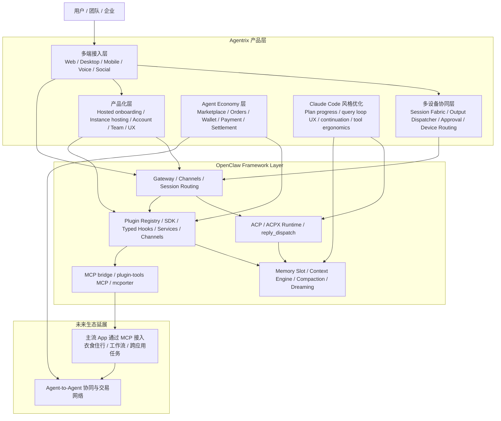
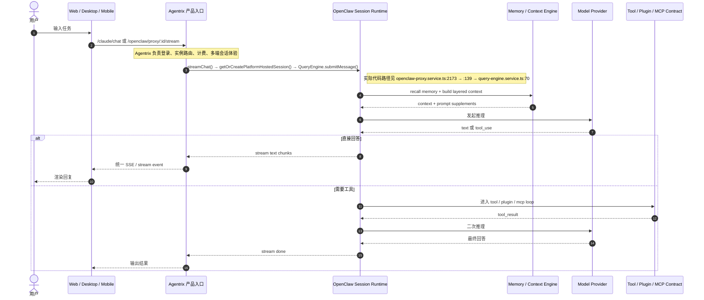
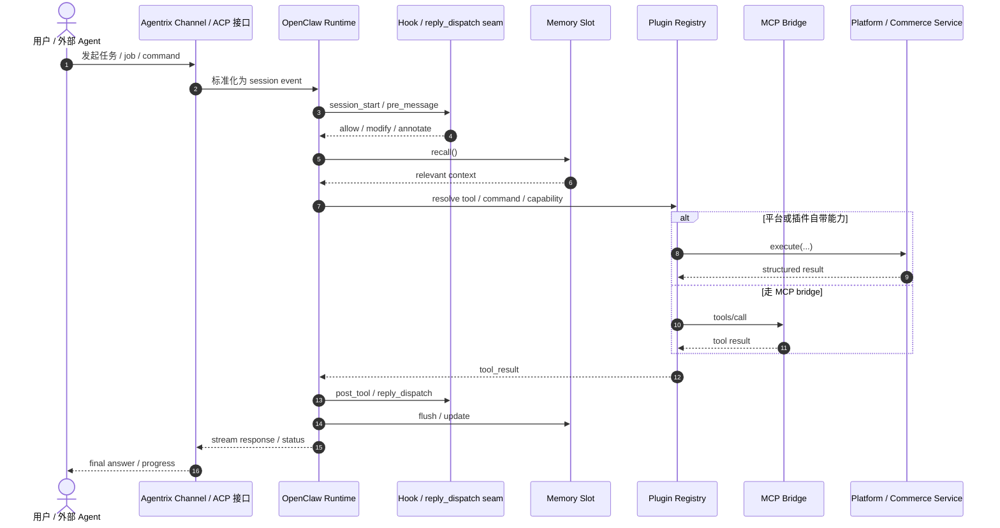
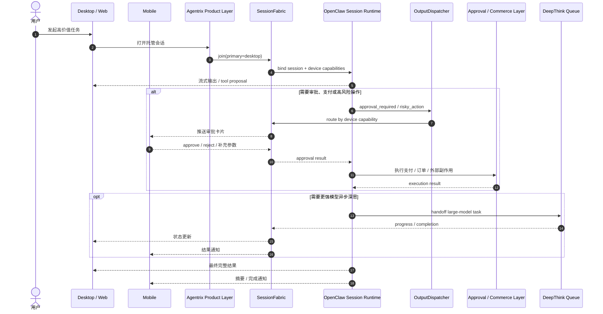

# Agentrix 实际架构图与 OpenClaw 四月版逐层差异图

更新时间：2026-04-07  
审计修订：2026-04-08（基于代码实际验证 + OpenClaw upstream v2026.4.5 最新对齐）

这份图不再以旧附件为主，而是基于两类证据重画：

- Agentrix 当前仓库实际实现
- upstream `openclaw/openclaw` 主仓当前结构

本地证据重点：

- `backend/src/entities/openclaw-instance.entity.ts`
- `backend/src/modules/openclaw-proxy/openclaw-proxy.service.ts`
- `backend/src/modules/query-engine/query-engine.service.ts`
- `backend/src/modules/tool-registry/tool-registry.service.ts`
- `backend/src/modules/hooks/hook.service.ts`
- `backend/src/modules/voice/session-fabric.service.ts`
- `backend/src/modules/voice/output-dispatcher.service.ts`
- `backend/src/modules/voice/deep-think-orchestrator.service.ts`
- `backend/src/modules/agent-orchestration/agent-orchestration.service.ts`
- `backend/src/modules/agent/runtime/agent-runtime.service.ts`

上游 OpenClaw 证据重点：

- `openclaw/openclaw` `README.md` 中的 key subsystems
- `docs/plugins/architecture.md`
- `docs/automation/hooks.md`
- `docs/tools/acp-agents.md`
- `src/plugins/hooks.ts`
- `src/agents/pi-embedded-runner/compact.ts`
- `extensions/memory-core/index.ts`
- `extensions/acpx/*`

## 重要修正：Agentrix 的定位不是“并列 runtime”，而是“OpenClaw 框架上的产品封装”

基于这次重新检索 upstream `openclaw/openclaw` 当前主线，以及你刚刚明确的目标，这份文档需要先定一个更准确的前提：

- Agentrix 的底层框架应该定义为 OpenClaw framework，而不是一套独立 runtime 只“参考” OpenClaw。
- OpenClaw 已经形成公开 contract 的能力，原则上都应进入 Agentrix 支持范围，包括 Gateway、ACP/ACPX、Plugin SDK、Hooks、Memory Slot、Context Engine、MCP bridge 等。
- Agentrix 的差异化应该主要放在 OpenClaw 之上的产品层，而不是在 OpenClaw 旁边再维持一套长期并行内核。
- Claude Code 的价值更适合被吸收到 OpenClaw 兼容 seams 中，例如 Query loop、plan/progress、tool ergonomics、continuation/context compaction 体验，而不是单独分叉成另一套框架哲学。

换句话说：

- OpenClaw 负责 runtime、protocol、plugin ecosystem、memory/hook/ACP 主框架。
- Agentrix 负责多端接入、产品化托管、用户开箱即用体验、跨设备协同、Agent Economy、未来通过 MCP 打通主流 app 的任务生态。

因此，下面的“差异图”应理解为“当前实现差异”，不是“未来长期保持分叉”的目标图。

## OpenClaw 2026.4.5+ 最新更新里，最该对齐的不是零散功能，而是框架 contract

如果按已发布稳定版本看，当前关键基线是 `2026.4.5`；如果按主仓 `main` 看，已经继续推进到 `Unreleased / 2026.4.6` 一带。对 Agentrix 最重要的不是某个单点 feature，而是下面这些框架收敛方向：

- ACPX runtime 已经被内嵌进 bundled `acpx` plugin，但需要注意 OpenClaw 官方 ACP 文档明确声明 "openclaw acp is a Gateway-backed ACP bridge, not a full ACP-native editor runtime"（使用 `@agentclientprotocol/sdk` 0.15.x），`reply_dispatch` 尚未在 Agentrix 中实现（代码搜索零命中）。
- Plugin-first 架构继续加强：plugin-config onboarding、ClawHub 搜索/安装、plugin-owned tools/services/channels 都在往标准化 contract 收口。Agentrix 当前 `PluginService` 有 create/install/uninstall/update 基本生命周期（[plugin.service.ts](../backend/src/modules/plugin/plugin.service.ts)），但 plugin-owned tools/services/channels/session grammar 在代码中均不存在（搜索 `pluginOwned` 零命中）。
- Memory 不再只是 recall，而是完整 memory slot 体系：`memory-core`、flush plan、prompt supplement、embedding provider、`memory-wiki`、light/deep/REM dreaming、`/dreaming` 与 Dreams UI。Agentrix 当前 `agent_memory` 表和 `AgentContextService` 已有基本 recall，但 memory-core/flush plan/dreaming/memory-wiki 在后端代码中均不存在（搜索零命中）。
- Context orchestration 正在插件化：context engine slot、provider-owned replay hooks、before/after compaction hooks、subagent/runtime seams 都越来越稳定。
- MCP 与 agent tool bridge 继续强化：plugin-tools MCP bridge、Claude CLI loopback MCP、mcporter bridge 模式，说明 OpenClaw 倾向于让 MCP 成为外部 app 和 agent runtime 的标准接缝。
- 多渠道和移动节点仍然是 OpenClaw 主线能力的一部分，不是外围附属：single Gateway、many channels、mobile nodes、pairing、voice/chat、rich device commands 已经是主产品面。
- `openclaw doctor --fix` 和 runtime compat migration 越来越重要，说明 OpenClaw 已把“快速演化但保持迁移路径”当成框架级能力，而不是文档约定。

这对 Agentrix 的含义非常直接：

- 以后不能只追某几个功能点，而要主动跟进 OpenClaw 的 public contract。
- 只要 OpenClaw 某个能力已经进入稳定 public surface，Agentrix 就应该把它纳入兼容目标。
- Agentrix 自己新增的能力，最好也尽量挂在 OpenClaw 风格的 contract 上，避免以后回归上游时成本越来越高。

## 图 1：Agentrix 当前实际架构图

```mermaid
flowchart TB
  subgraph C[终端与入口]
    Web[Web]
    Desktop[Desktop]
    Mobile[Mobile]
    Voice[Voice / Wearable]
    Social[Telegram / 渠道入口]
  end

  subgraph E[Agentrix 入口层]
    ClaudeChat[/claude/chat\n统一聊天 API]
    Proxy[/openclaw/proxy/:instanceId/*\n实例代理 / 平台托管聊天]
    VoiceGateway[Realtime Voice Gateway\nvoice + fabric events]
  end

  subgraph R[运行时与编排层]
    Instance[OpenClawInstance\ncloud / self_hosted / local]
    ProxySvc[OpenClawProxyService\n外部实例转发 + 平台托管执行]
    Context[AgentContextService\n分层上下文 / memory 注入]
    Intelligence[AgentIntelligenceService\nplan / memory extract / compaction / title]
    QueryEngine[QueryEngine\n统一 SSE 事件 / 工具循环]
    ToolRegistry[ToolRegistry\n声明式工具注册]
    HookSvc[HookService\nmessage/tool hooks]
    Orchestration[AgentOrchestration + AgentTeam\nspawn / coordinate / team template]
    Runtime[AgentRuntime\nplanner / workflow / memory runtime]
  end

  subgraph M[Agentrix 自有多端协同层]
    Fabric[SessionFabric\n多设备绑定 / 主设备切换]
    Dispatcher[OutputDispatcher\n按设备能力分发]
    DeepThink[DeepThinkOrchestrator\n超大模型异步回传]
    Pair[Desktop Pair / OAuth Bridge]
  end

  subgraph D[平台能力层]
    Skills[Skills / Marketplace]
    Commerce[Commerce / Orders / Tasks]
    Wallet[Wallet / Payment / X402]
    A2A[Agent-to-Agent / AgentAccount]
    MCP[MCP / Browser / Sandboxed Tools\n部分接入]
  end

  subgraph X[外部 OpenClaw 运行时]
    External[Self-hosted / Local OpenClaw]
  end

  subgraph P[持久化]
    P1[openclaw_instances]
    P2[agent_accounts / agent_teams]
    P3[agent_sessions / agent_messages]
    P4[agent_memory]
    P5[device_sessions / desktop_pair_sessions]
  end

  Web --> ClaudeChat
  Desktop --> ClaudeChat
  Desktop --> Proxy
  Mobile --> ClaudeChat
  Mobile --> Proxy
  Voice --> VoiceGateway
  Social --> Proxy

  ClaudeChat --> QueryEngine
  ClaudeChat --> Context
  Proxy --> Instance
  Proxy --> ProxySvc
  VoiceGateway --> Fabric
  VoiceGateway --> Dispatcher
  VoiceGateway --> DeepThink
  VoiceGateway --> ProxySvc

  Instance --> ProxySvc
  ProxySvc --> External
  ProxySvc --> Context
  ProxySvc --> Intelligence
  ProxySvc --> ToolRegistry
  ProxySvc --> HookSvc
  ProxySvc --> Orchestration
  ProxySvc --> Runtime

  QueryEngine --> ToolRegistry
  QueryEngine --> HookSvc
  Context --> P4
  Intelligence --> P3
  Intelligence --> P4
  Instance --> P1
  Orchestration --> P2
  Fabric --> P5
  Pair --> P5

  ToolRegistry --> Skills
  ToolRegistry --> Commerce
  ToolRegistry --> Wallet
  ToolRegistry --> A2A
  ToolRegistry --> MCP
```

### 图 1 读图结论

- Agentrix 的真实核心已经是 `OpenClawInstance + OpenClawProxy`，不是旧 `UserAgent`。
- 但入口仍保留双主路径：`/claude/chat` 和 `/openclaw/proxy/:instanceId/*`，说明它是融合态，不是单一控制平面。
- Claude Code 风格能力已经进入主链路：`ToolRegistry`、`QueryEngine`、`HookService`、`Compaction`、`Memory`。
- Agentrix 自己新增的差异化层，在多端协同：`SessionFabric`、`OutputDispatcher`、`DeepThinkOrchestrator`、桌面配对桥接。
- 商业域是第一等公民，不是外围插件：技能市场、钱包、支付、任务、订单都直接挂在平台工具层。

## 图 2：Agentrix 与四月版 OpenClaw 逐层差异图

这里的“四月版 OpenClaw”以 `openclaw/openclaw` 主仓当前形态为主，不再假设附件中的角色命名完全准确。

```mermaid
flowchart TB
  L1[第 1 层：入口与控制平面]
  A1[Agentrix\nWeb/Desktop/Mobile +\n/claude/chat + /openclaw/proxy + voice]
  O1[OpenClaw\nGateway WS + Channels + ACP\n更接近单控制平面]
  N1[差异\nAgentrix 仍保留历史双 chat 路径\nOpenClaw 更统一]

  L2[第 2 层：运行时核心]
  A2[Agentrix\nOpenClawInstance + OpenClawProxy\n平台托管与外部实例混合]
  O2[OpenClaw\nembedded runtime + ACP runtime +\nsession lanes + context engine]
  N2[差异\nAgentrix 更像 OpenClaw 底座外包一层平台代理\nOpenClaw 更像单体运行时内核]

  L3[第 3 层：工具与扩展]
  A3[Agentrix\nToolRegistry + Platform Tools +\nSkill / Commerce / Wallet / Task]
  O3[OpenClaw\nPlugin Registry + Typed Hooks +\nPlugin-owned tools / services / channels]
  N3[差异\nAgentrix 是平台内建业务工具优先\nOpenClaw 是插件能力优先]

  L4[第 4 层：记忆与压缩]
  A4[Agentrix\nagent_memory + layered context +\ncompaction 已接主聊天链路]
  O4[OpenClaw\nmemory-core plugin + flush plan +\nbefore/after compaction hooks + dreaming]
  N4[差异\nAgentrix 有 memory/compaction\n但 OpenClaw 的 plugin-memory 体系更完整]

  L5[第 5 层：多 Agent / 子代理]
  A5[Agentrix\nagent_spawn / agent_coordinate /\nAgentTeam template / mailbox]
  O5[OpenClaw\nsubagent spawning + ACP sessions +\nsteer/kill/status/thread bindings]
  N5[差异\nAgentrix 已有轻量多 Agent\n但还没有统一 coordinator 内核]

  L6[第 6 层：多端与远程协同]
  A6[Agentrix\nSessionFabric + OutputDispatcher +\nDeepThink + QR pair + mobile approval]
  O6[OpenClaw\nRemote gateway + channels + bindings +\nplugin-based integrations]
  N6[差异\nAgentrix 更强在原生多设备协同\nOpenClaw 更强在统一远程/通道框架]

  L7[第 7 层：产品域]
  A7[Agentrix\nMarketplace / Wallet / Payment /\nCommerce / Task economy]
  O7[OpenClaw\n通用代理平台 + 插件生态\n不内建 commerce-first 产品域]
  N7[差异\nAgentrix 是 AI Agent Economy 平台\nOpenClaw 是通用代理运行平台]

  L1 --> A1
  L1 --> O1
  A1 --> N1
  O1 --> N1

  N1 --> L2
  L2 --> A2
  L2 --> O2
  A2 --> N2
  O2 --> N2

  N2 --> L3
  L3 --> A3
  L3 --> O3
  A3 --> N3
  O3 --> N3

  N3 --> L4
  L4 --> A4
  L4 --> O4
  A4 --> N4
  O4 --> N4

  N4 --> L5
  L5 --> A5
  L5 --> O5
  A5 --> N5
  O5 --> N5

  N5 --> L6
  L6 --> A6
  L6 --> O6
  A6 --> N6
  O6 --> N6

  N6 --> L7
  L7 --> A7
  L7 --> O7
  A7 --> N7
  O7 --> N7
```



### 图 2 读图结论

- Agentrix 不是“落后版 OpenClaw”，而是“OpenClaw 底座平台化 + 多端化 + 商业化”的变体。
- 四月版 OpenClaw 主仓现在最强的是统一内核：Gateway、ACP、Plugin Registry、Typed Hooks、Memory Plugin、MCP/Plugin bridge。
- Agentrix 现在最强的是平台层：实例托管、双聊天路径兼容、多设备编排、语音深度推理回传、商业交易闭环。
- 真正缺口不在于有没有 `plan`、`memory`、`compaction` 这些模块，而在于这些模块还没有像 OpenClaw 那样被统一到一个更强的运行时控制平面里。
- 所以如果以后要继续往“四月版 OpenClaw”靠，重点不是重复造功能，而是继续收敛：
  - 统一 chat/control plane
  - 统一 runtime session model
  - 把 ToolRegistry / QueryEngine / Hooks / Memory / Subagent 收口到同一套 runtime contract
  - 让多端协同层成为这个 runtime 的原生能力，而不是外挂能力层

### 图 2 的正确解释

- 这张图描述的是 Agentrix 当前实现与 upstream OpenClaw 当前主线之间的结构差异。
- 它不代表 Agentrix 要长期保留这些差异，更不代表 Agentrix 应该维持一套独立于 OpenClaw 的框架内核。
- 更准确的目标是：把图 2 中第 2 到第 5 层逐步向 OpenClaw public contract 收敛，把差异主要保留在第 1 层接入方式和第 6 到第 7 层产品能力上。

## 图 3：Agentrix 目标态封装关系图

这张图更符合你刚刚明确的路线: OpenClaw 是底层框架，Agentrix 是其上的产品化封装与生态放大器。



### 图 3 读图结论

- OpenClaw 应该被定义为 Agentrix 的 framework substrate，不是竞争性对照物。
- Agentrix 要做的不是复制 OpenClaw，而是承接 OpenClaw 的 framework evolution，并把它包装成普通用户可以直接使用的产品。
- Agentrix 的核心增量价值主要有三块：
  - 多端接入与跨设备协同
  - Claude Code 风格体验优化
  - Agent Economy 与未来跨 app 任务生态
- 所以产品与架构原则应当是：
  - OpenClaw 有的框架能力，Agentrix 原则上都要支持
  - Agentrix 新增能力，优先挂到 OpenClaw 兼容 contract 上
  - 真正长期保留差异的地方，主要在用户入口、协同体验和商业生态层

## 图 4-6：按新定位重画的三张时序图

下面这三张图是按“OpenClaw 是 framework substrate，Agentrix 是其上的产品封装”这个新定位重画的。

需要特别说明两点：

- 它们描述的是“正确的主链路理解方式”，不等于宣称三张图里的每一个 contract 今天都已经 100% 落地。
- 哪些已经落地、哪些只是半条链路、哪些还没补齐，以下面 `OpenClaw contract 对照表` 为准。

### 图 4：Agentrix 托管会话主链路

这张图替换掉过去把 Agentrix 画成“自己有一套并列 runtime”的理解。正确关系是：Agentrix 负责产品入口、身份、实例路由、多端体验，真正的会话执行内核应理解为 OpenClaw session runtime。



### 图 4 读图结论

- `/claude/chat` 和 `/openclaw/proxy/:instanceId/*` 应被理解为 Agentrix 的两种产品入口，不应被理解成两套并列框架。
- 会话、上下文、工具循环、记忆注入这些“框架内核”应该尽量向 OpenClaw runtime contract 收口。
- Agentrix 的价值主要放在入口层与产品层，而不是再在 runtime 层复制一套平行体系。

### 图 5：OpenClaw contract-first 的执行主链路

这张图替换掉过去那种“工具、插件、MCP、ACP 各走各的”的理解。正确方式应是：它们都挂在同一个 runtime contract 上，Plugin/Hooks/Memory/MCP/ACP 只是不同接缝，不是彼此独立的大烟囱。



### 图 5 读图结论

- `Memory`、`Plugin`、`MCP`、`ACP` 不是四条平行产品线，而应是同一个 runtime 的四类 contract seam。
- 如果先单独“补 ACP”而不先把 runtime seam、plugin seam、hook seam 做稳，最后很容易又做出一套只在 Agentrix 内部成立的 ACP 适配层。
- 所以真正的 catch-up 不是逐个名词打勾，而是让这些能力都回到同一个 OpenClaw-style runtime 主链路里。

### 图 6：多端协同与审批主链路

这张图表达的是 Agentrix 真正应该长期保留的差异化：它不是替代 OpenClaw runtime，而是把 OpenClaw runtime 包装成跨设备、可审批、可托管、可交易的产品体验。



### 图 6 读图结论

- 多端协同是 Agentrix 的产品增量，不是对 OpenClaw runtime 的替代。
- `SessionFabric`、`OutputDispatcher`、`DeepThink`、桌面配对桥接这些能力，应该压在 OpenClaw session runtime 之上，而不是平行于它。
- 以后 Agentrix 最该长期保留的差异，不在 ACP/Plugin/Memory/MCP 的框架 contract，而在这种多设备协同、审批、托管与商业闭环体验。

## OpenClaw contract 对照表

下面这张表只看 framework contract，不把 Agentrix 的产品增量能力混进去。

状态判定口径：

- `已支持`: 主链路已有稳定实现，可以视为真实存在的 contract，不只是 demo 接口。
- `部分支持`: 仓库里已有实体、接口或半条链路，但还没形成统一 runtime contract。
- `待补齐`: 还不能声称兼容该 contract，或当前只是外围适配，不是内核能力。

| Contract 模块 | OpenClaw 期望 contract | Agentrix 当前落点（代码验证） | 状态 | 判断 |
|---|---|---|---|---|
| 入口与会话路由 | 单一 Gateway WS + Channels + ACP（Pi agent RPC 模式） | `/claude/chat` → QueryEngine 直调；`/openclaw/proxy/:id/*` → `streamChat()` (proxy:2173) → `getOrCreatePlatformHostedSession()` (:139) → `QueryEngine.submitMessage()` (qe:70)；voice 并存 | 部分支持 | ⚠️ 文档原称 `createOrResumeSession()` 不存在，实际为 `getOrCreatePlatformHostedSession()`。仍双 chat path |
| 多端 channel / device binding | 多 channel、pairing、remote/mobile node、25+ channels | `SessionFabric` + `Realtime Voice Gateway` + 桌面 pair / OAuth bridge | ✅ 已支持 | Agentrix 强项：原生 QR 配对、DeepThink 异步回传 |
| Query loop / tool runtime | embedded Pi agent runtime、tool loop、11+ stream events、compaction | `QueryEngine.submitMessage()` (qe:70) + `ToolRegistry` @RegisterTool() + 11 种 StreamEvent + 25 max turns | ✅ 已支持 | 最接近 OpenClaw contract 的核心 |
| Hooks seam | Gateway hooks + Plugin hooks (before_model_resolve / before_prompt_build / before/after_tool_call / before/after_compaction / message_* / session_* 共 20+) | `HookService` 9 种: PRE_TOOL_USE / POST_TOOL_USE / SESSION_START / SESSION_END / PLAN_ACCEPT / PLAN_REJECT / MEMORY_SAVE / MESSAGE_PRE / MESSAGE_POST + HMAC 签名 | 部分支持 | ⚠️ OpenClaw 20+ hook vs Agentrix 9 种。缺 before_model_resolve / before_compaction 等。`reply_dispatch` 零命中 |
| Plugin manifest / lifecycle | plugin registry + manifest + install/enable/disable + sandbox + ClawHub | `PluginService` 有 create(:92) / install(:142) / uninstall(:184) / updateVersion(:210) | 部分支持 | 基本 CRUD 有了，缺 sandbox、permissions、ClawHub sync |
| Plugin-owned tools / services / channels | 插件拥有工具、服务、channel、session grammar | ⚠️ `pluginOwned` 零命中。工具通过 @RegisterTool() 集中注册，插件仅声明 capabilities 字符串 | ❌ 待补齐 | **最明显结构性缺口**：插件无法拥有自己的 tool/channel |
| Memory / context / compaction | memory-core + memory slot + flush plan + compaction hooks + dreaming + memory-wiki | `agent_memory` + `AgentContextService` + `QueryEngine` compaction。⚠️ memory-core / memorySlot / flush plan / dreaming 均零命中 | 部分支持 | 基础 recall + compaction 有效，距 OpenClaw 差 5 个子系统 |
| MCP server / bridge | stdio / SSE / Streamable HTTP + OAuth/OIDC + plugin-tools MCP + mcporter | `McpController` + `McpService` + `McpServerRegistryService`，HTTP/SSE 已实现 | 部分支持 | HTTP/SSE + registry 已有。缺 stdio relay、OAuth/OIDC、plugin-tools bridge |
| ACP / ACPX runtime | ⚠️ OpenClaw 官方定位: "Gateway-backed ACP bridge, not full ACP-native runtime" (@acp/sdk 0.15.x) | `/api/acp/skills` 仅市场入口。⚠️ `reply_dispatch` 零命中，无 session lifecycle / prompt routing | ❌ 待补齐 | ⚠️ OpenClaw 自身也只是 bridge 级。Agentrix 连 bridge 都缺 |
| Subagent / team orchestration | sessions_* tools + subagent spawn + steer/kill/status | `AgentOrchestrationService` spawn/coordinate/mailbox。⚠️ spawn() 有 TODO，async 执行未完成 | 部分支持 | 骨架 ≈ 80%，核心 async 执行有 TODO stub |
| Runtime compat / doctor | `openclaw doctor --fix` + compat migration + 自动修复路径 | 仅 TypeORM migration，无 runtime-level compat | ❌ 待补齐 | 缺 OpenClaw 风格 runtime compat contract |

### 这张表的关键结论（审计修订 2026-04-08）

> 本次审计基于 Agentrix 代码 grep/AST 搜索 + OpenClaw v2026.4.5 官方文档交叉验证。

- **3 个 ❌ 缺口**：Plugin-owned tools、ACP bridge、Runtime compat — 这三项在代码中**零实现**。
- **⚠️ OpenClaw ACP 自身只是 bridge 级** — 官方文档明确写 "Gateway-backed ACP bridge, not a full ACP-native editor runtime"。追赶 ACP 时目标应是 bridge 而非 full runtime。
- **⚠️ `reply_dispatch` / `createOrResumeSession` / `pluginOwned` / `memory-core`** — 4 个文档中出现的关键符号在 Agentrix 代码中**零命中**（只存在于规划文档）。
- 当前最不该被低估的是 `Query loop`、`MCP`、`Hooks` 这几个底座，它们离 OpenClaw contract 已经很近。
- 当前真正的结构性缺口在 **Plugin-first contract** 和 **single control plane**，这两件事不补齐，很多能力都会继续以"半条链路"存在。
- Agentrix 的多端协同与商业域不属于“补 OpenClaw contract”的对象；它们应在 contract 收敛后继续作为上层产品增强保留。

## 按优先级排序的 catch-up roadmap

### 先说结论

- 四块优先顺序，我建议按 `Memory -> Plugin -> MCP -> ACP` 来追。
- 但严格说，在这四块之前还有一个 `0 号横切任务`：把 `/claude/chat` 和 `/openclaw/proxy/:instanceId/stream` 收口到同一套 session/runtime seam，否则后面四块仍会各补一份。
- 这个排序不是按名词热度排，而是按“当前代码基础 + 用户价值 + 避免再造并行栈”的综合收益排。

| 优先级 | 模块 | 状态 | 这一批必须拿下的交付 | 完成判据 |
|---|---|---|---|---|
| P0 | 统一 runtime seam（横切） | ✅ 已完成 | `RuntimeSeamService` — 统一 `buildRuntimeContext()` + `postProcess()`；已注入两条 chat path（Path A ClaudeIntegrationController + Path B OpenClawProxyService）；hook blocking + MCP/plugin tool 注入 + memory flush | 10/10 单测通过；两条路径共用同一 runtime contract |
| P0.5 | Hooks 扩充 (9→21) | ✅ 已完成 | `HookEventType` 9→21 种：新增 BEFORE_MODEL_RESOLVE / BEFORE_PROMPT_BUILD / BEFORE_COMPACTION / AFTER_COMPACTION / BEFORE_INSTALL / AFTER_INSTALL / TOOL_RESULT_PERSIST / GATEWAY_START / GATEWAY_STOP / MESSAGE_RECEIVED / MESSAGE_SENDING / MESSAGE_SENT；迁移文件 `1781000000000-ExpandHookEventTypes.ts` | HookEventType = 21 种 |
| P1 | Memory contract | ✅ 已完成 | `MemorySlotService` — slot CRUD + recall (scope/tag/importance 过滤排序) + flush plan (queue write/delete) + compaction reinject；`MemorySlotController` — 5 个 REST 端点；三端 API client (web/mobile/desktop) + 移动端 AgentMemoryScreen | 13/13 单测通过；三端 recall API 可用 |
| P2 | Plugin-first contract | ✅ 已完成 | `plugin.entity.ts` 扩展 ownedTools/ownedHooks/ownedChannels/ownedServices + requiredPermissions + sandboxLevel + securityPolicy；`plugin.service.ts` 新增 activate/deactivate/getPluginProvidedHooks/getPluginProvidedMcpServers/validatePermissions；controller 3 端点 | 插件可拥有 tools/hooks，可激活/停用/权限校验 |
| P3 | MCP 补齐 | ✅ 已完成 | `mcp-server-registry.service.ts` 新增 exchangeOAuthToken / buildAuthHeaders / registerDesktopDiscoveredTools / relayStdioToolCall / proxyToolCallForMobile；controller 4 端点；桌面 extensionApi 补 exchangeMcpOAuthToken / registerDesktopMcpTools / relayMcpToolCall | 桌面 relay + OAuth + 移动端中转可用 |
| P4 | ACP bridge | ✅ 已完成 | `AcpBridgeService` — session lifecycle (create/load/status/steer/kill/list) + reply dispatch + action listing/invoke；`protocol.controller.ts` 10 个 ACP 端点；三端 API client + 移动端 AcpSessionsScreen | 9/9 单测通过；ACP 作为 bridge contract 可用 |
| P5 | Commerce 结算 (Agent Economy) | ❌ 待做 | ① `commission.service.ts:78` TODO→智能合约 ② `referral-commission.service.ts:68` TODO→wallet transfer ③ `a2a.service.ts:495` synthetic txId→real transfer ④ `commerce.service.ts:554` PENDING→真实结算 ⑤ SUBSCRIPTION 扣费 ⑥ 支付失败 rollback ⑦ Budget pool validation | Skill PER_CALL + SUBSCRIPTION 计费→结算→佣金分成→提现全链通 |

### 为什么 ACP 不排第一

- ⚠️ **OpenClaw 自身也只是 ACP bridge，不是 full ACP runtime** — 官方文档原话: "Gateway-backed ACP bridge, not a full ACP-native editor runtime"。追赶目标应定位 bridge 级。
- 当前仓库里的 ACP 更接近 `protocol adapter + marketplace surface`，不是 OpenClaw 当前主线里的 `embedded ACPX runtime`。
- 如果今天先抢 ACP，极大概率会在当前双 chat path 之上再叠一层 Agentrix 自定义 ACP 栈，反而离 OpenClaw 更远。
- 先补 `Memory` 和 `Plugin`，再补 `MCP`，最后做 `ACP`，可以把 ACP 放回统一 runtime seam 里，而不是把它做成又一个旁路系统。

### 建议的阶段拆法

#### 第一阶段：先把底座收口

- 收口 `/claude/chat` 与 `/openclaw/proxy/:instanceId/*` 的 session/runtime seam。
- 明确统一的 stream event、tool loop、hook point、memory read/write 生命周期。
- 给两条 chat path 加同构验证，避免以后一边有能力、另一边掉队。

#### 第二阶段：先把 Memory 做成真正 contract

- 从“有 `agent_memory` 表和 context builder”升级到“有 memory slot contract”。
- 把 recall、write-back、flush、compaction 后重注入做成 runtime 生命周期的一部分。
- 让多端恢复和长会话恢复先稳定下来，这一步对 Agentrix 产品体验收益最大。

#### 第三阶段：再把 Plugin 做成框架接缝

- 插件不只解析 manifest，还要能拥有 tools、hooks、mcpServers、agents，必要时还能拥有 channel/service。
- 这样后面不论是 MCP bridge 还是 ACPX，都有地方挂，而不是继续写在平台核心模块里。

#### 第四阶段：把 MCP 补到完整可用

- 优先补桌面本地 `stdio` relay，因为这决定 Agentrix 能否真正接上大量本地 MCP 生态。
- 再补 OAuth/OIDC、registry、重连、移动端经后端中转的使用路径。
- 完成后，Agentrix 就能把 OpenClaw 的 MCP seam 接到自身多端产品层上。

#### 第五阶段：最后做 ACP / ACPX bridge

- 这时再做 ACP，目标是做成 **bridge 级 contract**（与 OpenClaw 相同定位），而非 full runtime。
- 同时把 Agentrix 已有的 marketplace、wallet、task、agent economy surface 挂到 ACP bridge 上，让它既对齐 OpenClaw，又保留 Agentrix 的商业差异化。

#### 第六阶段：Commerce 结算全链打通 (Agent Economy)

- 优先消灭 E2E audit 发现的 8 个 breakpoint：commission TODO → 智能合约、referral TODO → wallet transfer、synthetic txId → 真实转账、PENDING settlement → 结算 processor。
- 补齐 Skill SUBSCRIPTION 计费扣费逻辑，加支付失败 rollback 和 budget pool validation。
- 完成后 Agentrix 才真正成为一个 agent 能"工作、交易、增长"的平台。

### 这份 roadmap 的本质

- `P0 统一 seam` + `P0.5 Hooks` 是横切基础，不先做后面全白搭。
- `Memory` 先做，是因为它最直接改善现有产品，而且仓库里已经有有效底座。
- `Plugin` 第二，是因为 OpenClaw 的主线正在持续 plugin-first 化，不跟上这件事，后续所有 catch-up 都会变成一次性硬编码。
- `MCP` 第三，是因为它已经半落地，且是外部生态接入最快能见效的一块。
- `ACP` 不排第一，是因为 **OpenClaw 自身的 ACP 也只是 bridge 级** — 要避免把它做成又一层"只在 Agentrix 内部成立"的旁路适配。
- `Commerce` 放最后，是因为结算层需要 runtime seam 和 plugin 基础先到位。

---

## 附录：代码审计验证清单（2026-04-08，P0-P4 实施后更新）

> 以下关键符号已通过 grep/AST 搜索验证其在 Agentrix 代码中的存在/缺失状态。

| 符号 | 代码验证结果 | 文件位置 |
|---|---|---|
| `createOrResumeSession()` | ❌ 零命中（原文档错误） | — |
| `getOrCreatePlatformHostedSession()` | ✅ 存在 | `openclaw-proxy.service.ts:139` |
| `streamChat()` | ✅ 存在 | `openclaw-proxy.service.ts:2173` |
| `submitMessage()` | ✅ 存在 | `query-engine.service.ts:70` |
| `reply_dispatch` | ✅ 已实现 | `acp-bridge.service.ts` — `replyDispatch()` |
| `pluginOwned` | ✅ 已实现 | `plugin.entity.ts` — `ownedTools` / `ownedHooks` / `ownedChannels` / `ownedServices` |
| `MemorySlotService` / flush plan / compaction reinject | ✅ 已实现 | `memory-slot.service.ts` — readSlot / writeSlot / flushPendingWrites / buildCompactionReinject |
| `RuntimeSeamService` | ✅ 已实现 | `runtime-seam.service.ts` — buildRuntimeContext / postProcess |
| `HookEventType` | ✅ 21 种（从 9 种扩充） | `hook-config.entity.ts` |
| `PluginService` (create/install/uninstall/update) | ✅ 4+5 个生命周期方法 | `plugin.service.ts` — 原有 4 + 新增 activate/deactivate/getPluginProvidedHooks/getPluginProvidedMcpServers/validatePermissions |
| `@RegisterTool()` | ✅ 存在 | `tool-registry.service.ts` |
| `StreamEvent` types | ✅ 11 种 | `query-engine.service.ts` |
| `AgentOrchestrationService` spawn() | ✅ 骨架在，有 TODO | `agent-orchestration.service.ts` |
| `AgentRuntime` | ✅ 57 行包装器 | `agent-runtime.service.ts` |
| `McpController` + `McpService` | ✅ 存在 + 扩展 | `mcp/` 模块 + `mcp-registry/` 模块 (OAuth/relay/mobile-proxy) |
| `AcpBridgeService` | ✅ 已实现 | `acp-bridge.service.ts` — session CRUD + steer/kill + actions |
| `MemorySlotController` | ✅ 已实现 | `memory-slot.controller.ts` — 5 REST 端点 |
| `commission.service.ts:78` | ⚠️ TODO: 智能合约执行结算 | — |
| `a2a.service.ts:495` | ⚠️ synthetic txId，无真实转账 | — |

---

## 附录：P0-P4 实施变更清单（2026-04-09）

### 新建文件

| 文件 | 模块 | 说明 |
|---|---|---|
| `backend/src/modules/query-engine/runtime-seam.service.ts` | P0 | 统一 runtime context builder |
| `backend/src/modules/query-engine/runtime-seam.service.spec.ts` | P0 | 10 个单测 |
| `backend/src/modules/agent-context/memory-slot.service.ts` | P1 | Memory slot CRUD + flush + compaction |
| `backend/src/modules/agent-context/memory-slot.service.spec.ts` | P1 | 13 个单测 |
| `backend/src/modules/agent-context/memory-slot.controller.ts` | P1 | REST 端点: read/write/delete/recall/flush |
| `backend/src/modules/protocol/acp-bridge.service.ts` | P4 | ACP bridge: session lifecycle + dispatch + actions |
| `backend/src/modules/protocol/acp-bridge.service.spec.ts` | P4 | 9 个单测 |
| `backend/src/migrations/1781000000000-ExpandHookEventTypes.ts` | P0.5 | HookEventType 9→21 迁移 |
| `frontend/lib/api/memory-slot.api.ts` | P1 | Web 端 Memory API client |
| `frontend/lib/api/acp.api.ts` | P4 | Web 端 ACP API client |
| `src/services/memorySlot.api.ts` | P1 | 移动端 Memory API |
| `src/services/acpBridge.api.ts` | P4 | 移动端 ACP + MCP proxy API |
| `src/screens/agent/AgentMemoryScreen.tsx` | P1 | 移动端 Memory 浏览器 |
| `src/screens/agent/AcpSessionsScreen.tsx` | P4 | 移动端 ACP 会话管理 |

### 修改文件

| 文件 | 变更 |
|---|---|
| `backend/src/entities/hook-config.entity.ts` | HookEventType 9→21 |
| `backend/src/entities/plugin.entity.ts` | +ownedTools/ownedHooks/permissions/sandbox |
| `backend/src/modules/plugin/plugin.service.ts` | +activate/deactivate/getPluginProvidedHooks/MCP/permissions |
| `backend/src/modules/plugin/plugin.controller.ts` | +3 端点: activate/deactivate/permissions |
| `backend/src/modules/mcp-registry/mcp-server-registry.service.ts` | +OAuth/relay/mobile proxy |
| `backend/src/modules/mcp-registry/mcp-server-registry.controller.ts` | +4 端点: oauth-exchange/desktop-tools/relay-call/mobile-proxy |
| `backend/src/modules/query-engine/query-engine.module.ts` | +RuntimeSeamService |
| `backend/src/modules/agent-context/agent-context.module.ts` | +MemorySlotController/Service |
| `backend/src/modules/protocol/protocol.module.ts` | +AcpBridgeService |
| `backend/src/modules/protocol/protocol.controller.ts` | +10 ACP 端点 |
| `backend/src/modules/ai-integration/claude/claude-integration.controller.ts` | RuntimeSeam 集成 (Path A) |
| `backend/src/modules/ai-integration/claude/claude-integration.module.ts` | +QueryEngineModule import |
| `backend/src/modules/openclaw-proxy/openclaw-proxy.service.ts` | RuntimeSeam 集成 (Path B) |
| `backend/src/modules/openclaw-proxy/openclaw-proxy.module.ts` | +QueryEngineModule import |
| `frontend/lib/api/plugin.api.ts` | +activatePlugin/deactivatePlugin/getPluginPermissions |
| `desktop/src/services/extensionApi.ts` | +6 函数: MCP OAuth/relay + Memory slot CRUD |

### 测试结果

- RuntimeSeam: **10/10** ✅
- MemorySlot: **13/13** ✅
- AcpBridge: **9/9** ✅
- TypeScript 编译: **0 错误** (22 文件检查)