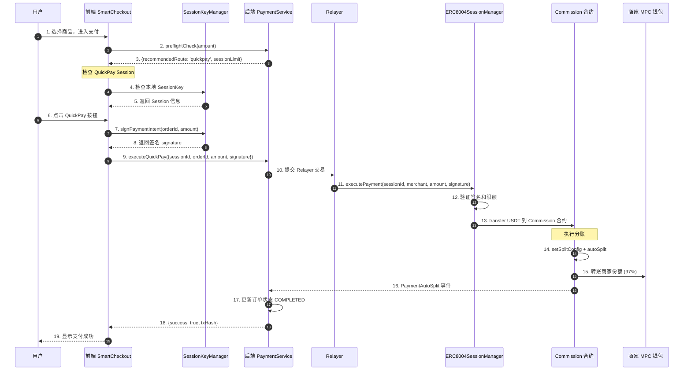
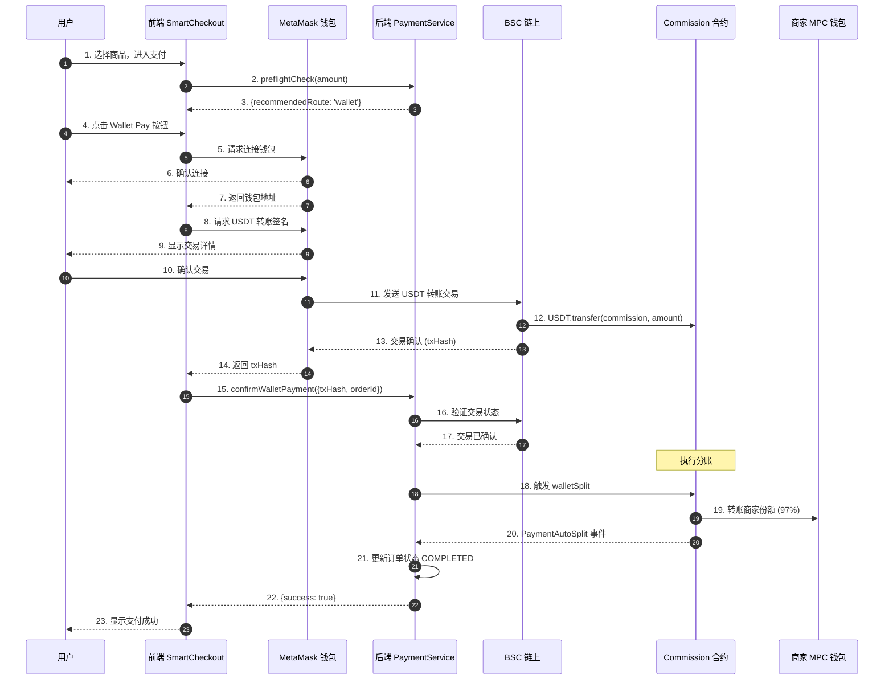
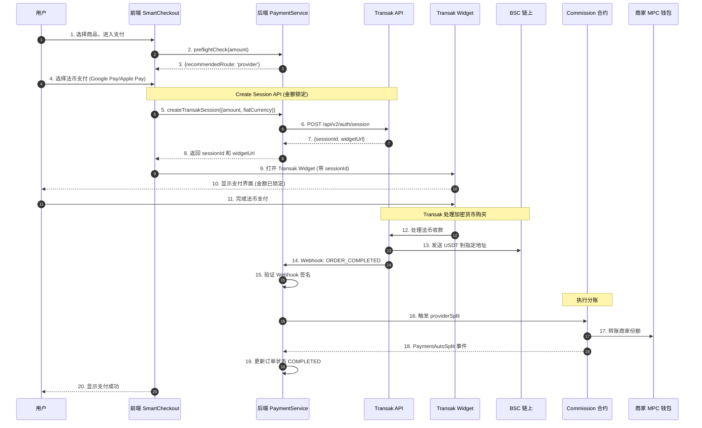
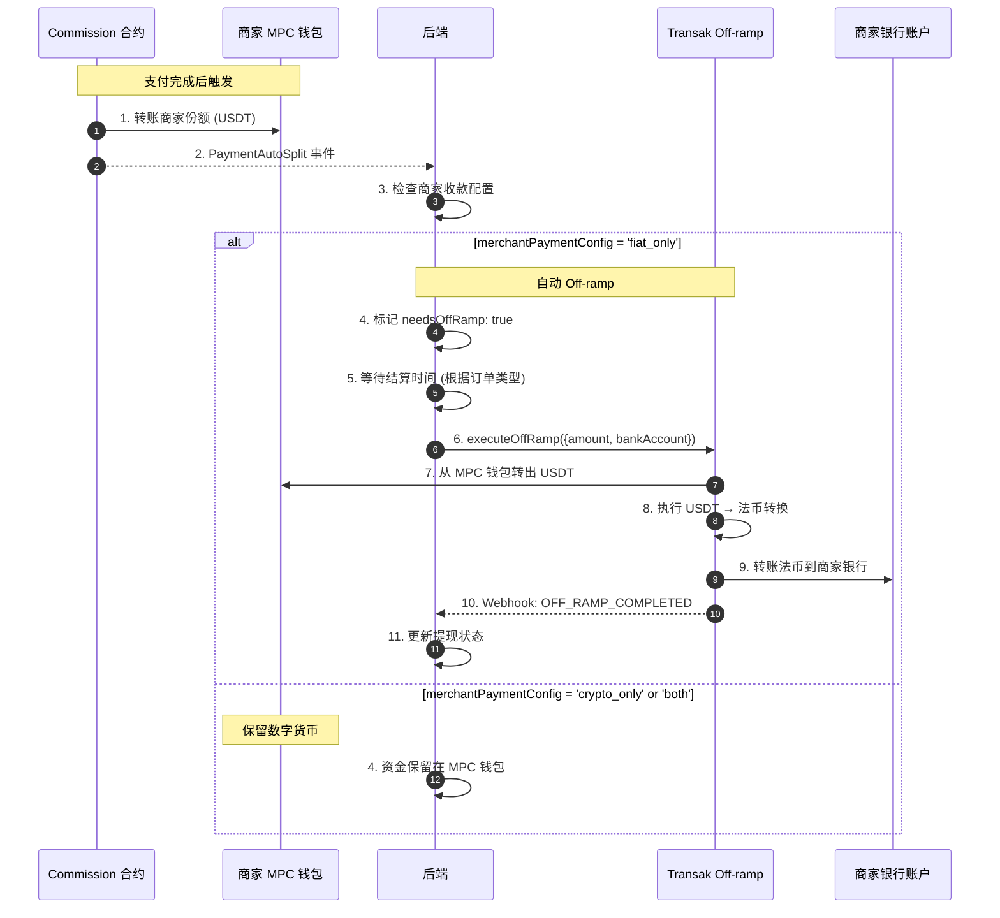
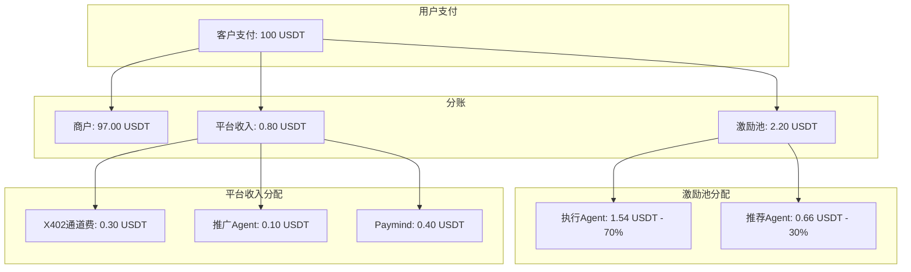

# 支付流程完整说明（用户端到商户端）

## 一、用户端支付流程

### 1. 支付初始化（前端 SmartCheckout）

**位置**: `frontend/components/payment/SmartCheckout.tsx`

**流程**:
1. 用户选择商品/服务，进入支付页面
2. 前端调用 `paymentApi.preflightCheck()` 进行预检查
   - 检查 QuickPay 可用性和限额
   - 获取推荐路由
3. **路由选择逻辑**（核心条件：用户是否有钱包）:
   ```
   if (用户有 QuickPay Session 且限额内) {
     路由 = 'quickpay'  // 优先使用 QuickPay
   } else if (用户有钱包) {
     路由 = 'wallet'    // 使用钱包支付
   } else {
     路由 = 'provider'  // 走 Provider 通道（Transak）
   }
   ```

### 2. 支付方式处理

#### 场景 A: QuickPay（X402 Session）
- 用户已授权 QuickPay Session
- 前端调用 `paymentApi.process()` 并传递 `sessionId` 和 `signature`
- 后端通过 Relayer 执行链上支付

#### 场景 B: 钱包支付
- 用户连接钱包（MetaMask 等）
- 前端直接调用智能合约转账 USDC 到 Commission 合约
- 转账成功后，前端调用 `paymentApi.process()` 传递 `txHash`

#### 场景 C: Provider 支付（Transak）
- 用户没有钱包，选择法币支付（Google Pay、Apple Pay、银行卡等）
- 前端打开 Transak Widget（嵌入在 Agentrix UI 中，不跳转）
- 用户通过 Transak 购买加密货币（USDC）
- Transak 完成支付后，通过 Webhook 通知后端

**Transak 完整流程**:
```
1. 确认价格 → 2. 邮箱验证 → 3. 身份认证(KYC) → 4. 支付 → 5. 完成
```

**关于 KYC 和邮箱验证**:
- **邮箱验证**：Transak 强制要求，无法跳过。如果传入 `email` 参数且设置 `isAutoFillUserData: true`，会自动填充但用户仍可编辑
- **KYC 身份认证**：Transak 作为受监管的虚拟资产服务提供商，必须对所有用户进行 KYC 验证
  - **首次用户**：必须完成完整 KYC 流程（姓名、地址、证件、自拍）
  - **已验证用户**：如果用户之前在 Transak 完成过 KYC，后续订单只需登录验证邮箱即可
  - **Staging 环境**：KYC 检查是模拟的，会自动通过（测试特性）
  - **Production 环境**：必须完成真实 KYC，审核通过后才能支付

**Google Pay 测试说明**:
- 在 Staging 环境，Google Pay 使用 Transak 提供的测试卡（如 4242424242424242）
- 显示的卡片信息不是用户真实的卡片
- 要测试 Google Pay，需要加入 Google Pay 测试组：https://developers.google.com/pay/api/web/guides/resources/test-card-suite

**资金流向**:
```
用户法币 → Transak → 购买 USDC → 发送到 Commission 合约 → 按分佣规则分配
```
钱打到 Commission 合约地址（固定），然后通过分佣机制转给商户，不是转到用户钱包

---

## 二、后端支付处理流程

### 1. 支付处理入口（PaymentService.processPayment）

**位置**: `backend/src/modules/payment/payment.service.ts`

**流程**:
1. **接收支付请求**
   - 获取用户信息（KYC 状态、国家信息）
   - 构建路由上下文（金额、货币、跨境信息等）

2. **支付方式映射**
   - `apple_pay` / `google_pay` → `PaymentMethod.TRANSAK`
   - `crypto` → 智能路由选择（X402 或 WALLET）

3. **智能路由选择**（如果未指定支付方式）
   - 优先检查 X402 授权（QuickPay）
   - 其次检查其他 QuickPay 授权
   - 最后使用智能路由选择最佳通道

4. **支付执行**
   - **QuickPay (X402)**: 通过 Relayer 执行链上支付
   - **钱包支付**: 验证 `txHash`，标记为完成
   - **Transak**: 创建支付记录，等待 Webhook 回调

5. **计算分佣**
   - 调用 `commissionCalculator.calculateAndRecordCommission()`
   - 计算商家、平台、推荐人、执行 Agent 的分成
   - 根据订单类型（NFT/虚拟资产/服务/实体商品）使用不同佣金规则

6. **托管处理**（如果是托管交易）
   - 创建 Escrow 托管
   - 根据订单类型自动处理结算时间

---

## 三、合约分佣流程

### 1. 分账配置设置

**位置**: `contract/contracts/Commission.sol`

**流程**:
1. 后端调用合约 `setSplitConfig()` 设置分账配置
   - `merchantMPCWallet`: 商家 MPC 钱包地址
   - `merchantAmount`: 商家应得金额
   - `referralFee`: 推荐人分佣
   - `executionFee`: 执行 Agent 分佣
   - `platformFee`: 平台分佣
   - `settlementTime`: 结算时间（根据订单类型）

2. 合约触发 `SplitConfigSet` 事件
3. 后端 ContractListener 监听事件并记录

### 2. 支付到合约

**三种场景**:

#### 场景 1: QuickPay (X402)
```solidity
function quickPaySplit(bytes32 orderId, uint256 amount)
```
- 从用户钱包转账 USDC 到合约
- 自动调用 `_autoSplit()` 分账

#### 场景 2: 钱包直接转账
```solidity
function walletSplit(bytes32 orderId, uint256 amount)
```
- 从用户钱包转账 USDC 到合约
- 自动调用 `_autoSplit()` 分账

#### 场景 3: Provider 法币转数字货币
```solidity
function providerSplit(bytes32 orderId, uint256 amount)
```
- Provider（Transak）发送 USDC 到合约
- 自动调用 `_autoSplit()` 分账

### 3. 自动分账（_autoSplit）

**流程**:
1. 验证分账配置和结算时间
2. 验证合约 USDC 余额
3. **分账到各方**:
   - 商家 MPC 钱包: `merchantAmount`（数字货币 USDC）
   - 推荐人钱包: `referralFee`
   - 执行 Agent 钱包: `executionFee`（如果有钱包）
   - 平台 Treasury: `platformFee`
   - Off-ramp 分佣: `offRampFee`（可配置，可为 0）

4. 触发 `PaymentAutoSplit` 事件
5. 后端 ContractListener 监听事件并更新订单状态

---

## 四、商家收款流程

### 1. 资金到达商家 MPC 钱包

**所有支付都先打到商家 MPC 钱包（数字货币 USDC）**

- 合约分佣后，商家部分自动转账到 `merchantMPCWallet`
- 这是数字货币（USDC），不是法币

### 2. 商家收款方式处理

#### 场景 A: 商家只接受法币（`merchantPaymentConfig = 'fiat_only'`）

**自动 Off-ramp 转换**:
1. 支付记录标记 `needsOffRamp: true`, `autoOffRamp: true`
2. 当满足结算条件时（根据订单类型）:
   - 从商家 MPC 钱包提取 USDC
   - 调用 `TransakProviderService.executeOffRamp()`
   - 通过 Transak Off-ramp 将 USDC 转换成法币
   - 法币直接打到商家银行账户

**流程**:
```
商家 MPC 钱包（USDC）
  ↓
Transak Off-ramp API
  ↓
商家银行账户（法币，如 CNY/USD）
```

#### 场景 B: 商家接受数字货币（`merchantPaymentConfig = 'crypto_only'` 或 `'both'`）

**数字货币收款**:
- 资金直接留在商家 MPC 钱包（USDC）
- 商家可以：
  - 保留数字货币
  - 手动触发 Off-ramp 转换成法币（通过 `WithdrawalService`）

#### 场景 C: 商家自带 Crypto 钱包

**直接转账到商家钱包**:
- 如果商家配置了外部 crypto 钱包地址
- 合约分佣时直接转账到商家钱包（而不是 MPC 钱包）

### 3. 手动 Off-ramp（可选）

**位置**: `backend/src/modules/payment/withdrawal.service.ts`

**用途**:
- 商家接受数字货币，但想手动将 MPC 钱包中的 USDC 转换成法币
- 商家主动调用 `WithdrawalService.createWithdrawal()`

**流程**:
1. 商家在前端发起提现请求
2. 后端创建 Withdrawal 记录
3. 调用 `TransakProviderService.executeOffRamp()`
4. 从 MPC 钱包提取 USDC，通过 Transak 转换成法币
5. 法币打到商家银行账户

---

## 五、端对端时序图

### 5.1 QuickPay (X402) 支付完整时序图



### 5.2 钱包直接支付时序图



### 5.3 Transak 法币支付时序图 (Create Session API)



### 5.4 商家自动 Off-ramp 时序图



---

## 六、X402 V2 协议支付流程

### 6.1 X402 V2 特点

- **通道费**: 0.3% 从平台费中扣除（商户实收不变）
- **资金追踪**: 详细记录每笔交易资金流向
- **向后兼容**: 非 X402 支付使用原有费率

### 6.2 X402 V2 费率结构

| 产品类型 | 激励池 | 平台费 | X402通道费 | 商户实收 |
|---------|--------|--------|-----------|---------|
| 实体商品 | 2.2% | 0.8% | 0.3%* | 97% |
| 服务类 | 3.7% | 1.3% | 0.3%* | 95% |
| 虚拟资产 | 2.2% | 0.8% | 0.3%* | 97% |
| NFT | 1.7% | 0.8% | 0.3%* | 97.5% |

> *X402 通道费从平台费中扣除，商户实收不变

### 6.3 X402 V2 资金流示例 (100 USDT 实体商品)



---

## 七、完整流程概览图

```
┌─────────────────────────────────────────────────────────────┐
│                    用户端支付流程                              │
└─────────────────────────────────────────────────────────────┘
                            │
        ┌───────────────────┼───────────────────┐
        │                   │                   │
    [有钱包]            [有钱包]            [无钱包]
        │                   │                   │
    QuickPay           钱包支付            Provider支付
   (X402)              (直接转账)          (Transak)
        │                   │                   │
        └───────────────────┴───────────────────┘
                            │
                            ▼
┌─────────────────────────────────────────────────────────────┐
│                  后端支付处理 (PaymentService)                 │
│  - 验证支付                                                    │
│  - 计算分佣                                                    │
│  - 创建托管（如需要）                                           │
└─────────────────────────────────────────────────────────────┘
                            │
                            ▼
┌─────────────────────────────────────────────────────────────┐
│                   合约分佣 (Commission.sol)                    │
│  - 设置分账配置 (setSplitConfig)                              │
│  - 支付到合约 (quickPaySplit/walletSplit/providerSplit)      │
│  - 自动分账 (_autoSplit)                                     │
└─────────────────────────────────────────────────────────────┘
                            │
                            ▼
        ┌───────────────────┴───────────────────┐
        │                                         │
    [商家 MPC 钱包]                        [其他分佣]
    (USDC 数字货币)                    (推荐人/Agent/平台)
        │                                         │
        ▼                                         ▼
┌─────────────────────────────────────────────────────────────┐
│                    商家收款处理                                │
└─────────────────────────────────────────────────────────────┘
        │
        ├─── 商家只接受法币 ───► [自动 Off-ramp]
        │                          │
        │                          ▼
        │                    Transak Off-ramp
        │                          │
        │                          ▼
        │                    商家银行账户（法币）
        │
        ├─── 商家接受 Crypto ───► [保留在 MPC 钱包]
        │                          │
        │                          ├─── 保留数字货币
        │                          │
        │                          └─── [手动 Off-ramp]
        │                                     │
        │                                     ▼
        │                              WithdrawalService
        │                                     │
        │                                     ▼
        │                              Transak Off-ramp
        │                                     │
        │                                     ▼
        │                              商家银行账户（法币）
        │
        └─── 商家自带钱包 ───► [直接转账到商家钱包]
```

---

## 八、关键配置和参数

### 1. 商家收款配置 (`merchantPaymentConfig`)
- `'fiat_only'`: 只接受法币 → 自动 Off-ramp
- `'crypto_only'`: 只接受数字货币 → 保留在 MPC 钱包
- `'both'`: 两种都接受 → 默认保留在 MPC 钱包，可手动 Off-ramp

### 2. 订单类型和结算时间
- **NFT/虚拟资产**: 即时结算（`settlementTime = 0`）
- **服务**: 等待服务开始
- **实体商品**: 等待确认收货（7天自动确认）

### 3. Off-ramp 配置
- **自动 Off-ramp**: 商家只接受法币时自动触发
- **手动 Off-ramp**: 商家通过 `WithdrawalService` 手动触发
- **Provider**: 使用 Transak Off-ramp API

---

## 九、Webhook 处理

### Transak Webhook

**位置**: `backend/src/modules/payment/transak-webhook.controller.ts`

**处理事件**:
- `ORDER_PROCESSING`: 订单处理中
- `ORDER_COMPLETED`: 订单完成 → 更新支付状态为 `COMPLETED`
- `ORDER_FAILED`: 订单失败 → 更新支付状态为 `FAILED`

**流程**:
1. Transak 发送 Webhook 到后端
2. 后端验证签名
3. 更新支付记录状态
4. 触发分佣计算和合约分账

---

## 十、总结

### 核心原则
1. **所有支付都先打到商家 MPC 钱包（数字货币）**
2. **合约分佣后，商家部分自动转账到 MPC 钱包**
3. **根据商家收款配置决定是否自动 Off-ramp**
4. **商家可以手动触发 Off-ramp 将数字货币转换成法币**

### 资金流
```
用户支付 → 合约分佣 → 商家 MPC 钱包（USDC）
                              │
                    ┌─────────┴─────────┐
                    │                   │
               [自动 Off-ramp]    [保留数字货币]
                    │                   │
                    ▼                   ▼
            商家银行账户（法币）    可手动 Off-ramp
```

### 关键服务
- **PaymentService**: 支付处理入口
- **CommissionCalculatorService**: 分佣计算
- **TransakProviderService**: Transak On-ramp/Off-ramp (新版 509 行，位于 backend/src/modules/payment/)
- **WithdrawalService**: 手动 Off-ramp
- **ContractListenerService**: 监听合约事件
- **Commission.sol**: 智能合约分账

---

## 📊 版本历史

| 版本 | 日期 | 更新内容 |
|------|------|---------|
| V2.0 | 2025-01-17 | 添加端对端时序图、X402 V2 支付流程、资金流图 |
| V1.0 | 2025-01 | 初始版本 |

---

**文档维护**: Agentrix Team  
**最后更新**: 2025-01-17

