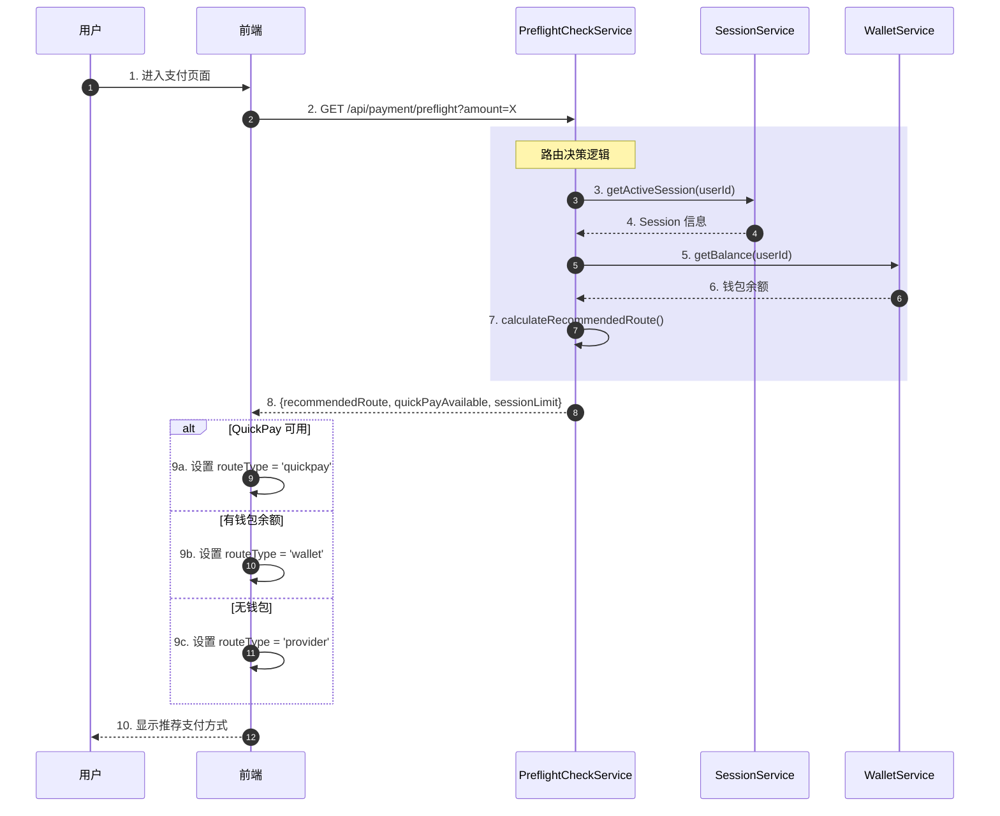
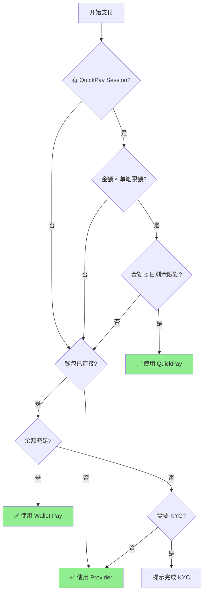
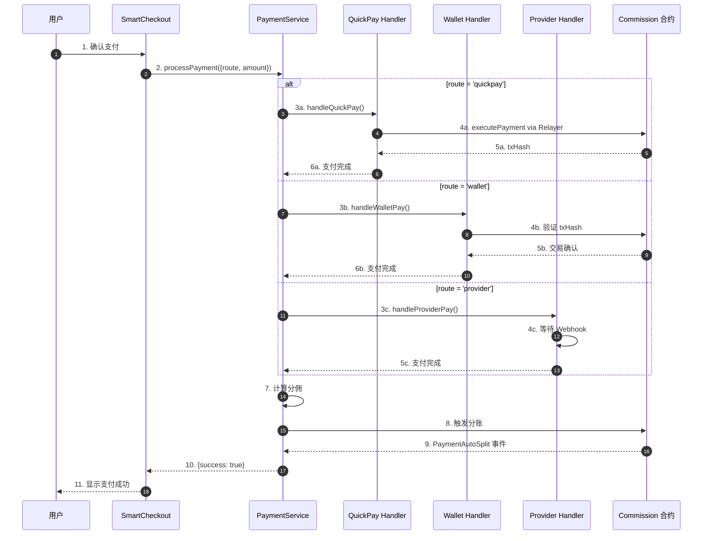

# Agentrix 智能路由系统文档 V5.0

**版本**: 5.0  
**更新日期**: 2025年12月11日  
**分支**: feat/smartcheckout-layout

---

## 📋 目录

1. [智能路由概述](#1-智能路由概述)
2. [路由决策逻辑](#2-路由决策逻辑)
3. [支付通道对比](#3-支付通道对比)
4. [Pre-Flight Check 机制](#4-pre-flight-check-机制)
5. [路由优先级规则](#5-路由优先级规则)
6. [商户价值分析](#6-商户价值分析)
7. [技术实现](#7-技术实现)
8. [常见问题](#8-常见问题)

---

## 1. 智能路由概述

### 1.1 什么是智能路由

智能路由是 Agentrix 支付系统的核心功能，根据用户状态、订单金额、可用通道等因素，**自动选择最优支付方式**。

### 1.2 设计目标

| 目标 | 描述 | 优先级 |
|------|------|--------|
| **成本最优** | 选择费率最低的通道 | ⭐⭐⭐ |
| **成功率最高** | 优先选择成功率高的通道 | ⭐⭐⭐ |
| **用户体验** | 减少用户操作步骤 | ⭐⭐ |
| **全球覆盖** | 支持多地区、多货币 | ⭐⭐ |

### 1.3 支持的路由类型

```typescript
type RouteType = 'quickpay' | 'wallet' | 'provider' | 'local-rail' | 'crypto-rail';
```

| 路由类型 | 描述 | 通道 |
|---------|------|------|
| `quickpay` | 一键免 Gas 支付 | Session + Relayer |
| `wallet` | 钱包直接转账 | ERC20 Transfer |
| `provider` | 第三方支付服务商 | Transak / Stripe |
| `local-rail` | 本地支付通道 | 支付宝 / 微信 (计划中) |
| `crypto-rail` | 跨链加密支付 | DEX 聚合 (计划中) |

---

## 2. 路由决策逻辑

### 2.1 决策流程图

```
用户发起支付
    ↓
Pre-Flight Check (预检查)
    ↓
┌─────────────────────────────────────────┐
│          检查 QuickPay 可用性            │
│                                          │
│  ✓ 有活跃 Session?                       │
│  ✓ 金额 ≤ 单笔限额?                      │
│  ✓ 金额 ≤ 日剩余限额?                    │
│                                          │
│  全部满足 → 推荐 QuickPay               │
└─────────────────────────────────────────┘
    ↓ (不满足)
┌─────────────────────────────────────────┐
│          检查 Wallet Pay 可用性          │
│                                          │
│  ✓ 钱包已连接?                          │
│  ✓ 余额充足?                            │
│                                          │
│  全部满足 → 推荐 Wallet Pay             │
└─────────────────────────────────────────┘
    ↓ (不满足)
┌─────────────────────────────────────────┐
│          降级到 Fiat Provider            │
│                                          │
│  → 推荐 Transak (法币支付)              │
└─────────────────────────────────────────┘
```

### 2.2 代码实现

```typescript
// SmartCheckout 初始化时的路由决策
const initializePayment = async () => {
  // 1. 执行预检查
  const result = await paymentApi.preflightCheck({
    amount: order.amount.toString(),
    currency: order.currency,
  });
  
  // 2. 获取用户状态
  const finalSession = session || activeSession || currentSession;
  const hasWallet = isConnected && defaultWallet;
  const hasQuickPaySession = Boolean(finalSession);
  
  // 3. 判断 QuickPay 是否可用
  const quickPayEligible = hasQuickPaySession && result.quickPayAvailable;
  
  // 4. 设置推荐路由
  if (quickPayEligible) {
    setRouteType('quickpay');
  } else if (hasWallet) {
    setRouteType('wallet');
  } else {
    setRouteType('provider');
  }
};
```

---

## 3. 支付通道对比

### 3.1 费率对比

| 通道 | 费率 | Gas 费 | KYC | 到账时间 |
|------|------|--------|-----|---------|
| **QuickPay** | 0% | 无 (Gasless) | 否 | 即时 |
| **Wallet Pay** | 0% | ~0.1 USDT | 否 | ~15秒 |
| **Transak** | 1-5% | 无 | 是 | 2-5分钟 |
| **Stripe** | 2.9% + $0.30 | 无 | 否 | 即时 |

### 3.2 成本示例

**订单金额**: $100 USD

| 通道 | 费用计算 | 商户实收 |
|------|---------|---------|
| QuickPay | $0 | **$100** |
| Wallet Pay | ~$0.10 (Gas) | **$99.90** |
| Transak (3%) | $3 | **$97** |
| Stripe | $2.9 + $0.30 = $3.20 | **$96.80** |

### 3.3 适用场景

| 通道 | 适用场景 | 不适用场景 |
|------|---------|-----------|
| **QuickPay** | 小额高频、已授权用户 | 首次用户、大额订单 |
| **Wallet Pay** | 已有钱包用户、即时支付 | 无币用户 |
| **Transak** | 无币用户、大额订单 | 小额订单 (< $30) |

---

## 4. Pre-Flight Check 机制

### 4.1 预检查接口

**端点**: `GET /api/payment/preflight`

**请求参数**:
```typescript
{
  amount: string;     // 订单金额
  currency: string;   // 货币代码 (USD/CNY/USDT)
}
```

**响应示例**:
```typescript
{
  recommendedRoute: 'quickpay',
  quickPayAvailable: true,
  sessionLimit: {
    singleLimit: '100',
    dailyLimit: '1000',
    dailyRemaining: '850'
  },
  walletBalance: '50.5',
  requiresKYC: false,
  fees: {
    gasFee: '0.1',
    providerFee: '0',
    total: '0.1'
  },
  providerOptions: [
    {
      id: 'transak',
      name: 'Transak',
      price: 100,
      fee: 3,
      minAmount: 30,
      available: true
    }
  ]
}
```

### 4.2 预检查逻辑

```typescript
// backend: preflight-check.service.ts
async preflightCheck(userId: string, dto: PreflightCheckDto) {
  // 1. 检查用户 Session
  const session = await this.sessionService.getActiveSession(userId);
  
  // 2. 检查钱包余额
  const balance = await this.walletService.getBalance(userId);
  
  // 3. 检查 KYC 状态
  const kycStatus = await this.kycService.getStatus(userId);
  
  // 4. 计算推荐路由
  const recommendedRoute = this.calculateRecommendedRoute({
    session, balance, kycStatus, amount: dto.amount
  });
  
  return {
    recommendedRoute,
    quickPayAvailable: Boolean(session),
    sessionLimit: session?.limit,
    walletBalance: balance?.toString(),
    requiresKYC: !kycStatus?.verified,
  };
}
```

---

## 5. 路由优先级规则

### 5.1 优先级顺序

1. **QuickPay** (最高优先级)
   - 条件: 有 Session + 金额在限额内
   - 优势: 零费用、即时到账、无需签名

2. **Wallet Pay** (次优先级)
   - 条件: 钱包已连接 + 余额充足
   - 优势: 即时、无需 KYC

3. **Provider** (最低优先级)
   - 条件: 其他方式不可用
   - 优势: 支持法币、无需持币

### 5.2 限额检查规则 (V5.0 更新)

```typescript
// 从 Session 根级别读取限额 (已修复)
const singleLimit = session?.singleLimit ? parseFloat(String(session.singleLimit)) : 0;
const dailyLimit = session?.dailyLimit ? parseFloat(String(session.dailyLimit)) : 0;
const usedToday = session?.usedToday ? parseFloat(String(session.usedToday)) : 0;
const dailyRemaining = dailyLimit - usedToday;

// 有效限额检查
const hasValidLimits = singleLimit > 0 && dailyLimit > 0;

// 超限判断
const exceedsLimit = hasValidLimits && cryptoAmount && (
  cryptoAmount > singleLimit ||      // 超过单笔限额
  cryptoAmount > dailyRemaining      // 超过日剩余限额
);

// QuickPay 禁用条件
const isQuickPayDisabled = !session || (hasValidLimits && exceedsLimit);
```

---

## 6. 商户价值分析

### 6.1 成本节省

**场景**: 月 GMV $100,000，假设 60% 用户有 Session

| 支付方式 | 比例 | 金额 | 费用 | 费率 |
|---------|------|------|------|------|
| QuickPay | 60% | $60,000 | $0 | 0% |
| Wallet Pay | 20% | $20,000 | $20 | 0.1% |
| Transak | 20% | $20,000 | $600 | 3% |
| **总计** | 100% | $100,000 | **$620** | **0.62%** |

**对比纯 Stripe**: $100,000 × 2.9% = $2,900  
**节省**: $2,900 - $620 = **$2,280/月 (78%)**

### 6.2 转化率提升

| 指标 | 传统支付 | 智能路由 | 提升 |
|------|---------|---------|------|
| 支付步骤 | 5-8 步 | 1-3 步 | -60% |
| 支付耗时 | 30-60秒 | 5-15秒 | -70% |
| 放弃率 | 15-20% | 5-8% | -60% |
| 成功率 | 95% | 99.5% | +4.5% |

---

## 7. 技术实现

### 7.1 前端组件

**文件**: `frontend/components/payment/SmartCheckout.tsx`

```typescript
// 路由选择 UI
const CryptoSection = () => {
  const session = currentSession || activeSession;
  
  // 限额检查 (V5.0 修复)
  const singleLimit = session?.singleLimit ? parseFloat(String(session.singleLimit)) : 0;
  const dailyRemaining = dailyLimit - usedToday;
  
  const hasValidLimits = singleLimit > 0;
  const exceedsLimit = hasValidLimits && cryptoAmount > singleLimit;
  const isQuickPayDisabled = !session || exceedsLimit;
  
  return (
    <div>
      {/* QuickPay 卡片 */}
      <QuickPayCard 
        disabled={isQuickPayDisabled}
        reason={exceedsLimit ? 'Exceeds session limit' : 'Enable for instant payment'}
      />
      
      {/* Wallet Pay 卡片 */}
      <WalletPayCard />
    </div>
  );
};
```

### 7.2 后端服务

**文件**: `backend/src/modules/payment/preflight-check.service.ts`

```typescript
@Injectable()
export class PreflightCheckService {
  async preflightCheck(userId: string, dto: PreflightCheckDto) {
    const session = await this.sessionService.getActiveSession(userId);
    const amount = parseFloat(dto.amount);
    
    // 检查 QuickPay 可用性
    let quickPayAvailable = false;
    if (session) {
      const singleLimit = session.singleLimit || 0;
      const dailyRemaining = (session.dailyLimit || 0) - (session.usedToday || 0);
      quickPayAvailable = amount <= singleLimit && amount <= dailyRemaining;
    }
    
    return {
      recommendedRoute: quickPayAvailable ? 'quickpay' : 'wallet',
      quickPayAvailable,
      sessionLimit: {
        singleLimit: session?.singleLimit?.toString() || '0',
        dailyLimit: session?.dailyLimit?.toString() || '0',
        dailyRemaining: dailyRemaining?.toString() || '0',
      }
    };
  }
}
```

---

## 8. 路由选择时序图

### 8.1 智能路由决策流程



### 8.2 路由优先级决策树



### 8.3 完整支付路由流程



---

## 9. 常见问题

### 9.1 QuickPay 总是显示 "Exceeds session limit"

**原因**: Session 限额字段读取路径错误

**解决**: V5.0 已修复，从 `session.singleLimit` 而非 `session.limit.singleLimit` 读取

### 9.2 法币订单无法使用 QuickPay

**原因**: QuickPay 未处理法币→USDT 转换

**解决**: V5.0 已修复，自动将法币金额转换为 USDT 后执行 QuickPay

### 9.3 Transak 金额无法锁定

**原因**: 
- Create Session API 被 Cloudflare 阻止
- Staging 环境不支持 URL 参数锁定

**解决**: 部署后端到海外服务器

---

## 📊 版本历史

| 版本 | 日期 | 更新内容 |
|------|------|---------|
| V5.1 | 2025-01-17 | 添加路由时序图、决策树、X402 V2 支持、0.3% 通道费从平台费扣除、资金路径跟踪 |
| V5.0 | 2025-12-11 | 修复 Session 限额检查、法币订单支持 |
| V4.0 | 2025-01 | 全球通道支持、商户价值优化 |
| V3.0 | 2024-12 | Pre-Flight Check 机制 |

---

## 9. X402 V2 协议支持

### 9.1 X402 V2 概述

X402 V2 是 Agentrix 支付系统对 ARN/X402 协议的升级支持。主要变化：

- **通道费逻辑**: 0.3% 通道费从平台费中扣除（而非额外收取）
- **资金路径追踪**: 详细记录每笔交易的资金流向
- **向后兼容**: 非 X402 支付仍使用原有费率结构

### 9.2 费率结构 (V4.0)

| 产品类型 | 激励池 | 平台费 | X402通道费 | 商户实收 |
|---------|--------|--------|-----------|---------|
| 实体商品 | 2.2% | 0.5% | 0.3%* | 97% |
| 服务类 | 3.7% | 1.0% | 0.3%* | 95% |
| 虚拟资产 | 2.2% | 0.5% | 0.3%* | 97% |
| NFT | 1.7% | 0.5% | 0.3%* | 97.5% |

> *注：X402 通道费从平台费中扣除，商户实收不变

### 9.3 资金路径示例

**100 USDT 实体商品订单 (X402 V2)**：

```
客户支付: 100 USDT
    ├─→ 商户实收: 97.00 USDT (97%)
    ├─→ 激励池: 2.20 USDT (2.2%)
    │     ├─→ 执行Agent: 1.54 USDT (70%)
    │     └─→ 推荐Agent: 0.66 USDT (30%)
    └─→ 平台收入: 0.80 USDT (0.8%)
          ├─→ X402通道费: 0.30 USDT (0.3%)
          ├─→ 推广Agent: 0.10 USDT (20%)
          └─→ Paymind: 0.40 USDT
```

### 9.4 管理员资金路径查看

资金路径功能已集成到管理后台：

- **路径**: `/admin/fund-paths`
- **功能**: 
  - 查看所有交易的资金分配详情
  - 按支付ID或交易哈希搜索
  - 过滤 X402 支付
  - 导出资金流报表

---

**文档维护**: Agentrix Team  
**最后更新**: 2025-01-17
